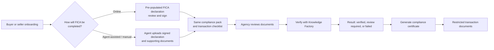

# Buyer and seller FICA declaration implementation plan

## Outcome

Give every property transaction one clear FICA path.

The buyer or seller either completes a pre-populated FICA declaration in onboarding, or the agent uploads a manually completed declaration and the supporting documents. Both routes produce the same transaction compliance record, document checklist and verification action. Agency staff then run or record the Knowledge Factory check and save a compliance certificate to the transaction.

Credit, affordability and marketing flows are explicitly outside this work.

## What the current architecture already provides

The implementation belongs to the primary transaction workspace (`the-it-guy/`) plus shared Supabase migrations.

- `SellerOnboarding.jsx` already captures seller data and a multi-signer compliance state. `sellerComplianceDocumentModel.js` converts that data into document sections for individuals, companies, trusts and representatives.
- `propertyDisclosure.js` already provides the branded A4 HTML layout, table/grid sections, signature blocks, footer and print/PDF-friendly markup used by the seller compliance pack.
- `sellerDocumentRequirementsService.js` already creates a `signed_fica_declaration` requirement and accepts either onboarding completion or a physical agent upload with seller context.
- The canonical document system already stores document definitions, requirement rules, requirement instances, review events and document links. `uploadDocument` already handles internal agent uploads, durable storage, transaction activity and canonical-requirement linking.
- `BuyerDocumentWorkspace` and onboarding required-document upload paths already provide a buyer document checklist and upload experience.
- The agency pipeline already contains the buyer FICA panel and the Knowledge Factory FICA workspace.

There is one important limitation to fix before reusing the seller output as-is: the current “Signed FICA Declaration” is generated through `buildPropertyDisclosureDocumentMarkup`. It can include the FICA summary but is structurally a seller compliance/disclosure pack. The requested result is a **standalone Buyer FICA Declaration** and a **standalone Seller FICA Declaration** with the same branded layout. We should extract the shared layout primitives, rather than copy the disclosure document or put buyer FICA details into a property-defects form.

The current Knowledge Factory case workspace is a manual internal workflow; its provider submission is disabled. The shared buyer/seller FICA panel currently uses a mock provider. “Verify with Knowledge Factory” must remain unavailable until a real server-side integration is connected.

## Product shape

### The declaration

Each generated declaration is its own branded HTML/PDF document. It uses the seller declaration's visual language—header, agency identity, reference, grouped rows, execution block and footer—without reusing the property disclosure content.

It contains:

- property and transaction reference;
- buyer or seller identity and contact details;
- entity/authority details when the party is a company, trust, estate or representative;
- the FICA declaration and transaction information-sharing permission, in approved wording;
- document checklist selected by entity type and transaction context;
- signer name, role, signature and signed timestamp; and
- document version and declaration reference.

One natural person signs their own declaration. For an entity, the authorised person signs in their stated capacity, with authority documentation remaining a checklist item. Co-buyers/co-sellers each sign their own declaration rather than sharing a generic signature.

The declaration is evidence of information supplied and permission to process it. It is not the verification result or the compliance certificate.

### The two completion routes

| Route | Who uses it | What Arch9 records | Completion rule |
|---|---|---|---|
| Online declaration | Buyer or seller | Generated HTML/PDF, signer state, form snapshot, canonical declaration document and matching checklist | Required parties sign the declaration; documents can then be uploaded through the portal or by staff. |
| Manual / agent-assisted | Agent or authorised staff member | Uploaded physical declaration, party type, signer/capacity, source=`agent_physical_upload`, and the same checklist | The document is not treated as complete until the agent supplies the required context. |

The agent route is an alternative way to provide the same evidence. It must not be a separate compliance workflow, a generic “Other” document, or a way to bypass the declaration/checklist.

## Implementation phases

### Phase 1 — shared declaration document contract and renderer

Create a shared `ficaDeclarationDocumentModel` that accepts `{ partyType, party, transaction, property, signing, documentRequirements, branding }` and produces the ordered sections for both buyers and sellers. Create a `buildFicaDeclarationDocumentMarkup` renderer that reuses the existing A4 header, footer, grid and signer-card styles from `propertyDisclosure.js`.

The model should have only two variants: buyer and seller. Entity differences belong in the data sections, not separate templates. Use an approved versioned declaration wording input rather than hard-coding wording in UI components.

Update the seller declaration to use the new standalone renderer. This preserves its current signed-FICA requirement and manual completion route while making its generated output truly separate from the property disclosure. Add a buyer declaration requirement and generate the equivalent buyer output from buyer onboarding data.

Expected primary files:

- new `src/core/documents/ficaDeclarationDocumentModel.js`
- new `src/core/documents/ficaDeclarationDocumentMarkup.js`
- `src/services/sellerDocumentRequirementsService.js`
- `src/services/clientPortalWorkspaceService.js`
- `src/lib/purchaserPersonas.js` and buyer document requirement adapters
- new focused document-model/rendering tests

Definition of done: individual, co-party, company, trust, foreign and representative fixtures render a readable branded declaration; seller disclosure rendering remains unchanged; generated files are labelled `Buyer FICA Declaration` or `Seller FICA Declaration`.

### Phase 2 — buyer onboarding signing route

Add a short final **FICA declaration** section to buyer onboarding after personal/entity details. Keep it as a review-and-sign step, not a second long form: the declaration is pre-populated from the information the buyer has already supplied.

The page should show the generated declaration summary, required signers, a declaration acknowledgement and signature action. On signing, save the completed signing state with the buyer onboarding snapshot and create/link the `buyer_fica_declaration` document requirement. The final form must show the generated PDF/download after successful persistence.

Mirror the seller signer model for buyer, co-buyer and entity signers where those roles already exist in `buyerOnboardingFlowContract.js`. Do not add credit questions, bond questions or marketing controls.

Expected primary files:

- `src/pages/ClientOnboarding.jsx`
- `src/lib/buyerOnboardingFlowContract.js`
- `src/lib/api.js` buyer onboarding snapshot/projection path
- `src/components/client-portal/documents/BuyerDocumentWorkspace.jsx`
- buyer onboarding and signer tests

Definition of done: a buyer can finish onboarding and receive a distinct signed FICA declaration in their transaction document list; existing fast onboarding data capture remains intact.

### Phase 3 — one canonical FICA compliance pack and manual route

Add canonical definitions/requirements for `buyer_fica_declaration` and align `seller_fica_declaration` aliases so both resolve to the same kind of compliance pack. Keep supporting document requirements driven by the existing purchaser/entity and transaction rules: individual, co-buyer, company, trust, foreign and representative/authority requirements.

Add an **Agent upload FICA pack** action to the buyer and seller lead/transaction workspace. It requests:

- signed declaration PDF;
- party type;
- signer name and capacity;
- whether this is a buyer or seller; and
- the applicable transaction/listing or lead context.

The agent can upload supporting documents one by one against the generated requirements. Reuse `uploadDocument`, canonical requirement linking, upload idempotency and restricted visibility. Do not create a separate bucket or a parallel document metadata table.

For a pre-transaction lead, attach the manual pack to the lead profile and carry it forward into the transaction using the existing document-projection/continuity pattern. Do not mark it “verified” before it is connected to a transaction or a reviewed lead compliance record.

Expected primary files:

- new migration for canonical buyer FICA declaration definitions/rules and any required compatibility aliases
- `src/core/documents/documentRequestCanonicalAdapter.js`
- `src/services/documents/canonicalDocumentAdapterService.js`
- `src/pages/agency/AgencyPipelinePage.jsx`
- relevant lead-to-transaction document projection service

Definition of done: online and physical declarations create the same requirement key, appear in the same pack, and allow staff to tell which route supplied the evidence.

### Phase 4 — Knowledge Factory verification handoff

Use one compliance case created from the declaration document and checklist. The case must identify the organisation, party, lead/transaction, declaration document, entity type and document readiness. The agent sees one action: **Verify with Knowledge Factory**.

Build a server-side Knowledge Factory adapter only after the provider’s supported API, authentication, consent requirements and result format are confirmed. It must never send provider credentials to the browser. Replace mock-provider success/fallback behavior with explicit `not_configured` or `integration_unavailable` states. The button is enabled only when the declaration and the context-required documents are complete.

Persist normalized outcomes only: provider name/reference, submitted/completed times, check statuses, overall status, reviewer and result expiry. Restrict raw provider payloads to the server-side integration boundary.

Extend the existing `knowledge_factory_fica_cases` only if it can safely gain transaction, party and declaration-document links. Otherwise create a small transaction-scoped compliance-case table linked to it. Do not overload a JSON form snapshot as the authoritative result record.

Definition of done: staff can start a real provider check from a valid pack, see a pending/verified/review-required/failed result, and no screen can show a mock result as real verification.

### Phase 5 — review outcome and certificate

Add a compact compliance panel in the lead and transaction workspaces. It should answer four questions immediately: declaration signed/uploaded, documents complete, Knowledge Factory status, and staff approval status.

When an authorised staff member approves a result, generate a separate `FICA Compliance Certificate` PDF using the same visual system. It contains the party and transaction references, provider reference, check summary, result, reviewer, approval date and expiry. It must not reproduce ID numbers, raw provider payloads or every supporting-document value.

Save the certificate as a restricted `fica_compliance_certificate` document linked to the transaction compliance pack. If the result expires or is superseded, the old certificate remains historical and is marked superseded; do not silently overwrite it.

Definition of done: a staff member can open the declaration, evidence and certificate from one FICA panel, with a clear distinction between “documents received”, “provider checked” and “approved”.

### Phase 6 — access controls and migration of current paths

Add new append-only migrations. Apply RLS and storage boundaries before enabling live verification:

- buyers/sellers can read only their own shared declaration and requests;
- assigned agency staff and authorised compliance staff can review the pack;
- only authorised staff/server workflows can create provider results, approve results or generate certificates;
- attorneys and originators receive only the documents deliberately shared for their transaction role;
- raw provider responses are never exposed through the ordinary `documents` table or client portal;
- all document uploads, verification starts/results and approvals have durable audit events.

Preserve existing seller FICA declarations and physical uploads. Backfill only their canonical key/context where safe; label unclear legacy records for staff review rather than guessing a signer or declaration version.

Definition of done: positive and negative role tests cover buyer, seller, co-party, agent, compliance reviewer, attorney, originator, unrelated agency member and expired token. Existing seller-pack access continues to work.

## Fast, efficient user experience

The online experience should feel like the current seller declaration:

1. Capture party and entity information once.
2. Show a concise declaration preview.
3. Sign it.
4. Display the tailored document checklist.
5. Let the user upload immediately or let their agent handle it.

No duplicated personal-information page, no credit questions and no complex risk questionnaire. Entity type and transaction type continue to select the documents.

## Decisions needed before implementation

1. Approve the exact buyer and seller FICA declaration wording, including who may receive the information.
2. Confirm whether an agent may attest to a physical signature or whether every manual upload needs the signed PDF only.
3. Confirm the authoritative Knowledge Factory API/product, credentials, supported checks and certificate terminology.
4. Confirm which staff roles may run checks and approve certificates.
5. Confirm whether a lead may complete a declaration before a transaction exists, or whether the lead only stores draft/manual evidence until a transaction is created.

## Verification plan

- Unit tests for declaration facts, required signers and entity-specific document packs.
- HTML/PDF render checks for desktop and print layout, including one long company/trust scenario.
- Browser checks for online buyer, online seller, manual buyer upload and manual seller upload.
- Database/RLS tests for every relevant role and for storage bytes as well as document metadata.
- Integration tests using a Knowledge Factory sandbox or explicitly labelled test provider; no mock result may satisfy a production compliance gate.

## Out of scope

This plan does not alter credit, affordability, bond-originator, marketing, pricing or property-disclosure workflows. It does not authorize a database migration, deployment, live Knowledge Factory check or legal wording publication.
