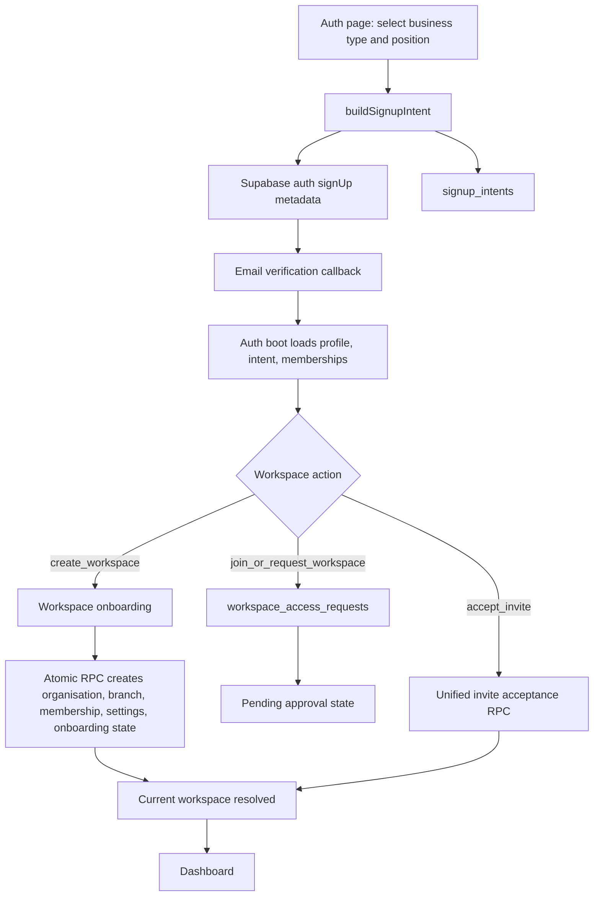
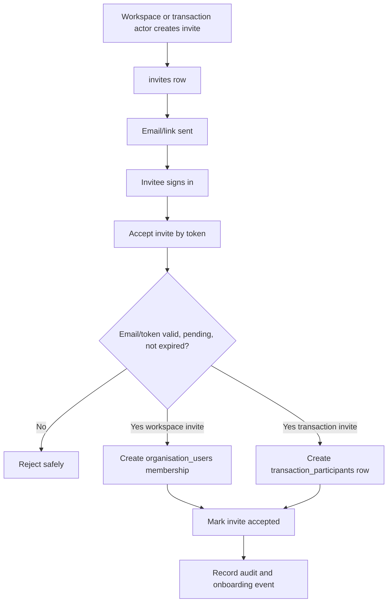
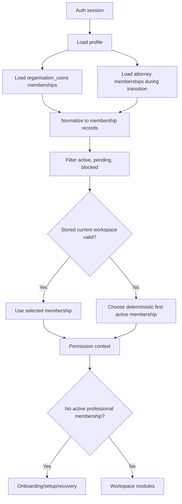
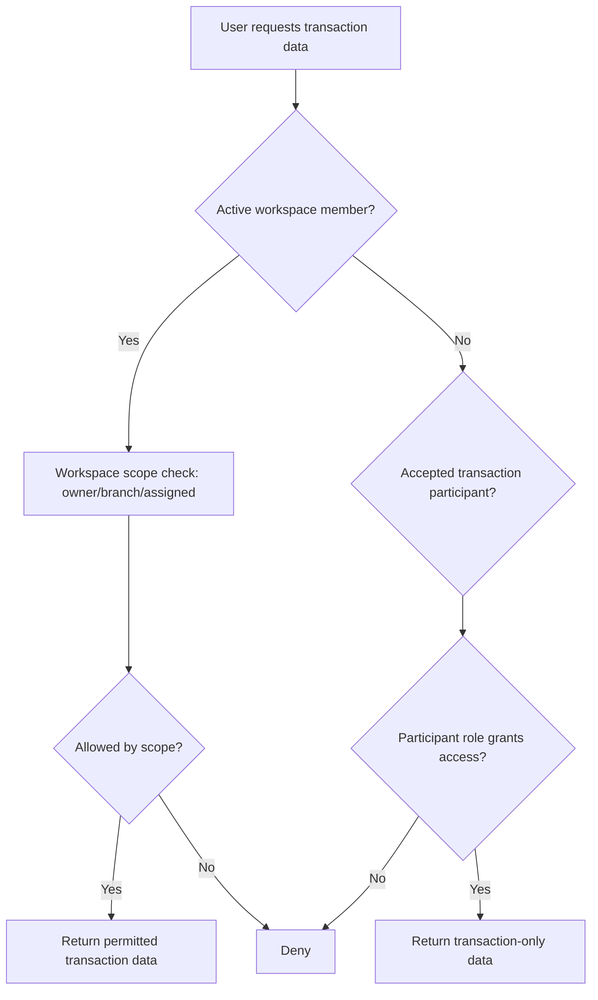

# Phase 1: Onboarding and Workspace Architecture Stabilisation

Date: 2026-05-24

Scope: discovery and infrastructure stabilisation plan only. This document does not introduce personal workspaces, standalone professionals, dashboard redesigns, CRM redesigns, or transaction redesigns.

## Executive Summary

Bridge already has the beginnings of a proper foundation: signup intents, onboarding states, workspace invites, workspace access requests, membership-aware auth boot, and a central permission resolver.

The current risk is that these newer systems coexist with older systems:

- `profiles.role` still acts as app role, onboarding role, and permission role in different places.
- `organisation_users.role`, `organisation_users.organisation_role`, attorney firm roles, signup intent roles, and transaction participant roles overlap.
- Workspace invites exist, but legacy organisation-user invite tokens and attorney firm invitations still run separate lifecycles.
- Principal agency setup uses `completeAgencyOnboarding` in `settingsApi`, not the newer workspace engine, and it performs fragmented client-side writes.
- Several production paths still tolerate missing workspace context by returning default/local/demo data.
- Transaction access and workspace membership are partially coupled in RLS and client services.

Recommended Phase 1 decision: stabilise around one professional workspace model now:

- `profiles.system_role`: platform user class, for example `professional`, `client`, `admin`, `super_admin`.
- `profiles.role`: transitional legacy app role only until migration is complete.
- `organisation_users.workspace_role`: the canonical role inside a workspace.
- `transaction_participants.transaction_role`: the canonical role inside a transaction.
- `invites`: the canonical invite table for workspace, transaction, branch, team, and client invites.
- No production fallback to local/demo/default workspace data.

## Current Signup Flow

### Public Signup

Entry point:

- `the-it-guy/src/pages/Auth.jsx`

Flow:

1. User selects business type and position.
2. `buildSignupIntent` maps that selection to app role, workspace type, intended organisation role, onboarding path, and workspace action.
3. `createSignupUserMetadata` writes the intent into Supabase auth metadata during `signUp`.
4. `storeSignupIntentTemporarily` also writes the intent into `sessionStorage`.
5. After email verification, `AuthCallback` redirects to the intent route.
6. `AuthSessionContext` calls `loadBridgeAuthState`.
7. `authBoot` loads/creates profile, loads signup intent, loads memberships, chooses current workspace, and derives onboarding state.
8. `PostDashboardSetup` handles create/join/request flows.

Current tables involved:

- `auth.users`
- `profiles`
- `signup_intents`
- `onboarding_states`
- `onboarding_events`
- `organisations`
- `organisation_users`
- `organisation_settings`
- `organisation_branches`
- `workspace_invites`
- `workspace_access_requests`

Key issue:

- The signup intent layer is good, but `profiles.role` is still the app role. It is not yet separated into `system_role`.

### Agency Principal Signup

Expected flow:

1. Principal signs up.
2. Selects estate agency owner/manager.
3. Creates agency organisation.
4. System creates organisation, default branch, principal membership, settings, onboarding state.
5. Principal reaches dashboard with active workspace membership.

Current flow:

- `Auth.jsx` creates an intent for `agency_owner`.
- `PostDashboardSetup.jsx` detects `workspace_action = create_workspace`, `workspace_type = agency`, and `intended_org_role in owner/principal`.
- Agency-specific principal UI calls `completeAgencyOnboarding` in `the-it-guy/src/lib/settingsApi.js`.
- `completeAgencyOnboarding`:
  - calls `ensureOrganisationContext`
  - creates an organisation if none exists
  - upserts principal membership into `organisation_users`
  - upserts `organisations`
  - upserts `organisation_settings`
  - writes team invitations into `organisation_users` with invite tokens
  - calls `completeOnboarding`

Finding:

- This is not atomic. If organisation creation succeeds but settings, invites, branches, or onboarding completion fails, the account can be left partially configured.
- Actual branch rows are not inserted by `completeAgencyOnboarding`. Branches are stored inside `organisation_settings.settings_json.organisationBranches`, while the newer workspace engine uses `organisation_branches`.
- The principal membership role is written as `super_admin`, while the newer role model maps agency owners to `principal`/`owner`.
- This flow bypasses the newer `createWorkspaceFromIntent` orchestration in `services/workspaceService.js`.

Conclusion:

- Principal setup is partially implemented but not reliable enough for Phase 1 success criteria.

### Agency Agent / Admin Signup Without Existing Agency

Current signup intent:

- `agency_operational` maps to:
  - `app_role = agent`
  - `workspace_type = agency`
  - `intended_org_role = agent`
  - `workspace_action = join_or_request_workspace`

Current flow:

- User can complete profile setup.
- User is routed to `/setup`.
- `PostDashboardSetup` shows join/request flow.
- `requestWorkspaceAccess` inserts into `workspace_access_requests` and sets onboarding state to `workspace_pending_approval`.
- Auth boot requires active membership for non-client roles before dashboard access.

Current behaviour:

- A standalone agent cannot reach the full dashboard without active workspace membership.
- No personal workspace or placeholder organisation is intentionally created by the newer flow.
- Older services may still synthesize fallback organisation context or default IDs if called directly.

Conclusion:

- Standalone agents are not properly supported yet. The safest Phase 1 position is to keep them blocked at pending setup until personal workspace work begins.

### Invited Agent Flow

Current invite systems:

1. `workspace_invites`
   - Implemented by `services/workspaceService.js`.
   - Has `workspace_id`, `workspace_type`, `invited_email`, `app_role`, `organisation_role`, branch/team/department, token, status, expiry.
   - Acceptance verifies signed-in email matches invited email.

2. `organisation_users` invite tokens
   - Implemented by `settingsApi.inviteOrganisationUser`, `fetchOrganisationInviteByToken`, and `completeInvitedMemberOnboarding`.
   - Stores invite metadata directly on membership rows.
   - Acceptance verifies signed-in email and token through `bridge_claim_org_invite` where available.

3. `attorney_firm_invitations`
   - Implemented by `services/attorneyFirmInvitations.js`.
   - Separate table and lifecycle.
   - Acceptance verifies signed-in email.

4. Transaction roleplayer email introductions
   - `AttorneyTransactionDetail.jsx` sends transaction-role emails.
   - This is not a proper invite lifecycle.

5. Local agent invite fallback
   - `AgentInviteOnboarding.jsx` can fall back to `agentInviteService` when unsafe local fallbacks are enabled.

Critical finding:

- Email matching is present in the main invite acceptance flows, which is good.
- The risk is architectural inconsistency: accepting different invite types writes different tables and onboarding state in different ways.

## Current Role Architecture

### Current Role Locations

| Location | Current use | Problem |
| --- | --- | --- |
| `profiles.role` | App/module role: `agent`, `developer`, `attorney`, `bond_originator`, `client`, `platform_admin`, transitional `viewer` | This should become `profiles.system_role` plus transitional app role. |
| `signup_intents.app_role` | Signup module role | Duplicates `profiles.role` but is useful during onboarding. |
| `signup_intents.intended_org_role` | Intended workspace role | Good concept, but naming should become `intended_workspace_role`. |
| `organisation_users.role` | Main membership permission role | Currently canonical in code and RLS, but name is too generic. |
| `organisation_users.organisation_role` | Added by workspace foundation migration | Duplicates `role`; code still mostly uses `role`. |
| `organisation_users.app_role` | Membership app role | Helpful during transition, but not a permission source. |
| `attorney_firm_members.role` | Attorney firm membership role | Separate membership system parallel to `organisation_users`. |
| `transaction_participants.role_type` | Transaction role/category | Should become `transaction_role`. |
| `transaction_participants.legal_role` | Transfer/bond/cancellation lane role | Transaction-specific subrole, not workspace membership. |
| `transaction_role_players.role_type` | Roleplayer snapshot | Separate from participants and invites. |
| `appointment_participants.participant_role` | Appointment role label | Not a permission role. |

### Required Target Role Model

System role:

- Stored on `profiles.system_role`.
- Values: `client`, `professional`, `admin`, `super_admin`.
- Governs platform-level user class only.

Workspace role:

- Stored on `organisation_users.workspace_role`.
- Values should include:
  - `owner`
  - `principal`
  - `director`
  - `partner`
  - `branch_manager`
  - `manager`
  - `sales_manager`
  - `development_manager`
  - `sales_agent`
  - `agent`
  - `attorney`
  - `conveyancer`
  - `consultant`
  - `processor`
  - `bond_originator`
  - `admin_staff`
  - `paralegal`
  - `viewer`

Transaction role:

- Stored on `transaction_participants.transaction_role`.
- Values should include:
  - `listing_agent`
  - `selling_agent`
  - `transfer_attorney`
  - `bond_attorney`
  - `bond_originator`
  - `buyer`
  - `seller`
  - `developer_contact`
  - `external_collaborator`

### Role Refactor Direction

1. Add `profiles.system_role` and backfill from `profiles.role`.
2. Add `organisation_users.workspace_role` and backfill from `role`/`organisation_role`.
3. Add `transaction_participants.transaction_role` and backfill from `role_type` plus `legal_role`.
4. Keep legacy columns during transition.
5. Make all role resolution read from central helpers:
   - `resolveSystemRole(profile)`
   - `resolveWorkspaceRole(membership)`
   - `resolveTransactionRole(participant)`
6. Stop membership role writes to `profiles.role`.

## Current Workspace Resolution

Current resolver:

- `AuthSessionContext` stores selected workspace in `localStorage`.
- `authBoot.chooseCurrentMembership` chooses selected active membership if valid, otherwise first active membership.
- `WorkspaceContext` exposes `currentWorkspace`, `currentMembership`, and permissions.

Positive:

- Invalid workspace switching is ignored in `AuthSessionContext.selectWorkspace`.
- Non-client users without active memberships are routed into onboarding/recovery.

Fragile areas:

- `WorkspaceContext` exposes `ALL_WORKSPACE` when no current workspace exists. This is useful for UI, but dangerous if downstream services treat it as real context.
- `settingsApi.ensureOrganisationContext` returns `buildDefaultOrganisation(profile)` and `persisted: false` when schema, permission, or organisation resolution fails.
- `fetchAccountSettings` returns a demo profile if Supabase is not configured.
- `agencyPipelineService` has `resolveOrganisationIdForLocalStore` behaviour that can return `default`.
- `agentClientDirectory` explicitly falls back to `organisationId = 'default'`.
- Multiple local storage backed modules remain in professional surfaces.

Required Phase 1 behaviour:

- Missing workspace context must not become `all`, `default`, demo, or local data in production services.
- UI may show a setup or empty state, but production service calls must hard fail safely.

## Current Membership Architecture

Current membership sources:

- `organisation_users`
- `attorney_firm_members`
- dev auth synthetic memberships
- pending invite rows matched by email

Current auth boot:

- Fetches organisation memberships by `user_id`.
- Also fetches invited/pending `organisation_users` rows by email.
- Fetches attorney memberships separately.
- Sorts and chooses a current active membership.

Issues:

- `organisation_users` and `attorney_firm_members` are two different professional membership systems.
- `organisation_users.role` and `organisation_users.organisation_role` duplicate meaning.
- `organisation_users.status` includes invited/pending/active/suspended/removed/deactivated, but older code also uses `deactivated` while some migrations use `inactive`.
- There is no persisted `current_workspace_id` on profile/user preferences. Current workspace is localStorage plus first membership fallback.
- Cache invalidation exists via `clearOrganisationRuntimeCache`, but service-level local data can survive workspace switching.

Required Phase 1 rules:

- A professional may belong to multiple workspaces.
- A professional must have exactly one active current workspace for workspace-scoped modules.
- Workspace switch must clear workspace-scoped runtime caches.
- Permissions must resolve from the active membership only.
- Pending invited memberships must not grant dashboard access.

## Current Invite Architecture

### Target Invite Table

The proposed unified table should be `public.invites`.

Suggested columns:

- `id`
- `invite_type`
- `status`
- `token`
- `expires_at`
- `inviter_user_id`
- `target_workspace_id`
- `target_workspace_role`
- `target_transaction_id`
- `target_transaction_role`
- `email`
- `phone`
- `metadata`
- `created_at`
- `accepted_at`
- `accepted_by`

Required types:

- `workspace_invite`
- `transaction_invite`
- `branch_invite`
- `team_invite`
- `client_invite`

Acceptance rules:

- Signed-in email must match invited email, or
- token must be validated by a definer RPC that explicitly authorises that user, and
- status must be pending, not expired, not revoked, not already accepted.

Migration plan:

1. Create `invites` table and `bridge_accept_invite(token)` RPC.
2. Backfill:
   - `workspace_invites` -> `invites`
   - `organisation_users` invite columns -> `invites`
   - `attorney_firm_invitations` -> `invites`
3. Update invite creation to write only to `invites`.
4. Update acceptance to call one RPC.
5. Keep compatibility views for old modules during transition.
6. Remove token columns from `organisation_users` only after all UI has moved.

## Principal Organisation Creation Reliability

Current issue:

- `completeAgencyOnboarding` performs multiple client-side writes.
- It stores branch draft data in `organisation_settings`, not necessarily `organisation_branches`.
- It writes invites to `organisation_users`.
- It calls onboarding completion last.

Required fix:

- Create a single RPC, for example `bridge_complete_workspace_onboarding(payload jsonb)`, with one transaction that creates:
  - `organisations`
  - default `organisation_branches`
  - principal `organisation_users` membership
  - `organisation_settings`
  - onboarding state/event
  - initial invites in `invites`

Minimum agency-specific payload:

- organisation details
- principal details
- branch rows
- branding/settings
- invite rows
- signup intent id

Failure behaviour:

- Any insert/update failure rolls back all records.
- Client receives one structured error.

## Workspace Membership vs Transaction Participation

Current coupling:

- RLS functions such as `bridge_is_active_member(organisation_id)` are used broadly.
- Some transaction access policies rely on `bridge_has_transaction_access(transaction_id)`, which is the right direction.
- Many client queries still filter transactions by `organisation_id`.
- Participant tables use `role_type`/`legal_role` and not a canonical transaction role.
- Transaction roleplayer emails do not produce a secure invite/membership state.

Target separation:

Workspace membership controls:

- CRM
- dashboards
- analytics
- team visibility
- internal records
- workspace settings
- branches

Transaction participation controls:

- transaction visibility
- documents/comments/updates for that transaction
- assigned workflow participation
- external collaboration

Phase 1 work:

- Add transaction role vocabulary and alias columns.
- Ensure transaction RLS can grant access via `transaction_participants.user_id` or accepted transaction invite, independent of `organisation_users`.
- Do not grant CRM/workspace visibility from transaction participation.

## RLS and Permission Audit

Observed pattern:

- Many CRM/workspace policies use `bridge_is_active_member(organisation_id)`, which grants all active workspace members access.
- The permission registry has more granular scopes such as assigned/own/branch/all workspace.
- This is a mismatch.

High-risk tables:

- `leads`
- `contacts`
- `tasks`
- `appointments`
- `document_packets`
- `documents`
- `transaction_comments`
- `transactions`
- `transaction_participants`

Recommended scope model:

| Data area | Principal/owner | Branch manager | Agent | Admin staff | Transaction participant |
| --- | --- | --- | --- | --- | --- |
| Workspace settings | manage | no or limited branch settings | no | no | no |
| Users/invites | manage | branch limited | no | limited if configured | no |
| Leads | all workspace | branch | assigned/owned | configured | no |
| Contacts/clients | all workspace | branch | assigned/owned | configured | transaction-linked only |
| Tasks | all workspace | branch | assigned/owned | configured | transaction-linked only |
| Appointments | all workspace | branch | assigned/owned | configured | transaction-linked only |
| Transactions | all workspace | branch/assigned | assigned/participant | configured | participant only |
| Documents/comments | all workspace | branch/assigned | assigned/participant | configured | participant only |

RLS alignment plan:

1. Introduce SQL helpers:
   - `bridge_current_workspace_role(workspace_id)`
   - `bridge_can_access_workspace_record(workspace_id, owner_user_id, branch_id, assigned_user_id, scope_key)`
   - `bridge_can_access_transaction(transaction_id)`
2. Backfill ownership columns where missing:
   - `created_by`
   - `assigned_user_id`
   - `branch_id`
   - `visibility_scope`
3. Replace broad member policies with scope-aware policies.
4. Mirror permission registry scopes in SQL helpers.

## Duplicate Organisation Prevention

Current state:

- No strong duplicate prevention was found for agencies, firms, developers, or bond originators beyond basic IDs and some email uniqueness in membership/invites.

Recommended identifiers:

- Agency: registration number, PPRA/FFC number, trading name plus domain, principal email domain.
- Attorney firm: LPC registration, registration number, domain, partner email domain.
- Developer: company registration number, VAT, domain.
- Bond originator: FSP number, company registration, domain.

Recommended strategy:

1. Add `organisation_identity_claims`.
2. During onboarding, run duplicate detection before create:
   - exact registration/PPRA/FSP/LPC match
   - exact domain match
   - fuzzy legal/trading name plus province
3. If strong match exists:
   - do not create duplicate
   - route to claim/request flow
4. If weak match exists:
   - create pending verification workflow
5. Allow admin merge after review.

## Recommended Product Decision For Phase 1

Do not introduce standalone or personal workspaces in Phase 1.

For now:

- Require every professional dashboard workspace to resolve to an active workspace membership.
- Allow non-owner professionals to request access or accept an invite.
- Allow transaction participation to be prepared as a separate concept, but do not use it to unlock CRM/dashboard workspace access yet.
- Hard fail safely when workspace context is missing.

This keeps Phase 1 deterministic and leaves the system ready for personal workspaces in Phase 2.

## Required Technical Changes

### Migrations

1. Add canonical role columns:
   - `profiles.system_role`
   - `organisation_users.workspace_role`
   - `transaction_participants.transaction_role`
2. Add `invites` table.
3. Add invite acceptance RPC.
4. Add agency onboarding completion RPC.
5. Add duplicate organisation identity tables.
6. Add current workspace preference table or profile field.
7. Add RLS helper functions for scoped workspace and transaction access.

### Services

1. Replace `settingsApi.completeAgencyOnboarding` with RPC-backed orchestration.
2. Move `inviteOrganisationUser` to unified invite service.
3. Move attorney invitations to unified invite service.
4. Make `workspaceService.createMembership` the only membership creation path.
5. Add central role resolution service.
6. Remove production fallbacks from professional service modules.

### Auth and Context

1. Persist current workspace selection server-side.
2. Clear all workspace-scoped caches on workspace switch.
3. Make `ALL_WORKSPACE` a UI-only aggregate, never a service context.
4. Treat missing workspace as setup/recovery, not data fallback.

### Onboarding

1. Keep signup intent and onboarding state.
2. Use workspace engine for all professional workspace creation.
3. Use unified invites for all invited joins.
4. Complete onboarding only after membership and workspace validation passes.

## Data Flow Diagrams

### Signup and Workspace Creation

### Unified Invite Lifecycle

### Membership Resolution

### Transaction Access

## Phase 1 Implementation Sequence

1. Freeze new onboarding paths to the workspace engine.
2. Add canonical role aliases and central role resolvers.
3. Add unified `invites` table and acceptance RPC.
4. Migrate organisation and attorney invitations to the new invite service.
5. Replace agency principal completion with atomic RPC.
6. Remove production fallback reads for professional workspace data.
7. Add deterministic current workspace persistence.
8. Align permission registry with RLS helpers.
9. Add duplicate organisation detection and claim/request flow.

## Open Decisions

1. Whether `profiles.role` remains as a legacy app role through Phase 1 or is immediately renamed to `profiles.app_role`.
2. Whether attorney firms should move fully into `organisations` in Phase 1 or remain bridged through compatibility membership records.
3. Whether branch managers can invite users across a whole workspace or only within their branch.
4. Whether admins/admin staff have default CRM visibility or must be explicitly configured.
5. Exact transaction roles and document visibility mapping for external roleplayers.

## Immediate Bugs and Fragile Logic To Fix Before Personal Workspaces

1. `settingsApi.completeAgencyOnboarding` is not atomic and does not create real branch rows.
2. `organisation_users.role` and `organisation_users.organisation_role` duplicate role semantics.
3. `profiles.role` is still overloaded as app role.
4. `AgentInviteOnboarding` supports three invite sources and can still fall back to local invite data when unsafe flags allow it.
5. `agentClientDirectory` and `agencyPipelineService` still contain `default` organisation fallback logic.
6. `fetchAccountSettings` returns a demo profile when Supabase is not configured.
7. CRM RLS appears broader than the permission registry's assigned-only/branch-only intent.
8. Current workspace is only locally persisted.
9. Transaction emails are not unified transaction invites.
10. Duplicate organisations are not prevented at creation time.

