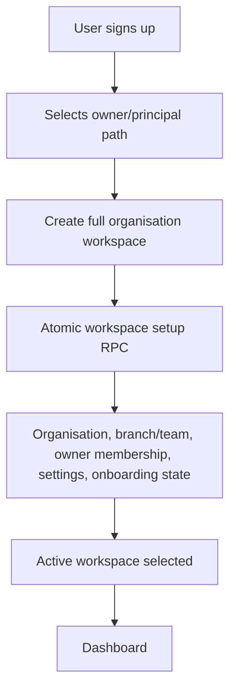
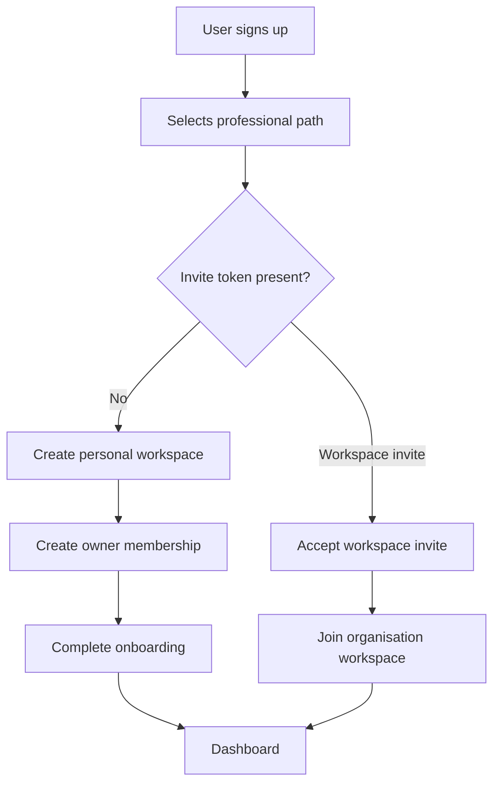
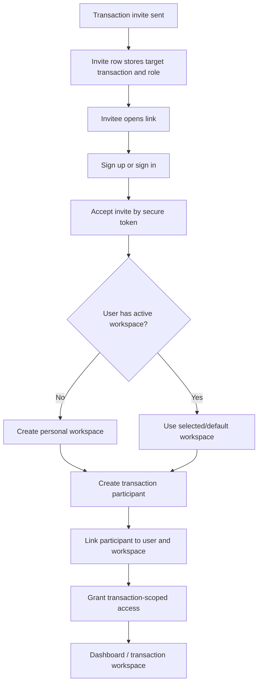
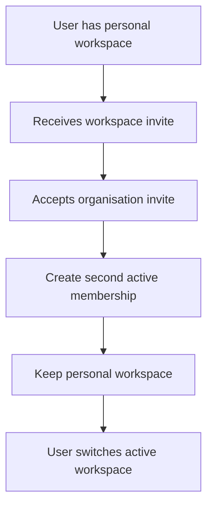
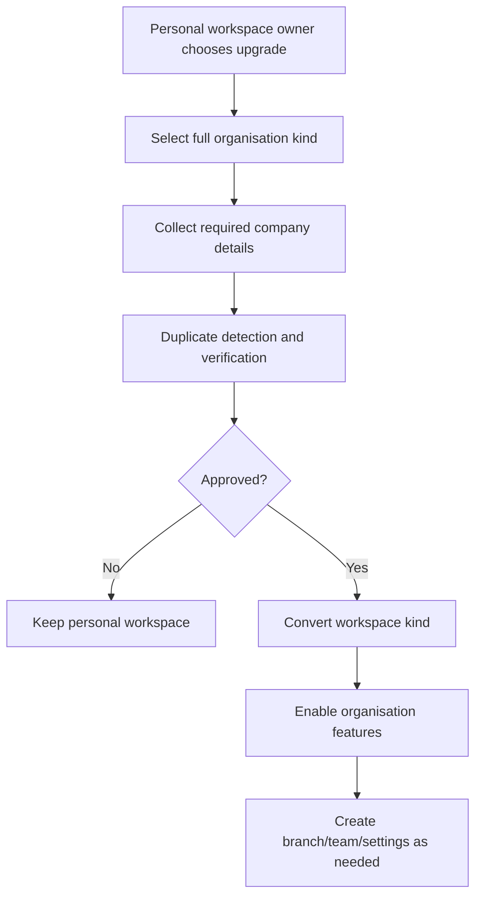

# Phase 2: Personal Workspaces and Flexible Professional Onboarding

Date: 2026-05-24

Scope: architecture and implementation plan for personal workspaces, transaction-first onboarding, multi-workspace membership, and transaction participation decoupling. This phase does not redesign CRM, analytics, transactions, or dashboards.

## Executive Summary

Phase 2 should keep one hard invariant:

Every professional user always belongs to at least one real workspace.

The change is that not every workspace is a full company. A personal workspace is still a real row in the workspace table, has a real membership, owns records, scopes storage, participates in RLS, receives audit events, and can later upgrade into or coexist with a full organisation.

Recommended model:

- Keep `public.organisations` as the internal workspace table for now.
- Add `organisations.workspace_kind`.
- Keep `organisations.type` / `workspace_type` as professional vertical.
- Treat `organisation_id` as `workspace_id` in new code while preserving the existing schema name during transition.
- Never allow production professional records to be created with `organisation_id = null`.

This lets Bridge support:

- independent estate agents
- independent attorneys/conveyancers
- independent bond originators
- independent developers/consultants
- transaction-first collaborators
- future workspace upgrades
- future workspace billing

## Core Data Model

### Workspace Type vs Workspace Kind

Current code uses `workspace_type` to mean professional vertical:

- `agency`
- `developer_company`
- `attorney_firm`
- `bond_originator`

Phase 2 adds `workspace_kind` to represent workspace shape:

- `agency`
- `attorney_firm`
- `bond_company`
- `developer`
- `personal_agent`
- `personal_attorney`
- `personal_originator`
- `personal_developer`

Recommended normalized split:

| Column | Meaning | Example |
| --- | --- | --- |
| `organisations.type` | Vertical/domain | `agency`, `attorney_firm`, `bond_originator`, `developer_company` |
| `organisations.workspace_kind` | Operating model | `personal_agent`, `agency`, `personal_attorney` |
| `organisation_users.workspace_role` | Role inside that workspace | `owner`, `principal`, `agent`, `attorney`, `consultant` |
| `transaction_participants.transaction_role` | Role inside a transaction | `listing_agent`, `transfer_attorney`, `bond_originator` |

The proposed `workspace_kind` values intentionally include full organisation kinds and personal kinds. This makes product and permission checks readable:

```js
isPersonalWorkspace(workspace.workspaceKind)
isFullOrganisationWorkspace(workspace.workspaceKind)
```

### Required Database Changes

Add to `public.organisations`:

- `workspace_kind text`
- `owner_user_id uuid references auth.users(id)`
- `upgraded_from_workspace_id uuid references public.organisations(id)`
- `converted_at timestamptz`
- `billing_owner_user_id uuid references auth.users(id)`
- `workspace_slug text`
- `personal_workspace boolean generated or derived from workspace_kind`

Add or standardise on `public.organisation_users`:

- `workspace_role text`
- `is_primary_owner boolean default false`
- `membership_source text`
- `active_workspace_selected_at timestamptz`

Add user preference storage:

- Preferred: `public.user_workspace_preferences`
  - `user_id`
  - `active_workspace_id`
  - `last_switched_at`
  - `settings_json`

Add to `public.transaction_participants`:

- `transaction_role text`
- `workspace_id uuid references public.organisations(id)`
- `participant_user_id uuid references auth.users(id)`
- `participant_status text`
- `access_scope text`
- `accepted_invite_id uuid references public.invites(id)`

Keep legacy columns during transition:

- `organisation_id`
- `organisation_users.role`
- `organisation_users.organisation_role`
- `transaction_participants.role_type`
- `transaction_participants.user_id`

## Workspace Kind Matrix

| Workspace kind | Workspace type | Default owner role | Branches | Team invites | CRM | Billing boundary |
| --- | --- | --- | --- | --- | --- | --- |
| `personal_agent` | `agency` | `agent` or `owner` | no | later | own records | user/workspace |
| `personal_attorney` | `attorney_firm` | `attorney` or `owner` | no | later | own matters/clients | user/workspace |
| `personal_originator` | `bond_originator` | `consultant` or `owner` | no | later | own applications | user/workspace |
| `personal_developer` | `developer_company` | `owner` | no | later | own deals/developments | user/workspace |
| `agency` | `agency` | `principal` | yes | yes | organisation/branch | workspace |
| `attorney_firm` | `attorney_firm` | `partner` or `owner` | departments | yes | firm matters | workspace |
| `bond_company` | `bond_originator` | `owner` | teams | yes | company applications | workspace |
| `developer` | `developer_company` | `owner` | teams | yes | portfolio | workspace |

Important: personal workspaces are not temporary guest accounts. They are durable, permissioned workspaces.

## Personal Workspace Creation

### When To Create Automatically

Create a personal workspace when:

- the user is a professional,
- no valid workspace invite is accepted,
- no full organisation creation path is chosen,
- no existing active workspace membership exists,
- onboarding is not client-only.

This applies to:

- standalone estate agent
- standalone attorney/conveyancer
- standalone bond originator
- standalone developer/operator
- invited transaction participant who is not yet a member of any workspace

### Required Service

Add a single service entry point:

```js
ensurePersonalWorkspaceForUser({ user, profile, signupIntent, transactionInvite })
```

Responsibilities:

1. Resolve professional vertical from signup intent or invite.
2. Check if the user already has an active personal workspace for that vertical.
3. Create an `organisations` row with `workspace_kind`.
4. Create an active `organisation_users` membership.
5. Create default settings.
6. Persist active workspace preference.
7. Complete onboarding if no other blocking setup is needed.
8. Record audit and onboarding events.

This must be atomic through RPC or a server-side transaction. Client-side multi-step creation is not safe enough.

### Naming Rules

Default names should be deterministic and editable later.

Examples:

- agent: `Alexander Landman Properties`
- attorney: `John Smith Conveyancing`
- originator: `Sarah Adams Home Loans`
- fallback: `Alexander Landman (Personal Workspace)`

Suggested function:

```js
buildPersonalWorkspaceName({ profile, workspaceKind })
```

The name is display-level only. Security and ownership must use workspace IDs.

## Updated Signup and Onboarding Paths

### Principal / Organisation Owner

Flow:



Output:

- Full organisation workspace.
- Owner/principal membership.
- Organisation features available.

### Independent Professional

Flow:



Output:

- Personal workspace if no organisation invite exists.
- Active workspace membership always exists.
- No pending setup dead-end for operational professionals.

### Transaction-First Invited Professional

Flow:



Output:

- Personal workspace is created automatically when needed.
- Transaction participant is linked to the user.
- Transaction access does not require agency/firm/company membership.

### Join Existing Organisation Later

Flow:



Output:

- Personal workspace remains intact.
- Organisation membership is additional.
- Records do not silently move.

### Upgrade Personal Workspace

Flow:



Output:

- Same workspace ID can evolve from `personal_agent` to `agency`, or user can create/join a separate organisation workspace.

## Multi-Workspace Membership

### Required Behaviour

A professional may belong to many workspaces, but must always have one active workspace.

Required invariant:

- `active_workspace_id` must point to an active membership for the signed-in user.
- If selected workspace is invalid, choose deterministic fallback and update persisted preference.
- If no active membership exists, create personal workspace or route to safe onboarding recovery.

### Active Workspace Resolution

Algorithm:

1. Load active memberships.
2. Load persisted `active_workspace_id`.
3. If persisted workspace is active, select it.
4. Else select:
   - personal workspace for the current signup/invite vertical, or
   - first active membership by deterministic sort.
5. Persist the selected workspace.
6. Clear workspace-scoped caches on any switch.

Workspace switch must clear:

- organisation settings cache
- CRM caches/local stores
- dashboard query state
- analytics query state
- document/listing workspace context
- notification scopes

### UI Principle

The workspace switcher should show both personal and organisation workspaces. Personal workspaces should be named plainly, not treated like a warning or degraded state.

## Transaction Participation Architecture

### Core Rule

Transaction access is granted by `transaction_participants`, not by shared workspace membership.

Workspace membership may still grant organisation-level transaction visibility for owners/managers, but cross-ecosystem collaboration must work through explicit participant rows.

### Participant Row Requirements

Each participant should store:

- transaction id
- participant user id
- participant workspace id
- participant email
- transaction role
- access scope
- status
- invite id
- capabilities:
  - `can_view`
  - `can_comment`
  - `can_upload_documents`
  - `can_manage_documents`
  - `can_update_workflow`
  - `can_view_financials`

Suggested `access_scope` values:

- `transaction_view`
- `transaction_collaborator`
- `document_collaborator`
- `workflow_participant`
- `limited_external`

### Cross-Workspace Example

Developer C owns transaction.

- Agency B has listing agent participant.
- Firm A has transfer attorney participant.
- Independent originator has personal workspace and bond originator participant.
- Buyer/seller have client portal access.

None of these parties need to share organisation membership.

## RLS Strategy

### Required RLS Sources

RLS must resolve access from three sources:

1. Active workspace membership:
   - CRM
   - team records
   - analytics
   - settings
   - workspace-owned documents

2. Record assignment:
   - assigned leads
   - assigned clients
   - assigned tasks
   - assigned appointments

3. Explicit transaction participation:
   - transaction rows
   - transaction documents
   - transaction comments
   - transaction events

### Required SQL Helpers

Add or revise:

```sql
bridge_is_workspace_member(workspace_id uuid)
bridge_workspace_role(workspace_id uuid)
bridge_workspace_kind(workspace_id uuid)
bridge_is_personal_workspace(workspace_id uuid)
bridge_can_access_workspace_record(workspace_id uuid, owner_user_id uuid, branch_id uuid, assigned_user_id uuid, scope text)
bridge_has_transaction_access(transaction_id uuid)
bridge_transaction_participant_role(transaction_id uuid)
bridge_can_access_transaction_document(transaction_id uuid, visibility_scope text, bucket_key text)
```

`bridge_has_transaction_access` already exists in RLS packs and checks `transaction_participants` by user/email. Phase 2 should make that helper the canonical transaction gateway and remove profile-role fallbacks where they can over-grant.

### RLS Rules For Personal Workspaces

Personal workspace records:

- visible to the workspace owner/member only unless explicitly shared through a transaction participant or future team invite.
- must not be visible to another organisation when the user later joins that organisation.
- may be transferred only through an explicit approved transfer flow.

Full organisation workspace records:

- visible by workspace role and scope.
- agents/staff should not inherit all CRM visibility simply by membership.

Transaction records:

- visible to participants regardless of workspace kind.
- participant access does not grant CRM/workspace access.

## Data Ownership and Migration Rules

### Ownership Model

Every workspace-owned record should have:

- `organisation_id` / workspace id
- `created_by`
- `owner_user_id` or `assigned_user_id` where applicable
- `branch_id` where applicable
- `visibility_scope`
- audit events

### Personal to Organisation Scenarios

Option A: upgrade personal workspace.

- Workspace ID stays the same.
- `workspace_kind` changes from personal to full organisation.
- Existing personal records remain in the same workspace.
- Organisation features are enabled.
- Audit event records conversion.

Option B: join existing organisation.

- Personal workspace remains.
- New organisation membership is created.
- Active workspace can switch.
- No records move automatically.

Option C: transfer selected records.

- User explicitly selects records to transfer.
- Receiving workspace admin approves.
- System writes transfer audit.
- Original workspace keeps archive/reference unless policy says otherwise.
- Transaction participation remains historically intact.

### Data That Must Not Move Silently

- leads
- contacts/clients
- appointments
- tasks
- listings
- documents
- transaction notes/comments
- analytics history

## Workspace Upgrades

### Upgrade `personal_agent` to `agency`

Requirements:

- collect legal/trading name
- registration/PPRA details
- branch setup
- principal verification
- duplicate detection
- billing owner confirmation

After upgrade:

- workspace kind becomes `agency`
- owner role becomes `principal` or `owner`
- branch features enabled
- team invite features enabled
- organisation CRM scopes enabled

### Upgrade `personal_attorney` to `attorney_firm`

Requirements:

- firm legal name
- LPC/registration details
- departments
- partner/admin role
- duplicate detection

### Upgrade `personal_originator` to `bond_company`

Requirements:

- company legal name
- FSP details
- consultants/team
- duplicate detection

### Upgrade `personal_developer` to `developer`

Requirements:

- developer company profile
- billing/ownership
- project/team setup
- duplicate detection

## Invite Architecture Updates

Phase 2 depends on the Phase 1 unified invite architecture.

`invites` must support:

- workspace invite only
- transaction invite only
- workspace plus transaction invite
- client invite
- branch/team invite

Transaction invite fields:

- `target_transaction_id`
- `target_transaction_role`
- `target_workspace_id` of inviter/owning workspace
- `invitee_workspace_kind_hint`
- `invitee_workspace_type_hint`
- `metadata`

Acceptance behaviour:

1. Validate token, status, expiry, email.
2. Ensure user exists.
3. Ensure personal workspace exists if no active workspace exists.
4. Create/activate transaction participant.
5. Create workspace membership only if invite includes workspace membership.
6. Mark invite accepted.
7. Record audit.

## Onboarding Routing Updates

### Signup Intent Changes

Add workspace actions:

- `create_organisation_workspace`
- `create_personal_workspace`
- `accept_workspace_invite`
- `accept_transaction_invite`
- `accept_workspace_and_transaction_invite`

Or keep existing actions and add:

- `workspace_kind_hint`
- `personal_workspace_allowed`
- `transaction_invite_token`

Recommended simpler path:

- keep `workspace_action`
- add `workspace_kind_hint`
- add `invite_type`

Examples:

| Signup path | Current action | Phase 2 result |
| --- | --- | --- |
| agency owner | `create_workspace` | create `agency` full workspace |
| agency operational without invite | `join_or_request_workspace` | create `personal_agent` workspace |
| attorney operational without invite | `join_or_request_workspace` | create `personal_attorney` workspace |
| bond operational without invite | `join_or_request_workspace` | create `personal_originator` workspace |
| transaction invite | `accept_invite` | create personal workspace if needed, join transaction |

### Post-Signup Resolver

Add:

```js
resolvePostSignupWorkspaceAction({ user, profile, signupIntent, inviteContext })
```

Order:

1. If transaction invite token exists, accept transaction invite.
2. If workspace invite token exists, accept workspace invite.
3. If full organisation owner path, create organisation workspace.
4. If professional operational path and no invite, create personal workspace.
5. If client path, route to client portal flow.
6. If ambiguity remains, route to setup recovery.

## Dashboard Loading

Dashboard services must use active workspace context.

Rules:

- No `organisation_id = null`.
- No `organisation_id = "default"`.
- No implicit `all` workspace for record writes.
- Personal workspace dashboard should show the same module shell with personal scopes.
- Full organisation dashboard may show wider team/branch analytics based on role.
- Transaction-first users may land on transaction workspace if that was the invite source.

## Billing Preparation

Phase 2 does not implement billing, but must make billing possible.

Add workspace billing boundaries:

- `billing_owner_user_id`
- `workspace_plan_key`
- `billing_status`
- `subscription_id` later

Billing-ready principles:

- Personal workspace is billable independently.
- Full organisation workspace is billable independently.
- A user can belong to multiple billable workspaces.
- Transaction participation does not automatically make a participant billable in the owning workspace.
- Record ownership and audit must identify which workspace incurred usage.

## Implementation Plan

### Step 1: Schema Foundation

Migrations:

- add `workspace_kind`
- add user workspace preferences
- add canonical personal workspace constraints
- add transaction participant canonical fields
- add invite fields needed for transaction-first onboarding

Backfill:

- existing agency orgs -> `workspace_kind = agency`
- existing attorney firms if stored outside organisations -> compatibility bridge or migrate to organisations
- existing bond/developer orgs -> matching full workspace kind

### Step 2: Constants and Role Resolution

Update:

- `workspaceTypes.js`
- new `workspaceKinds.js`
- signup intent mapping
- role resolver
- permission resolver
- auth boot normalisation

### Step 3: Personal Workspace Service

Add:

- `personalWorkspaceService`
- `ensurePersonalWorkspaceForUser`
- `buildPersonalWorkspaceName`
- RPC wrapper for atomic creation

### Step 4: Onboarding Resolver

Update:

- `Auth.jsx`
- `AuthCallback.jsx`
- `OnboardingProfileSetup.jsx`
- `PostDashboardSetup.jsx`
- `workspaceService.js`

Goal:

- independent professional signup creates personal workspace automatically.
- no operational professional gets stuck waiting unless they explicitly request a full organisation membership.

### Step 5: Transaction Invite Acceptance

Add:

- unified transaction invite acceptance path
- transaction participant linking
- post-accept routing to transaction/dashboard

### Step 6: Workspace Switching

Update:

- `AuthSessionContext`
- `WorkspaceContext`
- `OrganisationContext`
- `WorkspaceSwitcher`

Goal:

- active workspace persisted server-side.
- all workspace caches clear on switch.
- personal/full workspace labels and permissions resolve correctly.

### Step 7: RLS Refactor

Update policies by group:

1. workspace-owned CRM tables
2. transaction tables
3. documents/comments/events
4. appointments/tasks
5. settings/team/branches

Do this with SQL helpers, not duplicated policy logic.

### Step 8: Upgrade and Transfer Flows

Add backend support first:

- `workspace_upgrade_requests`
- `workspace_record_transfer_requests`
- audit events

UI can remain minimal until product design catches up.

## Risks

High risk:

- Broad `bridge_is_active_member(organisation_id)` policies could overexpose personal workspace records after users join organisations.
- Legacy local/demo/default fallbacks can hide missing workspace context.
- Transaction participant access currently contains profile-role fallback logic that may over-grant if not tightened.
- Attorney firms currently have a parallel membership/invite system.

Medium risk:

- Dashboard assumptions may expect branches/team metrics.
- Organisation settings loaders may assume full agency settings.
- Analytics may treat personal workspaces as organisations with team scope.

Low risk:

- Personal workspace naming and display labels.
- Workspace switcher UI labels.

## Success Criteria Mapping

| Success criterion | Architecture requirement |
| --- | --- |
| Any professional can join independently | automatic personal workspace creation |
| Personal workspaces work reliably | real workspace row, membership, settings, active workspace |
| Users no longer require full organisations | operational signup creates personal workspace |
| Transaction-first onboarding works | unified invites + personal workspace + participant linking |
| Multi-workspace membership works | persisted active workspace and deterministic switching |
| Transaction access decoupled | RLS based on `transaction_participants` |
| RLS supports personal workspaces | workspace-kind-aware and scope-aware policies |
| Onboarding friction drops | post-signup resolver creates/joins automatically |
| Platform becomes ecosystem-scalable | workspaces, memberships, invites, and transactions are independent but composable |

## Recommended Product Defaults

1. Independent agent signup creates `personal_agent`.
2. Independent attorney signup creates `personal_attorney`.
3. Independent bond originator signup creates `personal_originator`.
4. Independent developer signup creates `personal_developer`.
5. A transaction invite always creates a personal workspace if the professional has no active workspace.
6. Joining a company later does not delete or merge the personal workspace.
7. Upgrading a personal workspace is explicit and audited.
8. Moving records between workspaces is explicit and approved.
9. Personal workspaces are billable units later.

## Open Decisions

1. Should workspace kind values use business nouns (`personal_originator`) or shape plus vertical (`personal` + `bond_originator`)?
2. Should `organisations.type` be renamed to `workspace_type` in a later cleanup?
3. Should attorney firms move fully into `organisations` before personal attorney launch?
4. Should independent professionals be able to invite staff into personal workspaces, or must they upgrade first?
5. Should transaction-first users land directly on the transaction or on the dashboard with the transaction highlighted?
6. What fields are mandatory before converting personal workspace into a full organisation?

