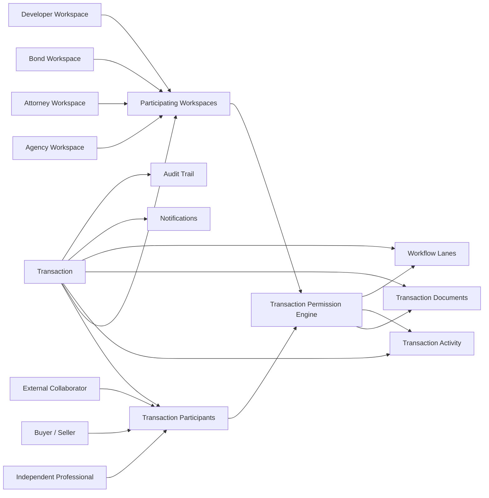
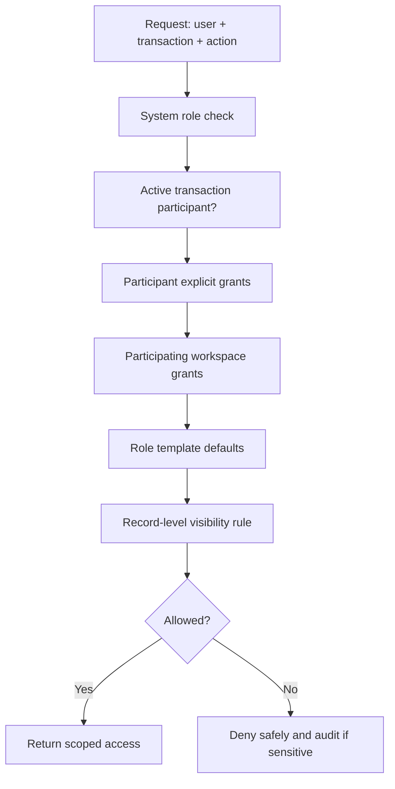
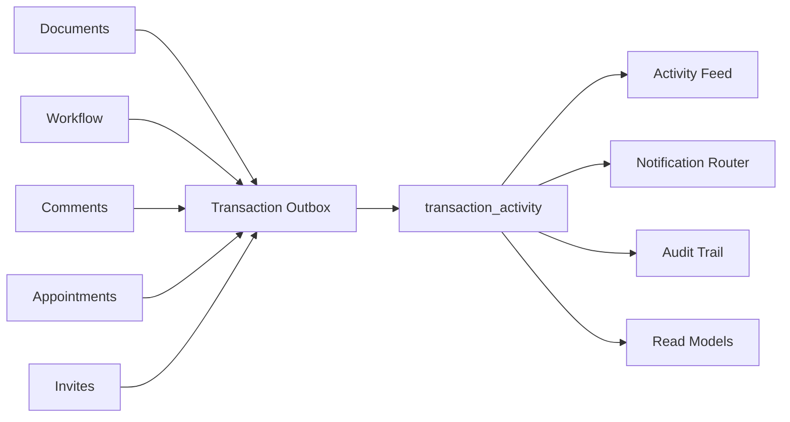
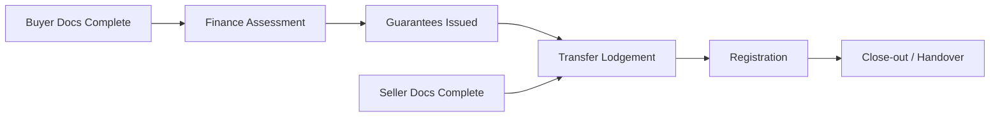

# Phase 3: Transaction Network Architecture & Cross-Organisation Collaboration

## Objective

Phase 3 moves Bridge from workspace-centred SaaS into a transaction collaboration network.

The target architecture is:

- transactions are first-class collaboration containers;
- workspaces participate in transactions instead of owning all transaction visibility;
- professionals, clients, and external collaborators receive transaction-scoped access through `transaction_participants`;
- documents, comments, timelines, workflow lanes, notifications, and audit trails resolve from transaction participation;
- organisation/workspace membership continues to control internal CRM, analytics, team management, billing, and workspace records.

This phase is architectural enablement only. It does not redesign CRM, dashboards, analytics, AI, or the full workflow automation engine.

## Current-State Audit

### What Already Exists

Bridge already has several transaction-network building blocks:

- `transactions` is the main transaction record, with `organisation_id`, `development_id`, assigned role emails, stage fields, lifecycle fields, and workflow metadata.
- `transaction_participants` exists with `transaction_id`, `user_id`, `participant_email`, `role_type`, `legal_role`, invitation token fields, status fields, visibility scope, and capability booleans.
- RLS helper `bridge_has_transaction_access(transaction_id)` already grants access through `transaction_participants.can_view`.
- RLS helper functions also exist for lane-level actions: finance lane, attorney lane, handover, snags, document approval, client contact visibility.
- `transaction_comments` and `transaction_events` exist and are protected through transaction access.
- `documents` has transaction linkage, document status, `visibility_scope`, `bucket_key`, owner role, uploaded/approved metadata, and versioning columns.
- Workflow foundations exist through `transaction_subprocesses`, `transaction_subprocess_steps`, `transaction_workflow_lanes`, `workflow_templates`, `workflow_audit_log`, `workflow_alerts`, and `workflow_generated_tasks`.
- `security_audit_events` exists for workspace-level security audit logging.
- Client portal notifications map next actions and activity feed events into client-visible notifications.

### Source Evidence Reviewed

Key implementation points reviewed:

- `the-it-guy/sql/schema.sql`: `transactions`, `transaction_participants`, `transaction_comments`, `transaction_events`, indexes, and RLS enablement.
- `the-it-guy/sql/bridge_rls_pack_1_safe.sql`: `bridge_has_transaction_access`, document access, lane edit, transaction comment/event policies, and document policies.
- `the-it-guy/sql/bridge_migration_pack_1.sql`: participant capability extensions, document visibility/versioning, transaction subprocesses, and subprocess steps.
- `supabase/migrations/202605210003_workflow_engine_phase2.sql`: workflow templates, workflow audit, workflow generated tasks, alerts, and transaction workflow lanes.
- `supabase/migrations/202605240003_permission_audit_foundation.sql`: `security_audit_events`.
- `the-it-guy/src/services/transactionWorkflowReadModelService.js`: lane read model, participants, events, checklist items, document requests, and workflow warnings.
- `the-it-guy/src/services/clientPortalNotificationsService.js`: notification normalization and activity-feed-to-client-notification mapping.
- `the-it-guy/src/services/auditLogService.js`: security, workspace, transaction, and permission audit event writer.

### Current Coupling & Fragility

The current implementation is only partially transaction-centric.

Major issues:

- `transactions.organisation_id` still acts as an ownership anchor in many product flows.
- `bridge_has_transaction_access` grants participant access, but still falls back to profile role plus assigned email columns on `transactions`.
- `transaction_participants.role_type` is constrained to broad app-style roles (`developer`, `agent`, `attorney`, `bond_originator`, `client`, `buyer`, `seller`, `internal_admin`) instead of transaction-specific roles (`listing_agent`, `transfer_attorney`, `bond_attorney`, etc.).
- `transaction_participants` has useful capability booleans, but they are not yet a complete permission engine.
- There is no canonical `workspace_id` on `transaction_participants`; `firm_id` handles attorney firms only.
- Participant uniqueness is currently `(transaction_id, role_type, legal_role)`, which prevents multiple agents, multiple attorneys, or multiple external collaborators in the same role category.
- Documents use broad role and bucket visibility rather than explicit participant or workspace grants.
- Activity is fragmented across `lead_activities`, `transaction_events`, `transaction_comments`, workflow audit rows, document packet histories, appointment flows, client portal notifications, and local audit utilities.
- Workflow audit and workflow templates remain organisation-scoped, which makes cross-organisation transaction orchestration awkward.
- Notifications are module-specific instead of event-driven from a canonical transaction event stream.
- Audit is split between workspace security audit, workflow audit, transaction events, document histories, and UI-local audit helpers.

## Target Architecture

### Core Principle

Transactions become shared collaboration containers.

Workspaces do not own transaction access. Workspaces may originate, steward, administer, or participate in a transaction, but user access must come from explicit transaction participation or a transaction-scoped grant.

## Recommended Data Model

### `transactions`

Keep the existing table, but reduce `organisation_id` from a security boundary to metadata.

Recommended new/renamed concepts:

- `originating_workspace_id`: workspace that created the transaction.
- `steward_workspace_id`: workspace currently responsible for transaction administration.
- `transaction_type`: resale, developer sale, private sale, transfer, rental, etc.
- `network_status`: active, paused, cancelled, completed, archived.
- `visibility_model`: participant_scoped, client_portal_enabled, restricted.

Do not remove `organisation_id` immediately. Treat it as legacy-compatible `originating_workspace_id` until migration is complete.

### `transaction_workspaces`

Create a canonical workspace participation table.

Suggested fields:

- `id`
- `transaction_id`
- `workspace_id`
- `workspace_role`
- `status`
- `invited_by_user_id`
- `invited_at`
- `accepted_at`
- `removed_at`
- `permissions_json`
- `metadata`
- `created_at`
- `updated_at`

Example `workspace_role` values:

- `originating_agency`
- `participating_agency`
- `developer`
- `transfer_firm`
- `bond_firm`
- `bond_originator_company`
- `external_company`

This lets Bridge say: Firm B participates in Transaction X without making every Firm B user visible.

### `transaction_participants`

This should become the canonical collaboration layer.

Recommended fields:

- `id`
- `transaction_id`
- `workspace_id` nullable for clients/external individuals
- `user_id` nullable until accepted
- `participant_email`
- `participant_phone`
- `participant_name`
- `participant_type`
- `transaction_role`
- `status`
- `access_scope`
- `permissions_json`
- `document_permissions_json`
- `workflow_permissions_json`
- `visibility_rules_json`
- `invited_by_user_id`
- `invite_id`
- `accepted_at`
- `removed_at`
- `expires_at`
- `metadata`
- `created_at`
- `updated_at`

Recommended `participant_type`:

- `professional`
- `client`
- `workspace_member`
- `external_collaborator`
- `system`

Recommended `transaction_role`:

- `listing_agent`
- `selling_agent`
- `principal`
- `buyer`
- `seller`
- `transfer_attorney`
- `bond_attorney`
- `bond_originator`
- `developer_rep`
- `municipal_contact`
- `inspector`
- `external_collaborator`
- `observer`

Recommended statuses:

- `invited`
- `pending`
- `active`
- `declined`
- `removed`
- `completed`
- `expired`

Important migration note: replace the unique constraint `(transaction_id, role_type, legal_role)` with a uniqueness model that supports multiple participants per role. Use partial unique indexes only where needed, such as one `primary` participant per role when the product requires it.

### `transaction_permission_grants`

For long-term scalability, do not keep adding boolean columns to `transaction_participants`.

Suggested table:

- `id`
- `transaction_id`
- `participant_id`
- `workspace_id`
- `permission_key`
- `scope`
- `allowed`
- `expires_at`
- `granted_by_user_id`
- `metadata`
- `created_at`

This allows explicit grants and revocations without schema churn.

Capability keys:

- `transaction.view`
- `transaction.comment`
- `transaction.invite_participant`
- `transaction.remove_participant`
- `transaction.edit_core`
- `transaction.view_client_contact`
- `transaction.edit_client_contact`
- `workflow.view_lane`
- `workflow.edit_finance_lane`
- `workflow.edit_transfer_lane`
- `workflow.edit_registration_lane`
- `documents.upload`
- `documents.view_shared`
- `documents.view_sensitive`
- `documents.approve`
- `documents.request`
- `timeline.view_shared`
- `timeline.post_shared`
- `audit.view`

## Transaction Permission Engine

Permission resolution should be layered.

Resolution order:

1. System admin override.
2. Active transaction participant grant.
3. Active participating workspace grant.
4. Transaction role default permission template.
5. Record-level visibility rule.
6. Token/client portal scoped access.
7. Deny.

Rules:

- Workspace membership alone must not grant transaction access.
- Transaction participation must not grant workspace CRM, analytics, or team data.
- Assigned email columns on `transactions` should become migration fallbacks only.
- RLS should call one canonical permission function, not many role-specific fallbacks.

Recommended core functions:

- `bridge_has_transaction_permission(transaction_id, permission_key)`
- `bridge_has_transaction_participation(transaction_id)`
- `bridge_can_view_transaction_record(transaction_id, record_type, record_id)`
- `bridge_can_mutate_transaction_record(transaction_id, record_type, record_id, action)`

## Cross-Organisation Collaboration Model

### Collaboration Rules

One transaction may include:

- Agency A
- Attorney Firm B
- Bond Originator C
- Developer D
- Independent Agent E
- Buyer F
- Seller G
- External temporary collaborators

They should collaborate inside one transaction record, not duplicated records.

### Visibility Boundaries

Workspace-scoped data:

- internal CRM notes
- private leads
- workspace analytics
- team performance
- internal tasks
- billing
- workspace settings

Transaction-scoped data:

- shared timeline
- shared documents
- participant comments
- workflow lane statuses
- milestone updates
- client-visible progress
- transaction audit trail

Private transaction data:

- workspace-private notes about the transaction
- internal legal notes
- sensitive financial data
- restricted documents
- participant-specific comments

## Shared Activity Architecture

Create a canonical append-only `transaction_activity` stream.

Suggested fields:

- `id`
- `transaction_id`
- `actor_user_id`
- `actor_workspace_id`
- `actor_participant_id`
- `event_type`
- `subject_type`
- `subject_id`
- `visibility_scope`
- `audience_json`
- `payload_json`
- `correlation_id`
- `source_module`
- `occurred_at`
- `created_at`

Visibility scopes:

- `internal_workspace`
- `transaction_shared`
- `role_scoped`
- `participant_scoped`
- `client_visible`
- `system_private`

This replaces or unifies:

- `transaction_events`
- parts of `transaction_comments`
- workflow audit transaction entries
- document packet lifecycle events
- appointment transaction events
- client portal activity feed source events

Do not delete existing tables in Phase 3. Introduce `transaction_activity` as the canonical write target and backfill/read from legacy sources until read models are migrated.

## Document Collaboration Layer

Documents must be separated into:

- workspace documents;
- transaction documents;
- client portal documents;
- restricted sensitive documents.

Recommended additions:

### `document_access_grants`

- `id`
- `document_id`
- `transaction_id`
- `participant_id`
- `workspace_id`
- `role_key`
- `permission_key`
- `granted_by_user_id`
- `expires_at`
- `metadata`
- `created_at`

### Document Visibility Policy

Visibility modes:

- `workspace_private`
- `transaction_shared`
- `role_scoped`
- `named_participants`
- `client_visible`
- `sensitive_restricted`

Rules:

- Participant transaction access does not automatically mean all document access.
- Sensitive documents require role, participant, or explicit grant checks.
- Document views and downloads should emit audit events.
- Document uploads should emit both activity and audit events.

## Workflow Orchestration Architecture

Current workflow foundations are useful, but they remain too organisation-oriented.

Target concept:

- transaction-level workflow lanes;
- participant-owned lane actions;
- dependency-aware milestones;
- event-driven status updates;
- no full automation engine yet.

Recommended lanes:

- `sale`
- `finance`
- `transfer`
- `bond`
- `signing`
- `registration`
- `handover`
- `client_onboarding`

Recommended dependency table:

### `transaction_workflow_dependencies`

- `id`
- `transaction_id`
- `source_type`
- `source_id`
- `target_type`
- `target_id`
- `dependency_type`
- `blocking`
- `status`
- `created_at`
- `resolved_at`
- `metadata`

Examples:

- finance lane cannot complete until buyer FICA complete;
- transfer lane cannot lodge until guarantees received;
- registration cannot complete until transfer and bond close-out complete.

Phase 3 should define the dependency model and read model. It should not yet build full automated workflow execution.

## External Collaboration & Limited Access

Bridge should support temporary or limited participants without requiring workspace membership.

Recommended model:

- create `transaction_participants` row with `participant_type = external_collaborator`;
- link invite through unified `invites`;
- set `expires_at` where temporary;
- grant explicit permissions only;
- block workspace CRM, analytics, and team visibility;
- emit audit events for invite, acceptance, document access, comments, and removal.

External collaborator examples:

- inspector;
- municipal officer;
- mortgage specialist;
- contractor;
- valuation specialist;
- temporary consultant.

## Event & Notification Architecture

Notifications should become consumers of transaction activity, not module-specific side effects.

Suggested tables:

### `notification_subscriptions`

- `id`
- `user_id`
- `participant_id`
- `workspace_id`
- `transaction_id`
- `channel`
- `event_filter_json`
- `enabled`
- `created_at`

### `notification_deliveries`

- `id`
- `activity_id`
- `recipient_user_id`
- `recipient_participant_id`
- `channel`
- `status`
- `dedupe_key`
- `sent_at`
- `read_at`
- `metadata`

Channels:

- in-app
- email
- WhatsApp
- client portal
- push later

Notification rules should be policy driven:

- participant invited;
- comment shared;
- document requested;
- document uploaded;
- document approved/rejected;
- stage changed;
- appointment requested/confirmed/rescheduled;
- finance approved;
- transfer lodged;
- registration completed.

## Audit & Compliance Architecture

Current audit is split. Phase 3 should standardise transaction auditability.

Recommended audit model:

- `transaction_activity` for user-facing and operational history;
- `security_audit_events` or a new `transaction_audit_events` table for compliance-grade immutable audit;
- document access logs for sensitive document views/downloads;
- workflow audit entries bridged into transaction activity.

Audit coverage must include:

- participant invited;
- participant accepted;
- participant removed;
- permission granted/revoked;
- document uploaded;
- document viewed/downloaded;
- document visibility changed;
- comment added/deleted;
- workflow lane changed;
- stage changed;
- finance approved;
- transfer lodged;
- registration completed;
- client data viewed where sensitive.

Recommended fields for compliance audit:

- `id`
- `transaction_id`
- `actor_user_id`
- `actor_workspace_id`
- `actor_participant_id`
- `action`
- `target_type`
- `target_id`
- `before_json`
- `after_json`
- `ip_address`
- `user_agent`
- `metadata`
- `created_at`

## Data Ownership & Transaction Sovereignty

Recommended ownership model:

- The transaction record is a shared collaboration container.
- The originating workspace owns creation provenance, not exclusive visibility.
- Participating workspaces own their private internal notes and internal CRM links.
- Participants own or are accountable for their contributed artifacts.
- Shared transaction activity is immutable collaboration history.
- Document ownership is separate from document visibility.
- Archival and retention rules must be transaction-level, with per-document sensitivity overrides.

No participant should be able to delete shared history unilaterally. Removal should revoke future access while preserving audit history.

## RLS Alignment Plan

Replace broad role and assigned-email fallbacks with participant-first checks.

Target policies:

- `transactions`: select via `bridge_has_transaction_permission(id, 'transaction.view')`.
- `transaction_participants`: select only participants visible to the requester; mutate only with `transaction.invite_participant` or `transaction.remove_participant`.
- `documents`: select via document grants and `documents.view_*` permissions.
- `transaction_activity`: select by activity visibility plus participant grant.
- `transaction_comments`: migrate into activity or protect by comment-specific permissions.
- `transaction_events`: keep as legacy compatibility or system-only event table.
- `transaction_subprocesses`: select/edit via workflow lane permissions.
- `transaction_workflow_lanes`: remove organisation-only dependency for transaction flows.

Assigned email fallbacks should be migration-only and eventually removed.

## Scalability Preparation

Expected bottlenecks:

- RLS functions that perform repeated participant lookups;
- activity feeds with high write volume;
- notifications fan-out;
- document grant checks;
- workflow lane read models;
- cross-workspace transaction lists.

Recommended mitigations:

- indexes on `(transaction_id, user_id)`, `(transaction_id, participant_email)`, `(transaction_id, workspace_id)`, and `(transaction_id, status)`;
- materialized/current-state read models for transaction dashboards;
- append-only event outbox for async notifications;
- partition or archive `transaction_activity` and audit tables by time;
- cache permission summaries per `(user_id, transaction_id)`;
- keep RLS helper functions stable, simple, and index-friendly.

## Migration Strategy

### Step 1: Canonicalize Participation

- Add `workspace_id`, `participant_type`, `transaction_role`, `permissions_json`, and `expires_at` to `transaction_participants`.
- Backfill from `role_type`, `legal_role`, assigned email columns, attorney assignment rows, and client records.
- Replace restrictive role uniqueness with primary-role flags and partial indexes.

### Step 2: Introduce Transaction Permission Engine

- Add canonical permission resolver functions.
- Map existing booleans to permission keys.
- Keep existing booleans during migration, but treat them as derived/legacy.

### Step 3: Add `transaction_workspaces`

- Backfill originating agency/developer/firm workspace participation.
- Use this for cross-organisation workspace presence without granting every workspace member access.

### Step 4: Add `transaction_activity`

- Start dual-writing from comments, documents, workflow, invites, appointments, and client portal actions.
- Build read model from `transaction_activity`, with fallback to legacy sources during transition.

### Step 5: Add Document Grants

- Add `document_access_grants`.
- Convert broad document visibility into explicit role/workspace/participant grants.
- Audit document views/downloads.

### Step 6: Event-Driven Notifications

- Add notification subscriptions and deliveries.
- Route notifications from `transaction_activity` instead of direct module calls.

### Step 7: Workflow Dependency Model

- Add `transaction_workflow_dependencies`.
- Keep existing lanes and subprocesses, but connect blockers and milestones through dependencies.

### Step 8: RLS Migration

- Move all transaction tables to permission-engine policies.
- Remove demo/open policies and assigned-email fallbacks once backfill is complete.

## Product Decisions Required

Before implementation, decide:

- Can multiple participants hold the same transaction role?
- Which roles are allowed to invite/remove participants?
- Which document classes are client-visible by default?
- Which actions create immutable audit events?
- Who can close/archive a shared transaction?
- What happens to transaction access after a participant leaves their workspace?
- How long should temporary external collaborator access last?
- Whether transaction stewardship can transfer from one workspace to another.

## Risk Report

High-risk current behaviours:

- Assigned-email fallback can grant access outside explicit participant state.
- Broad document role visibility may overexpose sensitive files.
- Organisation-scoped workflow/audit rows complicate cross-organisation collaboration.
- Multiple activity sources make audit completeness hard to prove.
- Existing participant uniqueness blocks realistic multi-party structures.
- Demo/open RLS policies in staging SQL must never reach production.
- Notification side effects can drift from the true transaction state.

Migration risks:

- Backfilling participants incorrectly could expose historical transactions.
- Removing assigned-email fallbacks too early could lock out valid users.
- Event dual-write may create duplicate timeline entries without correlation IDs.
- Document grants require careful defaults to avoid over-tightening or overexposure.

## Final Architecture Summary

Phase 3 should make these statements true:

- A transaction can include many workspaces, many professionals, clients, and external collaborators.
- Transaction access is granted by active transaction participation, not shared organisation membership.
- Documents, comments, workflow lanes, notifications, and activity feeds are transaction-scoped.
- Workspace membership controls internal workspace systems only.
- Transaction activity becomes the canonical timeline, audit source, and notification trigger.
- External collaborators can participate safely with limited permissions.
- Bridge can scale into a property transaction network without duplicating transactions across organisations.
