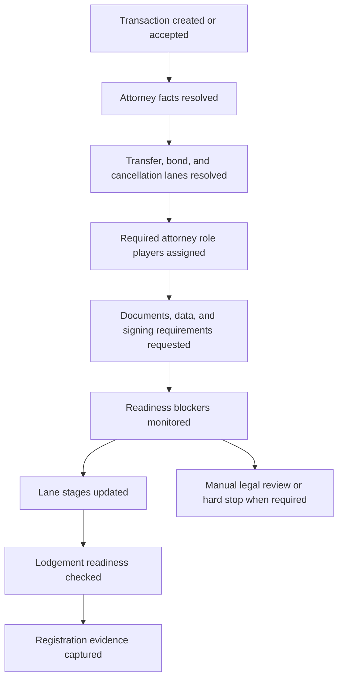

# Attorney Workflow Contract Phase 0

Implemented on 2026-07-12.

## Goal

Lock the attorney module workflow contract before P0/P1 remediation begins. This phase defines what the attorney module must support, which scenarios are automated, which require manual review, which must stop, and which UI surfaces must provide recovery paths so transactions do not get stuck.

Phase 0 is a contract-lock implementation. It does not change runtime behavior.

## Launch Story

The attorney pilot journey starts when a transaction requires legal handling and ends when transfer, bond, and cancellation work is either registered/closed, manually reviewed, or stopped with a clear reason.

## In Scope

| Area | Locked scope |
| --- | --- |
| Lane resolution | Transfer is always required. Bond is required for bond/hybrid finance. Cancellation is required when seller existing bond/cancellation is flagged. |
| Attorney assignments | Primary and supporting transfer, bond, and cancellation attorneys must be modeled with firm, department, and staff context. |
| Document requirements | Transfer, FICA, entity authority, property compliance, bond, cancellation, development, VAT, and signing requirements must resolve from transaction facts. |
| Complex parties | Companies, trusts, married persons, co-owners, directors, trustees, spouses, and beneficial owners must have clear requirement ownership. Person-level UX lands in Phase 6, but Phase 0 locks it as a non-negotiable contract. |
| Blockers | Missing assignment, missing/rejected document, unsigned document, inactive matter, manual blocker, and missing data must be visible and recoverable. |
| Manual review | Foreign parties, close corporations, POA, minors, curatorship, insolvency, deceased-estate buyer, commercial condition ambiguity, and unknown branches must not silently proceed as normal automation. |
| Unsupported stop | Business rescue/liquidation and other unsupported legal states must stop automated progression until a conveyancer explicitly handles the matter. |

## Out Of Scope

- Wiring every queue shortcut action. That is Phase 1.
- Replacing the Phase 1 shared editing flag. That is Phase 2.
- Creating the final aggregate launch gate. That is Phase 3.
- Proving a live staging multi-firm transaction. That is Phase 4.
- Building the real appointment wizard. That is Phase 5.
- Rendering every director/trustee/spouse as attorney sub-rows. That is Phase 6.

## Source Of Truth Map

| Domain | Source of truth |
| --- | --- |
| Phase 0 scenario matrix | `src/core/attorney/attorneyWorkflowLaunchContract.js` |
| Transaction fact resolution | `src/services/attorneyWorkflow/transactionFactsResolver.js` |
| Lane resolution | `src/services/attorneyWorkflow/attorneyWorkflowResolver.js` |
| Attorney document fallback | `src/services/attorneyWorkflow/attorneyDocumentRequirementsResolver.js` |
| Canonical document cardinality | `src/core/legal/legalRequirementCardinality.js`, purchaser/seller requirement engines, and canonical document services |
| Manual-review/unsupported boundary | `src/core/legal/legalScenarioMatrix.js` |
| Readiness blockers | `src/services/attorneyWorkflow/attorneyReadinessEngine.js` |
| Assignment service | `src/services/transactionAttorneyAssignments.js` |
| Partner invite role profiles | `src/services/transactionPartnerInvitationService.js`, `src/lib/invitationAcceptanceContract.js` |

## Scenario Matrix

| Scenario | Automation | Required lanes | Required document families | Practical recovery |
| --- | --- | --- | --- | --- |
| Transfer only, cash, individual buyer and seller | Automated | Transfer | OTP, buyer/seller FICA, marital status, rates, transfer docs, compliance certs | Assign transfer attorney, request docs, schedule transfer signing, manage lodgement. |
| Transfer and bond, company buyer, sectional title | Automated | Transfer, bond | Company registration, director IDs, company resolution, beneficial ownership, bank requirements, bond instruction, guarantees, body corporate clearance | Assign transfer and bond attorneys, request company authority, manage bank conditions and bond signing. |
| Transfer and cancellation, married seller with existing bond | Automated | Transfer, cancellation | Seller marital status, cancellation instruction, bond account, cancellation figures, cancellation guarantees, bank cancellation docs | Assign cancellation attorney, request figures, monitor notice/expiry, manage cancellation signing. |
| Transfer, bond, and cancellation with trust buyer/seller | Automated | Transfer, bond, cancellation | Trust deeds, letters of authority, trustee IDs, trustee resolutions, bank requirements, cancellation figures, sectional title clearances | Assign all legal lanes, request trust authority, coordinate bank/cancellation readiness, then lodgement. |
| Development sale with company buyer/seller | Automated | Transfer | Developer sale pack, unit schedule, developer signing authority, company resolutions, director IDs | Request developer pack, confirm company authority, prepare transfer docs. |
| Commercial company parties with unknown finance | Manual review | Transfer until finance clarified | Company authority, VAT, leases/occupancy, commercial property evidence | Capture finance, VAT, and suspensive-condition facts before normal automation. |
| Close corporation party | Manual review | Transfer | Company-like fallback docs plus CC/member authority review | Do not rely on company aliasing alone; conveyancer must confirm member authority. |
| Foreign individual buyer | Manual review | Transfer | Baseline individual docs plus source-of-funds/exchange-control review | Capture compliance facts and pause for legal review. |
| Business rescue or liquidation | Unsupported | Transfer may be technically resolvable, but automation must stop | Baseline docs may appear, but hard-stop reason is required | Stop automated progression and escalate to conveyancer review. |

## Lane Contract

| Lane | Attorney role | Required when | Pilot expectation |
| --- | --- | --- | --- |
| Transfer | `transfer_attorney` | Every sale transaction | Must be visible on all attorney matters and transaction detail. |
| Bond | `bond_attorney` | Finance type is `bond` or `hybrid` | Must be assignable/invitable and must have separate document/signing workflow. |
| Cancellation | `cancellation_attorney` | Seller existing bond or cancellation flag is true | Must be assignable/invitable and must not be hidden just because incoming queue is transfer-focused. |

## Blocker And Recovery Contract

| Blocker | Minimum severity | Owner | Required action |
| --- | --- | --- | --- |
| Missing assignment | Critical | Management | Assign attorney. |
| Missing document | Medium | Request owner | Request document. |
| Rejected document | High | Attorney | Review or re-request document. |
| Unsigned document | Medium | Client/attorney | Manage signing. |
| Inactive matter | High after 10 days, critical after 21 days | Attorney | Capture progress update or blocker. |
| Manual blocker | Medium | Blocker owner | Resolve, reopen, or escalate. |
| Missing data | Medium | Attorney | Capture required data before advancing. |

## Permission Contract

Phase 0 locks the intended permission shape; Phase 2 implements the code change.

| Role | May edit | May view | Override |
| --- | --- | --- | --- |
| Transfer attorney | Transfer lane | Required matter lanes | Firm admin/director partner |
| Bond attorney | Bond lane | Required matter lanes | Firm admin/director partner |
| Cancellation attorney | Cancellation lane | Required matter lanes | Firm admin/director partner |

Phase 2 closed the known P0 risk by removing the temporary `PHASE_ONE_SHARED_WORKFLOW_EDITING` branch and binding lane mutation rights to assigned lane/firm scope.

## Manual Review And Unsupported Boundary

Manual-review cases collect intake and block normal progression until a conveyancer records the decision:

- foreign buyer/seller or foreign entity
- close corporation
- power of attorney
- minor
- curatorship
- insolvency/sequestration
- deceased-estate buyer
- unusual commercial conditions or unknown finance

Unsupported cases stop automated progression:

- business rescue
- liquidation
- share block or other unsupported property structures
- any unmapped legal entity or capacity state marked unsupported by the legal scenario matrix

## P0 Implementation Map

| Phase | Locked work |
| --- | --- |
| Phase 1 | Wire or hide dead-end queue/table actions for all scenarios. |
| Phase 2 | Enforce role/lane permission scope and cross-firm edit denial. |
| Phase 3 | Add aggregate attorney launch gate and keep this Phase 0 contract in that gate. |
| Phase 4 | Prove one real staging transaction with transfer, bond, and cancellation attorneys. |

## P1 Implementation Map

| Phase | Locked work |
| --- | --- |
| Phase 5 | Replace note-based signing shortcut with real appointment workflow. |
| Phase 6 | Show person-level director, trustee, spouse, co-owner, signatory, and beneficial-owner requirements. |
| Phase 7 | Make every blocker actionable from the page where it appears. |
| Phase 8 | Build explicit manual-review handling for exceptional legal scenarios. |
| Phase 9 | Track stuck-matter metrics and pilot feedback. |

## Required Evidence Commands

| Coverage | Command |
| --- | --- |
| Attorney workflow Phase 0 contract | `npm run verify:attorney-workflow-phase0-contract` |
| Attorney workflow Phase 3 aggregate launch gate | `npm run verify:attorney-workflow-phase3-launch-gate` |
| Attorney workflow Phase 4 multi-firm smoke contract | `npm run verify:attorney-workflow-phase4-multi-firm-smoke` |
| Attorney workflow Phase 4 strict live smoke | `npm run verify:attorney-workflow-phase4-live` |
| Attorney workflow Phase 5 signing appointments | `npm run verify:attorney-workflow-phase5-signing-appointments` |
| Attorney workflow Phase 6 person-level requirements | `npm run verify:attorney-workflow-phase6-person-level-requirements` |
| Attorney workflow Phase 7 actionable blockers | `npm run verify:attorney-workflow-phase7-actionable-blockers` |
| Attorney workflow Phase 8 exceptional legal scenarios | `npm run verify:attorney-workflow-phase8-exceptional-legal-scenarios` |
| Attorney workflow Phase 9 pilot monitoring | `npm run verify:attorney-workflow-phase9-pilot-monitoring` |
| Existing attorney resolver gate | `node scripts/verify-attorney-workflow-resolvers.mjs` |
| Existing attorney lane gate | `node scripts/verify-attorney-workflow-lanes.mjs` |
| Existing attorney readiness gate | `node scripts/verify-attorney-readiness.mjs` |
| Existing attorney document requirements gate | `node scripts/verify-attorney-document-requirements.mjs` |
| Legal scenario boundary | `npm run test:legal-scenario-matrix` |
| Legal person-level cardinality | `npm run test:legal-requirement-cardinality` |

## Known Blockers

| ID | Status | Owner | Description | Required phase |
| --- | --- | --- | --- | --- |
| B-ATTY-0-1 | Closed | Attorney UX | Attorney queue row/bulk actions are wired, routed, or hidden. | Phase 1 |
| B-ATTY-0-2 | Closed | Security / Platform | Shared Phase 1 workflow editing has been narrowed to lane/firm scope. | Phase 2 |
| B-ATTY-0-3 | Closed | QA / Release | Aggregate launch gate includes the finance readiness direct Node gate. | Phase 3 |
| B-ATTY-0-4 | Pending Live Evidence | QA / Release | Strict live multi-firm transfer/bond/cancellation smoke harness is implemented; staging evidence still required. | Phase 4 |
| B-ATTY-0-5 | Closed | Attorney UX | Signing shortcut now opens a real appointment workflow backed by `appointments` and `appointment_participants`. | Phase 5 |
| B-ATTY-0-6 | Closed | Attorney UX / Legal Docs | Person-level director, trustee, spouse, co-owner, signatory, and beneficial-owner requirements are surfaced in attorney transaction UI. | Phase 6 |
| B-ATTY-0-7 | Closed | Attorney Operations | Manual-review and unsupported branches surface explicit operational ownership, pause/stop policy, and review actions. | Phase 8 |
| B-ATTY-0-8 | Closed | Attorney Operations / Pilot QA | Stuck-matter metrics and pilot feedback capture are surfaced in the attorney overview. | Phase 9 |

## Phase 0 Acceptance

- [x] Scenario matrix is encoded in `src/core/attorney/attorneyWorkflowLaunchContract.js`.
- [x] Automated, manual-review, and unsupported scenarios are all represented.
- [x] Transfer, bond, and cancellation lanes are locked as first-class lanes.
- [x] Required blocker categories and recovery actions are locked.
- [x] Intended lane permission scope is locked for Phase 2 implementation.
- [x] Person-level company/trust/marital cardinality is explicitly locked as a Phase 6 UX requirement.
- [x] Verification command exists: `npm run verify:attorney-workflow-phase0-contract`.

Decision: GO TO PHASE 1 WITH P0 BLOCKERS TRACKED.
