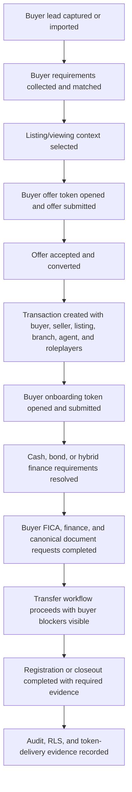

# Buyer-Side Launch Hardening Phase 0

Implemented on 2026-07-11.

## Goal

Lock the buyer-side launch contract before live staging automation begins. This phase defines what "buyer process from lead to registration" means, which staging personas and record IDs are required, which routes and data sources are in scope, who owns each gate, and which evidence must be produced before production sign-off.

Phase 0 is a scope, fixture, and evidence-contract implementation. It does not change runtime behavior.

## Launch Story

The launch-certified buyer journey starts when an agency user owns or receives a buyer lead and ends when the accepted-offer transaction reaches registration or closeout with buyer-visible onboarding, finance, document, workflow, privacy, and audit evidence intact.

## In Scope

| Area | Locked scope |
| --- | --- |
| Lead acquisition | Agency buyer lead list and detail workspace, lead source, assignment, ownership, branch, SLA, status, requirements, and communications. |
| Requirements and matching | Buyer budget, location, property requirements, readiness, listing match, viewing context, and lead-to-offer continuity. |
| Public offer token | Direct buyer offer, post-viewing offer session, revised offer, duplicate live offer handling, invalid token, expired token, and already-submitted states. |
| Offer-to-transaction | Accepted offer conversion into a transaction with buyer lead, buyer contact, accepted offer, listing, seller, branch, agent, finance, routing, participants, and onboarding URL preserved. |
| Buyer onboarding | Public and mobile buyer onboarding token flows for natural person, co-purchaser, foreign individual, company, trust, cash, bond, and hybrid branches. |
| Buyer portal | Buyer-facing client portal route for buying context, status, finance, documents, uploads, requirements, updates, and progress. |
| Finance and bond | Cash, bond, and hybrid route profiles, finance readiness, bond application context, bond roleplayer access, and no cross-role data leakage. |
| Documents | Buyer FICA, finance, canonical requirements, upload requests, review state, metadata visibility, download access, and document privacy boundaries. |
| Transfer and registration | Transaction workflow gates, attorney matter progression, transfer readiness, registration evidence, title deed/date confirmation, closeout state, and auditability. |
| Security and delivery | Token access, authenticated role access, RLS visibility, email/SMS delivery evidence, invalid token handling, audit rows, and no cross-workspace leakage. |

## Out Of Scope

- Seller-side onboarding depth beyond the seller/listing facts required for buyer offer conversion.
- Commercial landlord, rental, and developer unit reservation flows unless they share the buyer offer-to-registration route.
- Marketing website and public listing SEO surfaces unless they affect buyer offer token entry.
- Payments, commission payout, and post-registration analytics.
- Production data repair or migration rollout, except for staging fixture readiness needed to run launch evidence.
- Replacing buyer portal UI surfaces unless a later phase explicitly promotes that cleanup.

## Locked Routes

| Surface | Route |
| --- | --- |
| Buyer lead list | `/pipeline/leads` |
| Buyer lead detail | `/pipeline/leads/:leadId` |
| Buyer onboarding | `/client/onboarding/:token` |
| Mobile buyer onboarding | `/mobile/buyer-onboarding/:token` |
| Buyer client portal | `/client/:token/buying` |
| Buyer client portal section | `/client/:token/buying/:section` |
| Direct buyer offer | `/client/offer/:token` |
| Offer session | `/offers/session/:token` |
| Offer detail | `/offers/:token` |
| Transaction workspace | `/transactions/:transactionId` |

Demo buyer tokens remain:

- Buyer onboarding: `demo-buyer-onboarding`
- Buyer portal: `demo-buyer-portal`

## Source Of Truth Map

| Domain | Source of truth | Launch expectation |
| --- | --- | --- |
| Buyer lead state | `leads`, `lead_activities`, `lead_communication_events` | Buyer lead owner, branch, source, requirements, and history survive assignment, matching, and offer conversion. |
| Buyer requirements | Buyer requirement/profile fields and matching services | Buyer budget, property criteria, readiness, listing match, and viewing context remain available to agent workflows. |
| Offer lifecycle | Buyer offer records, offer events, accepted-offer conversion services | Submitted, revised, countered, expired, rejected, withdrawn, accepted, and converted states are stable and auditable. |
| Token entry | Offer tokens, onboarding tokens, portal tokens, token-scoped APIs | Valid links load the intended record; invalid, expired, duplicate, and reused tokens fail cleanly without data leakage. |
| Transaction spine | `transactions`, `transaction_participants`, `transaction_role_players`, `transaction_events` | Buyer lead/contact, listing, seller, branch, agent, finance, routing, and participant context are present after conversion. |
| Buyer onboarding facts | Buyer onboarding payloads and canonical buyer flow contracts | Buyer type, legal branch, finance branch, document requirements, and submitted facts are reusable by transaction workflows. |
| Finance and bond | `transaction_finance_details`, routing rules, bond/attorney roleplayer records | Cash, bond, and hybrid buyer routes resolve roleplayer, document, and readiness requirements. |
| Buyer documents | `documents`, `document_requests`, canonical requirements, review rows, storage/download grants | Buyer FICA, finance, and upload artifacts are visible only to expected roles and cannot be inferred by unrelated users. |
| Transfer/registration workflow | `transaction_subprocesses`, `transaction_subprocess_steps`, workflow gate/readiness services | Buyer blockers, transfer readiness, and registration evidence can be read and advanced without conflicting stage state. |
| Access and audit | RLS policies, token-scoped APIs, auth sessions, audit/event rows | Buyer token access and authenticated role access are scoped, observable, and denied for unrelated workspaces. |

## Staging Persona Contract

| Persona | Env keys | Phase use |
| --- | --- | --- |
| Buyer | `BUYER_SIDE_STAGING_BUYER_EMAIL`, `BUYER_SIDE_STAGING_BUYER_PASSWORD` | Buyer onboarding, portal, upload, offer, and buyer-visible transaction checks. |
| Assigned agent | `BUYER_SIDE_STAGING_AGENT_EMAIL`, `BUYER_SIDE_STAGING_AGENT_PASSWORD` | Lead ownership, matching, offer management, transaction handoff, and activity evidence. |
| Branch manager | `BUYER_SIDE_STAGING_BRANCH_MANAGER_EMAIL`, `BUYER_SIDE_STAGING_BRANCH_MANAGER_PASSWORD` | Branch-scoped visibility, reassignment, escalation, and lead/transaction oversight. |
| Transfer attorney | `BUYER_SIDE_STAGING_ATTORNEY_EMAIL`, `BUYER_SIDE_STAGING_ATTORNEY_PASSWORD` | Transfer workflow, document review, registration evidence, and attorney matter checks. |
| Bond user | `BUYER_SIDE_STAGING_BOND_EMAIL`, `BUYER_SIDE_STAGING_BOND_PASSWORD` | Bond/hybrid finance visibility, bond document access, and finance readiness checks. |
| Unrelated user | `BUYER_SIDE_STAGING_UNRELATED_EMAIL`, `BUYER_SIDE_STAGING_UNRELATED_PASSWORD` | Negative RLS probes for lead, offer, transaction, document, workflow, and token leakage. |

## Staging Record Contract

| Record | Env key | Required purpose |
| --- | --- | --- |
| Base URL | `BUYER_SIDE_LAUNCH_BASE_URL` | Browser and token-link tests target the intended staging deployment. |
| Supabase project ref | `BUYER_SIDE_LAUNCH_SUPABASE_PROJECT_REF` | Live scripts refuse non-staging projects before reading or mutating data. |
| Buyer lead | `BUYER_SIDE_STAGING_BUYER_LEAD_ID` | Lead list/detail, requirements, assignment, matching, and lifecycle evidence. |
| Listing | `BUYER_SIDE_STAGING_LISTING_ID` | Offer, matching, viewing, transaction property context, and branch attribution. |
| Offer | `BUYER_SIDE_STAGING_OFFER_ID` | Offer status, offer detail, acceptance, conversion, and duplicate handling evidence. |
| Direct offer token | `BUYER_SIDE_STAGING_OFFER_TOKEN` | `/client/offer/:token` browser smoke and invalid/expired token contrasts. |
| Offer session token | `BUYER_SIDE_STAGING_OFFER_SESSION_TOKEN` | `/offers/session/:token` and `/offers/:token` browser smoke. |
| Invalid offer token | `BUYER_SIDE_STAGING_INVALID_OFFER_TOKEN` | Known non-resolving token for explicit invalid-token browser evidence; may be synthetically generated when omitted. |
| Expired offer token | `BUYER_SIDE_STAGING_EXPIRED_OFFER_TOKEN` | Expired direct offer token browser evidence. |
| Duplicate direct offer token | `BUYER_SIDE_STAGING_DUPLICATE_OFFER_TOKEN` | Direct offer token that is already under live review and must block duplicate submission. |
| Duplicate offer session token | `BUYER_SIDE_STAGING_DUPLICATE_OFFER_SESSION_TOKEN` | Post-viewing session with multiple open offer records for duplicate/live-negotiation handling. |
| Revised offer token | `BUYER_SIDE_STAGING_REVISED_OFFER_TOKEN` | Countered or changes-requested offer token that must allow revised buyer submission. |
| Transaction | `BUYER_SIDE_STAGING_TRANSACTION_ID` | Transaction workspace, finance, documents, workflow, transfer, registration, and RLS probes. |
| Buyer onboarding token | `BUYER_SIDE_STAGING_ONBOARDING_TOKEN` | Public/mobile buyer onboarding and token delivery checks. |
| Buyer portal token | `BUYER_SIDE_STAGING_PORTAL_TOKEN` | Buyer portal route, upload, progress, and invalid token checks. |
| Buyer document request | `BUYER_SIDE_STAGING_DOCUMENT_REQUEST_ID` | Buyer upload visibility, review state, request ownership, and privacy probes. |
| Buyer FICA document request | `BUYER_SIDE_STAGING_BUYER_FICA_DOCUMENT_REQUEST_ID` | FICA, identity, and proof-of-address request privacy evidence. |
| Buyer finance document request | `BUYER_SIDE_STAGING_BUYER_FINANCE_DOCUMENT_REQUEST_ID` | Finance, bond, bank, income, and proof-of-funds request privacy evidence. |
| Buyer uploaded document | `BUYER_SIDE_STAGING_BUYER_UPLOADED_DOCUMENT_ID` | Buyer upload row, request-linkage, and metadata visibility evidence. |
| Buyer review document | `BUYER_SIDE_STAGING_BUYER_REVIEW_DOCUMENT_ID` | Attorney/bond review-state and review-grant evidence. |
| Buyer download document | `BUYER_SIDE_STAGING_BUYER_DOWNLOAD_DOCUMENT_ID` | Download permission, signed URL, and raw-table denial evidence. |
| Buyer document storage path | `BUYER_SIDE_STAGING_BUYER_DOCUMENT_STORAGE_PATH` | File-path lookup denial and portal signer transaction-scope evidence. |
| Onboarding delivery | `BUYER_SIDE_STAGING_ONBOARDING_DELIVERY_ID` | `communication_deliveries` evidence for buyer onboarding email delivery. |
| Portal delivery | `BUYER_SIDE_STAGING_PORTAL_DELIVERY_ID` | `communication_deliveries` evidence for buyer portal email delivery. |
| Offer delivery | `BUYER_SIDE_STAGING_OFFER_DELIVERY_ID` | `communication_deliveries` evidence for buyer offer-link email delivery. |
| Token SMS/WhatsApp delivery | `BUYER_SIDE_STAGING_TOKEN_SMS_DELIVERY_ID` | `communication_deliveries` evidence for SMS/WhatsApp token delivery. |
| Reused onboarding token | `BUYER_SIDE_STAGING_REUSED_ONBOARDING_TOKEN` | Inactive onboarding token that must fail public resolution. |
| Reused portal token | `BUYER_SIDE_STAGING_REUSED_PORTAL_TOKEN` | Inactive portal token that must fail public resolution. |
| Already-submitted onboarding token | `BUYER_SIDE_STAGING_ALREADY_SUBMITTED_ONBOARDING_TOKEN` | Submitted onboarding token that must show completion state and avoid duplicate onboarding creation. |
| Inactive portal token | `BUYER_SIDE_STAGING_INACTIVE_PORTAL_TOKEN` | Inactive portal token for invalid/reused portal evidence. |
| Malformed token | `BUYER_SIDE_STAGING_MALFORMED_TOKEN` | Non-resolving malformed token checked across buyer token tables. |

## Environment Contract

Real values must live in `.env.staging.local` or managed deployment secrets. `.env.example` must only contain empty placeholders.

Required Phase 0 placeholders:

- `BUYER_SIDE_LAUNCH_BASE_URL`
- `BUYER_SIDE_LAUNCH_SUPABASE_PROJECT_REF`
- `BUYER_SIDE_STAGING_BUYER_EMAIL`
- `BUYER_SIDE_STAGING_BUYER_PASSWORD`
- `BUYER_SIDE_STAGING_AGENT_EMAIL`
- `BUYER_SIDE_STAGING_AGENT_PASSWORD`
- `BUYER_SIDE_STAGING_BRANCH_MANAGER_EMAIL`
- `BUYER_SIDE_STAGING_BRANCH_MANAGER_PASSWORD`
- `BUYER_SIDE_STAGING_ATTORNEY_EMAIL`
- `BUYER_SIDE_STAGING_ATTORNEY_PASSWORD`
- `BUYER_SIDE_STAGING_BOND_EMAIL`
- `BUYER_SIDE_STAGING_BOND_PASSWORD`
- `BUYER_SIDE_STAGING_UNRELATED_EMAIL`
- `BUYER_SIDE_STAGING_UNRELATED_PASSWORD`
- `BUYER_SIDE_STAGING_BUYER_LEAD_ID`
- `BUYER_SIDE_STAGING_LISTING_ID`
- `BUYER_SIDE_STAGING_OFFER_ID`
- `BUYER_SIDE_STAGING_OFFER_TOKEN`
- `BUYER_SIDE_STAGING_OFFER_SESSION_TOKEN`
- `BUYER_SIDE_STAGING_INVALID_OFFER_TOKEN`
- `BUYER_SIDE_STAGING_EXPIRED_OFFER_TOKEN`
- `BUYER_SIDE_STAGING_DUPLICATE_OFFER_TOKEN`
- `BUYER_SIDE_STAGING_DUPLICATE_OFFER_SESSION_TOKEN`
- `BUYER_SIDE_STAGING_REVISED_OFFER_TOKEN`
- `BUYER_SIDE_STAGING_TRANSACTION_ID`
- `BUYER_SIDE_STAGING_ONBOARDING_TOKEN`
- `BUYER_SIDE_STAGING_PORTAL_TOKEN`
- `BUYER_SIDE_STAGING_DOCUMENT_REQUEST_ID`
- `BUYER_SIDE_STAGING_BUYER_FICA_DOCUMENT_REQUEST_ID`
- `BUYER_SIDE_STAGING_BUYER_FINANCE_DOCUMENT_REQUEST_ID`
- `BUYER_SIDE_STAGING_BUYER_UPLOADED_DOCUMENT_ID`
- `BUYER_SIDE_STAGING_BUYER_REVIEW_DOCUMENT_ID`
- `BUYER_SIDE_STAGING_BUYER_DOWNLOAD_DOCUMENT_ID`
- `BUYER_SIDE_STAGING_BUYER_DOCUMENT_STORAGE_PATH`
- `BUYER_SIDE_STAGING_ONBOARDING_DELIVERY_ID`
- `BUYER_SIDE_STAGING_PORTAL_DELIVERY_ID`
- `BUYER_SIDE_STAGING_OFFER_DELIVERY_ID`
- `BUYER_SIDE_STAGING_TOKEN_SMS_DELIVERY_ID`
- `BUYER_SIDE_STAGING_REUSED_ONBOARDING_TOKEN`
- `BUYER_SIDE_STAGING_REUSED_PORTAL_TOKEN`
- `BUYER_SIDE_STAGING_ALREADY_SUBMITTED_ONBOARDING_TOKEN`
- `BUYER_SIDE_STAGING_INACTIVE_PORTAL_TOKEN`
- `BUYER_SIDE_STAGING_MALFORMED_TOKEN`
- `BUYER_SIDE_PHASE7_STAGING_RUN_ID`
- `BUYER_SIDE_PHASE7_SIGNOFF_APPROVER`
- `BUYER_SIDE_PHASE7_SIGNOFF_APPROVED_AT`
- `BUYER_SIDE_PHASE7_RELEASE_NOTES_URL`
- `BUYER_SIDE_PHASE7_RESIDUAL_RISK_REGISTER_URL`
- `BUYER_SIDE_PHASE7_RESIDUAL_RISK_OWNER`
- `BUYER_SIDE_PHASE7_ROLLBACK_OWNER`
- `BUYER_SIDE_PHASE7_ROLLBACK_PLAN_URL`
- `BUYER_SIDE_PHASE7_SUPPORT_OWNER`
- `BUYER_SIDE_PHASE7_SUPPORT_PLAYBOOK_URL`
- `BUYER_SIDE_PHASE7_MONITORING_OWNER`
- `BUYER_SIDE_PHASE7_MONITORING_CHECKLIST_URL`
- `BUYER_SIDE_PHASE7_POST_LAUNCH_WATCH_WINDOW`

## Owner Map

| Owner | Phase 0 accountability | Launch sign-off evidence |
| --- | --- | --- |
| Product / Launch Owner | Confirms journey boundary, out-of-scope list, and go/no-go wording. | Approved buyer scope, live fixture contract, and final blocker register. |
| Agency Operations | Owns buyer lead, requirements, matching, viewing, branch/agent attribution, and buyer communications. | Lead, matching, assignment, offer, and transaction conversion evidence. |
| Buyer Experience | Owns public buyer offer, onboarding, buyer portal, token UX, and invalid-token experience. | Browser smokes for valid, expired, invalid, reused, duplicate, and already-submitted token paths. |
| Transaction Platform | Owns accepted-offer conversion, transaction spine, route profile, workflow gates, and registration action evidence. | Offer-to-transaction, routing, finance, transfer, registration, and activity checks. |
| Legal Documents | Owns buyer FICA, finance, canonical document requests, uploads, review state, and document privacy. | Document request, canonical document, metadata, upload, and download visibility checks. |
| Attorney Operations | Owns transfer workflow, matter progression, registration readiness, and closeout evidence. | Attorney transaction, workflow action, and registration evidence checks. |
| Bond / Finance | Owns bond/hybrid finance visibility, bond document access, and finance readiness. | Bond user access, finance tab, document, and roleplayer routing checks. |
| Security / Platform | Owns auth setup, RLS visibility, token scoping, delivery audit evidence, and no cross-workspace leakage. | RLS matrix, token delivery probes, unrelated-user denials, and audit rows. |
| QA / Release | Owns repeatable launch commands, JSON reports, checklist updates, and release sign-off packaging. | Phase gates, final launch candidate gate, run IDs, staging IDs, and residual-risk notes. |

## Phase Plan

| Phase | Goal | Required output |
| --- | --- | --- |
| Phase 0 | Scope and fixture lock | This audit doc, env placeholders, and `npm run verify:buyer-side-phase0-scope-fixtures`. |
| Phase 1 | Live staging buyer transaction run | Scripted buyer lead-to-registration staging smoke with real staging IDs through `npm run verify:buyer-side-phase1-live-staging-transaction`. |
| Phase 2 | RLS and cross-workspace access probes | Persona matrix for buyer, agent, branch manager, attorney, bond, and unrelated-user access through `npm run verify:buyer-side-phase2-rls-access`. |
| Phase 3 | Public offer token browser smoke | Browser coverage for direct offer, offer session, offer detail, duplicate, invalid, expired, and revised offer paths through `npm run verify:buyer-side-phase3-offer-token-browser`. |
| Phase 4 | Token delivery and invalid-token handling | Email/SMS delivery evidence plus expired, malformed, reused, and already-submitted token behavior through `npm run verify:buyer-side-phase4-token-delivery`. |
| Phase 5 | Buyer document and privacy verification | Buyer FICA, finance, upload, metadata, review, and download access matrix through `npm run verify:buyer-side-phase5-document-privacy`. |
| Phase 6 | Buyer launch candidate gate | One aggregate command that includes Phases 1 through 5 and local diagnostic evidence through `npm run verify:buyer-side-phase6-launch-candidate`. |
| Phase 7 | Final staging sign-off | Recorded staging run, residual risks, rollback owner, support owner, and post-launch monitoring checklist through `npm run verify:buyer-side-phase7-final-signoff`. |

## Known Blockers

| ID | Status | Owner | Description | Phase required |
| --- | --- | --- | --- | --- |
| B-BUYER-0-1 | Open | QA / Release | Real staging buyer fixture IDs and persona credentials must be supplied in `.env.staging.local` or managed secrets. | Phase 1 |
| B-BUYER-0-2 | Open | Security / Platform | Cross-workspace RLS probes need a buyer, assigned agent, branch manager, attorney, bond user, and unrelated user. | Phase 2 |
| B-BUYER-0-3 | Open | Buyer Experience | Public offer token browser smoke must use a seeded valid offer token plus invalid, expired, duplicate, and revised offer cases. | Phase 3 |
| B-BUYER-0-4 | Open | Security / Platform | Token delivery evidence must prove actual email/SMS links for onboarding, portal, and offers. | Phase 4 |
| B-BUYER-0-5 | Open | Legal Documents | Buyer document privacy must prove unrelated users cannot infer document existence, metadata, or download URLs. | Phase 5 |
| B-BUYER-0-6 | Open | QA / Release | Final staging sign-off must record the Phase 7 staging run ID, approver, release notes, residual-risk owner, rollback owner, support owner, and monitoring checklist. | Phase 7 |

## Required Evidence Commands

Phase 0 locks these commands as the initial evidence inventory. Later phases may consolidate them behind one launch command, but they should not remove coverage without a replacement.

| Coverage | Command |
| --- | --- |
| Buyer Phase 0 scope and fixtures | `npm run verify:buyer-side-phase0-scope-fixtures` |
| Buyer Phase 1 live staging transaction | `npm run verify:buyer-side-phase1-live-staging-transaction` |
| Buyer Phase 1 strict live evidence | `node scripts/buyer-side-phase1-live-staging-transaction-gate.mjs --live --confirm-staging --require-live` |
| Buyer Phase 2 RLS access probes | `npm run verify:buyer-side-phase2-rls-access` |
| Buyer Phase 2 strict live RLS evidence | `node scripts/buyer-side-phase2-rls-access-probes.mjs --live --confirm-staging --require-live` |
| Buyer Phase 3 offer-token browser smoke | `npm run verify:buyer-side-phase3-offer-token-browser` |
| Buyer Phase 3 local browser evidence | `node scripts/buyer-side-phase3-offer-token-browser-smoke.mjs --browser --confirm-staging --require-browser` |
| Buyer Phase 3 strict live token evidence | `node scripts/buyer-side-phase3-offer-token-browser-smoke.mjs --live --confirm-staging --require-browser` |
| Buyer Phase 4 token delivery and invalid-token handling | `npm run verify:buyer-side-phase4-token-delivery` |
| Buyer Phase 4 strict live delivery evidence | `node scripts/buyer-side-phase4-token-delivery-invalid-handling.mjs --live --confirm-staging --require-live` |
| Buyer Phase 5 document and privacy verification | `npm run verify:buyer-side-phase5-document-privacy` |
| Buyer Phase 5 strict live document privacy evidence | `node scripts/buyer-side-phase5-document-privacy-verification.mjs --live --confirm-staging --require-live` |
| Buyer Phase 6 launch candidate aggregate | `npm run verify:buyer-side-phase6-launch-candidate` |
| Buyer Phase 6 strict live evidence chain | `node scripts/buyer-side-phase6-launch-candidate-gate.mjs --require-live-evidence` |
| Buyer Phase 7 final sign-off package | `npm run verify:buyer-side-phase7-final-signoff` |
| Buyer Phase 7 strict final sign-off | `node scripts/buyer-side-phase7-final-signoff-gate.mjs --require-final-signoff` |
| Buyer local diagnostic | `npm run verify:buyer-side-lead-registration-diagnostic` |
| Buyer local diagnostic with browser smoke | `node scripts/buyer-side-lead-registration-diagnostic-gate.mjs --include-browser-smoke` |
| Lead workspace | `npm run test:agent-leads-workspace` |
| Lead ingestion | `npm run test:lead-ingestion` |
| Lead assignment | `npm run test:lead-assignment` |
| Lead matching | `npm run test:lead-matching` |
| Lead requirements | `npm run test:lead-requirements` |
| Buyer onboarding contract | `npm run test:buyer-onboarding-flow-contract` |
| Buyer South African scenarios | `npm run test:buyer-onboarding-sa-scenarios` |
| Buyer onboarding mobile browser smoke | `npm run test:buyer-onboarding-mobile-phase6` |
| Offer-to-transaction matrix | `npm run test:offer-to-transaction-scenario-matrix` |
| Transaction spine propagation | `npm run test:listing-to-transaction-routing-propagation` |
| Transaction routing profile | `npm run test:transaction-routing-profile` |
| Finance launch readiness | `npm run test:finance-tab-launch-readiness` |
| Document request matrix | `npm run test:document-request-scenario-matrix` |
| Transaction documents command centre | `npm run test:transaction-documents-command-centre` |
| Canonical document engine | `npm run test:transaction-canonical-document-engine` |
| Canonical workflow gates | `npm run test:canonical-workflow-gates` |
| Workflow rollup rules | `npm run test:workflow-rollup-rules` |
| Workflow actions | `npm run test:workflow-actions` |
| Transaction workflow rollup | `npm run test:transaction-workflow-rollup` |
| Transaction overview/activity | `npm run test:transaction-overview-conversation` |
| Browser entry blockers | `npm run test:browser-entry-blockers` |

## Launch Checklist

### Scope Lock

- [x] Start state is defined as buyer lead captured or imported.
- [x] End state is defined as registration or closeout with audit trail.
- [x] Primary routes are listed.
- [x] Demo buyer tokens are listed.
- [x] Data sources of truth are mapped.
- [x] Product out-of-scope areas are documented.
- [x] Owner map is documented.
- [x] Staging persona contract is documented.
- [x] Staging record contract is documented.
- [x] Environment placeholders are declared.

### Later Phase Entry Criteria

- [ ] Phase 1 has real staging fixture credentials and IDs.
- [ ] Phase 2 has unrelated-user credentials for RLS denial probes.
- [ ] Phase 3 has seeded valid, expired, invalid, duplicate, and revised offer token states.
- [ ] Phase 4 has delivery-path access for email/SMS link evidence.
- [ ] Phase 5 has buyer document request, upload, review, download, and storage-path fixture IDs.
- [x] Phase 6 has all prior phase commands consolidated.
- [ ] Phase 7 has final staging run approval, support owner, rollback owner, and monitoring checklist.

### Phase 7 Final Staging Sign-Off

- [x] Phase 7 final sign-off package command is implemented.
- [x] Phase 7 strict final sign-off command requires the Phase 6 strict live evidence chain.
- [ ] Phase 6 strict live evidence returns `READY_LIVE_CANDIDATE`.
- [ ] `BUYER_SIDE_PHASE7_STAGING_RUN_ID` records the approved staging run.
- [ ] `BUYER_SIDE_PHASE7_SIGNOFF_APPROVER` and `BUYER_SIDE_PHASE7_SIGNOFF_APPROVED_AT` record launch approval.
- [ ] `BUYER_SIDE_PHASE7_RELEASE_NOTES_URL` records the release note package.
- [ ] `BUYER_SIDE_PHASE7_RESIDUAL_RISK_REGISTER_URL` and `BUYER_SIDE_PHASE7_RESIDUAL_RISK_OWNER` record residual risk ownership.
- [ ] `BUYER_SIDE_PHASE7_ROLLBACK_OWNER` and `BUYER_SIDE_PHASE7_ROLLBACK_PLAN_URL` record rollback ownership.
- [ ] `BUYER_SIDE_PHASE7_SUPPORT_OWNER` and `BUYER_SIDE_PHASE7_SUPPORT_PLAYBOOK_URL` record launch support ownership.
- [ ] `BUYER_SIDE_PHASE7_MONITORING_OWNER`, `BUYER_SIDE_PHASE7_MONITORING_CHECKLIST_URL`, and `BUYER_SIDE_PHASE7_POST_LAUNCH_WATCH_WINDOW` record post-launch monitoring coverage.

## Phase 0 Acceptance

- The buyer launch journey is defined from lead to registration.
- The route surface is explicit.
- The data source-of-truth map is explicit.
- The staging persona contract is explicit.
- The staging record contract is explicit.
- The env placeholders are declared without real secrets.
- The owner map is explicit.
- The full launch checklist has an initial evidence inventory.
- Known blockers are captured without being hidden as test noise.
- Phase 1 can begin with live staging transaction fixture setup.

## Phase 0 Decision

Phase 0 is implemented and ready for review.

Decision: GO TO PHASE 1 WITH LIVE FIXTURES REQUIRED.
