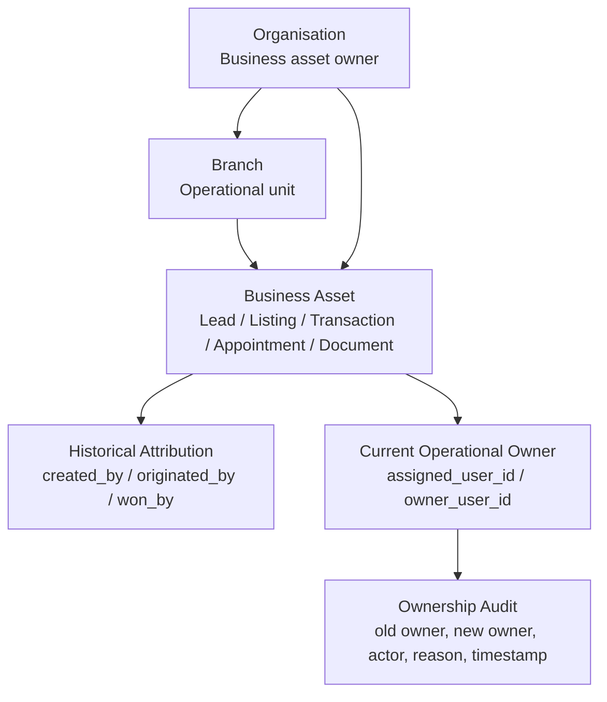

# Sprint 2: Ownership Framework & Business Asset Governance

Date: 2026-06-09

## Executive Verdict

Bridge has several ownership fields already, but ownership is not yet governed by a single canonical model.

The platform partially separates historical attribution from operational ownership:

- Leads have `created_by` and `assigned_user_id` / `assigned_agent_id`.
- Transactions have `created_by`, `owner_user_id`, `assigned_user_id`, `assigned_agent_id`, and branch/workspace assignment fields.
- Private listings have `created_by`, `assigned_agent_id`, `organisation_id`, and `branch_id`.
- Appointments have `created_by` and `agent_id`.
- Documents generally track upload/request attribution, but not canonical operational ownership.

The major gap is not field absence. The major gap is governance:

- No universal rule says which field is attribution and which field is current owner.
- No universal transfer engine exists for agency assets.
- No universal ownership-change audit exists.
- Reporting can easily confuse "won/created by" with "currently managed by".
- Agent resignation and agency transfer workflows cannot be safely automated until the ownership model is formalized.

Bottom line:

| Question | Answer |
| --- | --- |
| Do business objects currently have ownership fields? | Partially. |
| Is historical attribution preserved consistently? | Not consistently. |
| Is operational ownership preserved consistently? | Partially for leads and transactions, weaker for listings/appointments/documents. |
| Are transfers possible today? | Lead reassignment is supported; other asset transfers are ad hoc or missing. |
| Is there a universal audit trail for ownership changes? | No. |
| Are reports safe for attribution versus current management? | Needs hardening. |

## Ownership Architecture Diagram

Canonical target model:



Core rules:

1. Organisation owns the asset.
2. Branch scopes the asset operationally where applicable.
3. `created_by` answers "who created this?"
4. `owner_user_id` or `assigned_user_id` answers "who owns/manages this today?"
5. Transfer changes operational ownership only.
6. Transfer never changes attribution fields.
7. Every transfer creates an immutable audit record.

## Current Ownership Architecture Audit

| Object | Current Owner Field | Current Attribution Field | Organisation Field | Branch Field | Notes |
| --- | --- | --- | --- | --- | --- |
| Contacts | `assigned_agent_id` | Not consistently present | `organisation_id` | Missing / inherited via lead | Contact ownership is agent-like, but attribution is weak. |
| Leads | `assigned_user_id`, `assigned_agent_id` | `created_by` | `organisation_id` | `branch_id` | Best agency asset candidate. Assignment history exists. |
| Buyer Leads | Same as leads | `created_by` | `organisation_id` | `branch_id` | Uses lead category/direction to distinguish. |
| Seller Leads | Same as leads | `created_by` | `organisation_id` | `branch_id` | Can link to `private_listings.listing_id` / seller listing fields. |
| Lead Activities | `agent_id` / activity actor | Activity creator/actor implied | `organisation_id` | Inherited via lead | Activity belongs to the lead, not independently transferable. |
| Lead Notes | Stored as lead activity/task/note-like data | Actor implied | `organisation_id` | Inherited via lead | Needs parent-lead ownership. |
| Tasks | `assigned_agent_id` | Not consistently explicit | `organisation_id` | Inherited via lead/transaction | Should transfer with parent unless manually assigned. |
| Private Listings | `assigned_agent_id` | `created_by` | `organisation_id` | `branch_id` | Good raw fields, but no `won_by`/`original_listing_agent_id`. |
| Listing Documents | Parent listing owner; `uploaded_by` for actor | `uploaded_by` | Inherited via listing | Inherited via listing | Document ownership should inherit listing/transaction. |
| Listing Photos / Marketing Assets | Parent listing owner | Upload actor if present | Inherited via listing | Inherited via listing | Need parent ownership, not independent agent ownership. |
| Private Listing Activity | Parent listing owner | `performed_by` | Inherited via listing | Inherited via listing | Good attribution event field. |
| Transactions | `owner_user_id`, `assigned_user_id`, `assigned_agent_id` | `created_by` | `organisation_id` | `assigned_branch_id` | Strongest object for future ownership split, but creation services do not always set `created_by`. |
| Transaction Documents | Parent transaction owner; upload/request actor | `uploaded_by_user_id`, `created_by`, `created_by_role` depending table | Inherited via transaction / direct fields | Inherited via transaction | Needs consistent parent-transaction ownership. |
| Transaction Roleplayers | Parent transaction owner | Not transfer ownership; selection source/snapshot | Inherited via transaction | Often direct `branch_id` / `assigned_branch_id` in newer paths | Roleplayers are participants, not owners. |
| Transaction Activities | Parent transaction owner | `created_by`, `created_by_role` / actor | Inherited via transaction | Inherited via transaction | Good event model exists. |
| Appointments | `agent_id` | `created_by` | `organisation_id` | Missing direct branch | Needs `branch_id` or reliable parent-derived branch for reassignment. |
| Appointment Participants | Parent appointment owner | Participant metadata | `organisation_id` | Inherited via appointment | Should follow appointment ownership. |
| Viewings / Valuations / Meetings | `appointments.agent_id` | `appointments.created_by` | `organisation_id` | Inherited from lead/listing/transaction if link exists | Appointment type is not enough for ownership. |
| Document Packets | `assigned_agent_id` | `created_by` | `organisation_id` | Missing direct branch | Good ownership fields, but needs parent object relationship as source of truth. |

## Canonical Ownership Matrix

Recommended canonical model:

| Object | Created By / Attribution | Current Owner | Organisation | Branch |
| --- | --- | --- | --- | --- |
| Contact | `created_by` or first linked lead attribution | `assigned_user_id` or `assigned_agent_id` | `organisation_id` | `branch_id` or parent lead branch |
| Lead | `created_by` | `assigned_user_id` canonical; mirror `assigned_agent_id` during transition | `organisation_id` | `branch_id` |
| Lead Activity | `created_by` / `agent_id` | Parent lead owner | `organisation_id` | Parent lead branch |
| Task | `created_by` | `assigned_user_id` canonical; mirror `assigned_agent_id` if needed | `organisation_id` | Parent branch or direct `branch_id` |
| Private Listing | `created_by`; future `won_by_user_id` | `assigned_agent_id` or future `owner_user_id` | `organisation_id` | `branch_id` |
| Listing Document | `uploaded_by` | Parent listing owner | Parent listing org | Parent listing branch |
| Listing Photo / Marketing Asset | `uploaded_by` | Parent listing owner | Parent listing org | Parent listing branch |
| Listing Activity | `performed_by` | Parent listing owner | Parent listing org | Parent listing branch |
| Transaction | `created_by`; future `originated_by_user_id` | `owner_user_id` canonical; mirror `assigned_user_id` / `assigned_agent_id` | `organisation_id` | `assigned_branch_id` |
| Transaction Document | `uploaded_by_user_id` / `created_by` | Parent transaction owner | Parent transaction org | Parent transaction branch |
| Transaction Roleplayer | Selection actor if needed | Parent transaction owner | Parent transaction org | Parent transaction branch |
| Transaction Activity | `created_by` / actor | Parent transaction owner | Parent transaction org | Parent transaction branch |
| Appointment | `created_by` | `agent_id` or future `owner_user_id` | `organisation_id` | Parent lead/listing/transaction branch or future direct `branch_id` |
| Appointment Participant | Created through appointment | Parent appointment owner | `organisation_id` | Parent appointment branch |
| Document Packet | `created_by` | `assigned_agent_id` or parent owner | `organisation_id` | Parent object branch |

Canonical field preference:

| Purpose | Preferred Field | Transitional Aliases |
| --- | --- | --- |
| Historical creator | `created_by` | `performed_by`, `uploaded_by`, `uploaded_by_user_id`, `created_by_role` |
| Lead/listing current owner | `assigned_user_id` for leads; `assigned_agent_id` for current listing schema | `assigned_agent_id`, `assigned_agent_email` |
| Transaction current owner | `owner_user_id` | `assigned_user_id`, `assigned_agent_id` |
| Organisation asset owner | `organisation_id` | workspace-specific org fields |
| Branch operational unit | `branch_id` for leads/listings; `assigned_branch_id` for transactions | parent-derived branch |
| Transfer actor | `performed_by` or `transferred_by` in audit table | `assigned_by`, `created_by` on event tables |

## Object-Level Findings

### Leads

Current state:

- Compatibility migrations add `branch_id`, `assigned_user_id`, `assigned_agent_id`, and `created_by`.
- `buildRemoteLeadCreatePayload` sets:
  - `assigned_user_id` from `lead.assignedUserId` or `assignedAgentId`
  - `assigned_agent_id` from `lead.assignedAgentId`
  - `created_by` from `lead.createdBy` or actor
- Lead assignment adds:
  - `assigned_queue_id`
  - `assigned_at`
  - `ownership_status`
  - `lead_assignment_history`
- `leadAssignmentService.reassignLead` already updates `assigned_agent_id` and `assigned_user_id`, and records assignment history.

Verdict:

- Lead ownership is the most mature agency ownership model.
- The terminology is still "assignment", not "business asset ownership", but the capability exists.
- Historical creator can be preserved if `created_by` is never overwritten.

Risk:

- Contact ownership may not transfer with lead ownership.
- Lead subresources must inherit lead owner; otherwise ownership transfer will not line up with visibility.

### Private Listings

Current state:

- `buildPrivateListingPayload` writes:
  - `organisation_id`
  - `branch_id`
  - `assigned_agent_id`
  - `created_by`
- Listing documents use `uploaded_by`.
- Listing activity uses `performed_by`.
- Listing services update `assigned_agent_id`, but no dedicated transfer engine or transfer audit was found.

Verdict:

- Listings have the minimum fields needed for operational ownership and historical attribution.
- They do not yet distinguish:
  - original listing agent
  - listing winner
  - current listing manager

Risk:

- If `assigned_agent_id` is used in reports for both "won by" and "managed by", agent resignation will corrupt historical attribution.
- Seller portal links, document packets, photos, activity, and seller relationship must remain attached to listing, not agent.

### Transactions

Current state:

- Compatibility migrations add:
  - `assigned_branch_id`
  - `assigned_user_id`
  - `assigned_agent_id`
  - `owner_user_id`
  - `created_by`
- Transaction conversion sets `assigned_agent_id` and `owner_user_id` from the assigned agent.
- Transaction services and dashboards read `owner_user_id`, `assigned_user_id`, `assigned_agent_id`, and `created_by`.
- Transaction events and workflow events already support actor/event history.

Verdict:

- Transactions have the strongest schema shape for the target model.
- `owner_user_id` should be the canonical operational owner.
- `created_by` should be the immutable originator/creator.

Risk:

- Not every transaction creation path visibly sets `created_by`.
- `assigned_agent_id`, `assigned_user_id`, and `owner_user_id` can drift without a canonical sync rule.
- Roleplayers are not transaction owners and should not be confused with ownership.

### Appointments

Current state:

- `appointments` has:
  - `agent_id`
  - `created_by`
  - `organisation_id`
  - links to lead/contact/transaction/related entity
- No direct `branch_id` in the table definition found.

Verdict:

- Appointments have creator and current agent, but weak branch ownership.
- Future appointments can be reassigned by changing `agent_id`.
- Historical appointments should preserve `created_by` and event history.

Risk:

- Branch moves/offboarding cannot reliably bulk-transfer appointments without deriving branch from lead/listing/transaction.
- Appointment participant records should follow appointment ownership, not agent membership.

### Documents

Current state:

- Private listing documents:
  - `uploaded_by`
  - parent `private_listing_id`
- Transaction documents / document requests:
  - `uploaded_by_user_id`
  - `created_by`
  - `created_by_role`
  - parent transaction/document packet links
- Document packets:
  - `assigned_agent_id`
  - `created_by`
  - `organisation_id`

Verdict:

- Documents should generally not be independently transferred.
- Document ownership should be derived from parent asset:
  - listing documents from listing owner
  - transaction documents from transaction owner
  - packet rows from parent lead/listing/transaction owner

Risk:

- Direct document owner fields would create drift unless there is a clear parent/override rule.

## Transfer Matrix

| Object | Transfer Supported Today | Tested in Current Sprint | Required Canonical Transfer |
| --- | --- | --- | --- |
| Lead | Partially yes through `reassignLead` | Static audit only | Update `assigned_user_id`, `assigned_agent_id`, optional `branch_id`; record audit. |
| Contact | No dedicated transfer found | Static audit only | Transfer when linked lead transfers, or keep separate contact owner policy. |
| Lead Activity | Not independently transferable | Static audit only | Inherit parent lead owner; preserve actor. |
| Task | Partial manual assignment fields | Static audit only | Reassign `assigned_user_id`/`assigned_agent_id`; audit task transfer if independent. |
| Private Listing | Update possible, no transfer engine found | Static audit only | Update current listing owner/branch; preserve `created_by`/future `won_by_user_id`; audit. |
| Listing Documents | Parent-derived | Static audit only | No independent transfer; parent listing transfer controls access/ownership. |
| Listing Activity | Parent-derived | Static audit only | No independent transfer; preserve `performed_by`. |
| Transaction | Fields exist, no unified agency transfer engine found | Static audit only | Update `owner_user_id`, `assigned_user_id`, `assigned_agent_id`, `assigned_branch_id`; audit. |
| Transaction Documents | Parent-derived | Static audit only | Parent transaction transfer controls ownership. |
| Transaction Roleplayers | Not ownership transfer | Static audit only | Keep roleplayer assignments separate from owner transfer. |
| Appointment | Manual `agent_id` updates possible, no transfer engine found | Static audit only | Reassign future appointments; preserve historical appointments; audit. |
| Document Packet | Update possible, no universal transfer engine found | Static audit only | Inherit parent owner or update `assigned_agent_id` with audit. |

## Audit Trail Matrix

| Object | Existing Audit/History | Audit Enabled for Ownership Change? | Gap |
| --- | --- | --- | --- |
| Lead | `lead_assignment_history`, lead activity notification | Partial yes | Needs canonical ownership-change event naming and branch transfer fields. |
| Contact | None found | No | Needs parent-lead inheritance or contact transfer audit. |
| Task | None dedicated found | No | Needs task reassignment audit if tasks survive agent movement independently. |
| Private Listing | `private_listing_activity` | Partial pattern only | No dedicated owner-change event contract. |
| Listing Document | Upload attribution | No independent ownership audit | Parent listing transfer should cover it. |
| Transaction | `transaction_events`, `transaction_workflow_events`, `workflow_audit_log` | Possible, but not standardized | Needs ownership-change event type and field contract. |
| Transaction Document | Upload/request attribution | Parent-derived | Parent transaction transfer should cover it. |
| Appointment | Created/cancelled fields | No | Needs appointment reassignment event or workflow audit row. |
| Document Packet | Packet events exist | Partial | Needs packet ownership-change event if packet owner can differ from parent. |

Recommended universal event payload:

```json
{
  "event_type": "ownership_changed",
  "asset_type": "lead",
  "asset_id": "uuid",
  "organisation_id": "uuid",
  "branch_id_before": "uuid",
  "branch_id_after": "uuid",
  "previous_owner_user_id": "uuid",
  "new_owner_user_id": "uuid",
  "performed_by": "uuid",
  "reason": "Agent resignation",
  "source": "offboarding",
  "created_at": "timestamp"
}
```

## Proposed Ownership Transfer Engine

Do not build UI yet. The foundation should be a backend/service-layer transfer contract.

Suggested service/RPC boundary:

```text
bridge_transfer_asset_ownership(
  asset_type,
  asset_id,
  new_owner_user_id,
  new_branch_id,
  reason,
  transfer_source
)
```

Supported asset types for Sprint 3:

- `lead`
- `listing`
- `transaction`
- `appointment`
- `document_packet`

The engine must:

1. Validate actor authority.
2. Verify asset belongs to the organisation.
3. Verify new owner is an active member of the target organisation/branch.
4. Read old owner and old branch.
5. Update only operational ownership fields.
6. Preserve all attribution fields.
7. Record ownership audit.
8. Optionally cascade to child objects only where ownership is parent-derived.

Canonical update rules:

| Asset Type | Update Fields | Preserve Fields | Audit Target |
| --- | --- | --- | --- |
| Lead | `assigned_user_id`, `assigned_agent_id`, `assigned_at`, `branch_id`, `ownership_status` | `created_by`, `created_at`, original source fields | `lead_assignment_history` plus universal audit |
| Listing | `assigned_agent_id`, `branch_id` | `created_by`, future `won_by_user_id`, `created_at` | `private_listing_activity` plus universal audit |
| Transaction | `owner_user_id`, `assigned_user_id`, `assigned_agent_id`, `assigned_branch_id` | `created_by`, `created_at`, origin lead/listing links | `transaction_events` / universal audit |
| Appointment | `agent_id`, future/direct `branch_id` if added | `created_by`, historical event fields | appointment event/universal audit |
| Document Packet | `assigned_agent_id` only if owner differs from parent | `created_by`, packet creation metadata | document packet event/universal audit |

## Reporting Rules

Reporting must split attribution and current management:

| Metric | Use Field |
| --- | --- |
| Leads created | `leads.created_by` |
| Leads currently managed | `leads.assigned_user_id` / `assigned_agent_id` |
| Listings won | Future `private_listings.won_by_user_id`; until then `created_by` as temporary attribution proxy |
| Listings currently managed | `private_listings.assigned_agent_id` |
| Transactions originated | `transactions.created_by` or future `originated_by_user_id` |
| Transactions currently managed | `transactions.owner_user_id` |
| Agent active workload | current owner fields only |
| Commission attribution | snapshot fields plus future commission attribution model, not mutable current owner alone |
| Branch production | asset branch at creation/win for historical production; current branch for active workload |

Important:

- Never use current owner fields for historical "won by" reporting.
- Never overwrite `created_by` during reassignment.
- Commission snapshots must remain immutable once calculated.

## Scenario Testing Plan

Run in staging/local only. Do not mutate production.

| Scenario | Expected Result |
| --- | --- |
| Lead reassigned from Agent A to Agent B | `created_by` remains Agent A; `assigned_user_id` and `assigned_agent_id` become Agent B; history row created. |
| Seller lead converted to listing then reassigned | Lead attribution remains; listing `created_by`/future `won_by` remains; listing current owner changes. |
| Listing reassigned | Seller relationship, documents, photos, mandate packet, portal links, and activity remain attached to listing. |
| Transaction reassigned | `created_by` remains; `owner_user_id` changes; participants/roleplayers remain; workflow continues. |
| Future appointments reassigned | Future `agent_id` changes; completed historical appointments remain historically accurate. |
| Agent leaves agency | Assets remain organisation-owned; active workload moves to replacement owner; resigned agent loses access after membership deactivation. |
| Branch transfer | Asset branch changes only for operational workload; historical branch attribution must be preserved if reporting requires it. |
| Principal transfer | Organisation ownership remains; business assets do not move to a person. |

## Risk Report

### Critical

| Risk | Impact |
| --- | --- |
| Listings do not have a clear immutable "won by/original listing agent" field. | Historical listing attribution can be lost during reassignment. |
| No universal ownership transfer audit exists. | Offboarding can silently rewrite business ownership. |
| Transactions have multiple owner-like fields without a single canonical rule. | Reports and RLS can diverge. |
| Appointment branch ownership is weak. | Branch moves and offboarding cannot safely reassign calendars. |
| Current security issues from Sprint 1 can expose transferred assets incorrectly. | Ownership correctness depends on visibility hardening. |

### Medium

| Risk | Impact |
| --- | --- |
| Contacts do not have clean attribution/current owner split. | Contact ownership may drift from lead ownership. |
| Document packets can carry `assigned_agent_id` but also belong to parent assets. | Packet ownership can drift from listing/transaction owner. |
| Lead ownership exists but is called assignment and queue state. | Business reporting may not recognize it as ownership. |
| Current dashboard metrics mix owner-like fields. | Agent production and active workload can be double-counted or misattributed. |

### Low

| Risk | Impact |
| --- | --- |
| Naming varies between `agent_id`, `assigned_agent_id`, `assigned_user_id`, and `owner_user_id`. | Developer confusion and future bugs. |
| Commercial module has a more explicit scoped hierarchy. | Agency can borrow patterns later, but should avoid unplanned coupling. |

## Recommended Remediation Plan

### Before Sprint 3

1. Declare canonical ownership fields:
   - leads: `assigned_user_id` canonical current owner
   - listings: `assigned_agent_id` current owner until `owner_user_id` exists
   - transactions: `owner_user_id` canonical current owner
   - appointments: `agent_id` current owner until `owner_user_id` exists
2. Add or formalize immutable attribution fields:
   - listings need `won_by_user_id` or `originating_agent_id`
   - transactions need `originated_by_user_id` only if `created_by` is not reliable
3. Standardize ownership-change audit:
   - use a universal `asset_ownership_events` table in a future migration, or consistently write into existing event tables with a shared payload.
4. Define transfer service contract before UI:
   - one service/RPC path per asset type or one typed transfer engine.
5. Align RLS from Sprint 1 with current owner fields.

### Before Agent Offboarding

1. Build bulk reassignment using the same transfer engine.
2. Add dry-run mode:
   - list assets to transfer
   - list assets blocked
   - list assets already reassigned
3. Support replacement-owner validation:
   - same organisation
   - active membership
   - branch-compatible
4. Require reason/source for every transfer.

### Before Agent Transfer Between Agencies

1. Decide which assets can move agency and which remain with original agency.
2. Preserve original organisation attribution for reporting.
3. Ensure portals, document links, and transaction participants do not leak across organisations.
4. Add commission attribution snapshots before transfer.

## Success Criteria Status

| Success Criterion | Status |
| --- | --- |
| Ownership is clearly defined | Partially; this report defines the target model. |
| Historical attribution is preserved | Partially; `created_by` exists but not consistently protected or sufficient. |
| Operational ownership is preserved | Partially; leads and transactions strongest. |
| Transfers become possible | Leads yes; listings/transactions/appointments need engine. |
| Offboarding becomes possible | Not yet; needs transfer engine and visibility fixes. |
| Reporting remains accurate | Needs hardening to split attribution from current owner. |
| Future commission allocation remains possible | Partially; transaction commission snapshots exist, but attribution rules need formalization. |

## Sprint 2 Decision

Bridge should adopt this canonical rule:

```text
Organisation owns the asset.
Branch scopes the asset.
Creator/originator/winner is immutable historical attribution.
Current owner/assignee is mutable operational ownership.
Transfers only mutate operational ownership.
Every transfer writes audit.
Reports must choose attribution or current owner intentionally.
```

No production data changes, migrations, permission changes, or UI work were performed in this sprint.
