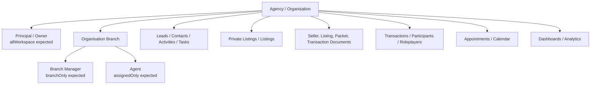
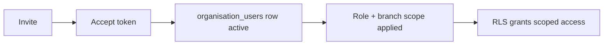

# Sprint 1: Principal/Agent Security Hardening & Visibility Baseline

Date: 2026-06-09

## Executive Verdict

Bridge has the right shape of a scoped security model, but it is not consistently enforced across the agency surface yet.

Confirmed from the migration and frontend audit:

- Agent-to-agent CRM isolation is not currently safe. `contacts`, `leads`, `lead_activities`, and `tasks` use organisation-member RLS, so any active member of the same agency can read and mutate CRM rows for the agency.
- Branch-manager scoping is not consistently safe. The frontend permission registry says branch managers are `branchOnly`, but several RLS policies treat `branch_manager` as an organisation admin or use `bridge_is_active_member(organisation_id)`.
- Transaction security is the strongest area. The transaction spine helper is ownership-aware and supports internal users, owners, assigned users, branch scope, participants, role players, attorneys, and bond originators.
- Seller/listing document security is a critical weak point. `private_listing_documents` and document packet tables allow broad active-member access.
- Frontend permissions are useful for navigation, but not sufficient as a security boundary. Key services request organisation-wide datasets and rely on RLS to trim rows.

Bottom line:

| Question | Answer |
| --- | --- |
| Can Agent A see Agent B's data? | Yes, for CRM leads/contacts/activities/tasks and likely seller/listing document surfaces. |
| Can a branch see another branch's data? | Likely yes for CRM, appointments, analytics inputs, branch directory data, and document packet rows. |
| Can a former agent still access data? | Usually no if their `organisation_users.status` is no longer `active`, but this requires live membership-status verification. |
| Can one organisation see another organisation's data? | No broad cross-organisation leak was found in the audited agency policies; most risky policies are still bounded by `organisation_id`. |
| Are dashboards scoped correctly? | Needs Review. Principal views are intended to be agency-wide; agent/branch views often fetch org-wide inputs and depend on RLS. |
| Are documents scoped correctly? | No. Private listing documents and document packets are overbroad. Transaction documents are stronger where the transaction spine is used. |
| Is RLS enforcing the intended business rules? | Partially. Transaction RLS is close; CRM, seller documents, appointments, and branch/member management need hardening. |

## Current Architecture Diagram

## Permission Model Found

Frontend permission registry:

- Agency `owner` and `principal`: `allWorkspace` for agency permissions.
- Agency `branch_manager`: `branchOnly` for most agency permissions; `manageBranches` is excluded, but `inviteUsers` and `manageUsers` are granted as branch-only.
- Agency `manager`: `branchOnly`.
- Agency `agent`: `assignedOnly`.
- Agency `viewer`: `assignedOnly`.

Database helper model:

- `bridge_is_active_member(target_org)` checks an active `organisation_users` row for the current user.
- `bridge_is_org_admin(target_org)` treats `super_admin`, `principal`, `admin`, `developer`, and `branch_manager` as org admins.
- `bridge_can_access_workspace_record(workspace_id, record_branch_id, assigned_user_id, permission_key)` implements the intended row model:
  - `all_branches`: all workspace records
  - `assigned_branch`: same branch or assigned user
  - `own`: assigned user only

Key gap: the strong `bridge_can_access_workspace_record` helper exists, but many agency CRM and document policies do not use it.

## Visibility Matrix

| Resource | Principal Expected | Branch Manager Expected | Agent Expected | Current Behaviour | Pass / Fail |
| --- | --- | --- | --- | --- | --- |
| CRM contacts | All agency | Branch contacts | Own/assigned contacts | Active organisation member can select/write all org contacts. | Fail - Critical |
| Seller leads / buyer leads | All agency | Branch leads | Own/assigned leads | Active organisation member can select/write all org leads. | Fail - Critical |
| Lead activities | All agency | Branch lead activity | Own/assigned lead activity | Active organisation member can select/write all org lead activities. | Fail - Critical |
| Tasks | All agency | Branch/own tasks | Own tasks | Active organisation member can select/write all org tasks. | Fail - Critical |
| Lead communication events | All agency | Branch lead comms | Own/assigned lead comms | Active organisation member can select; inserts/updates are active-member based. | Fail - Critical |
| Lead requirements | All agency | Branch leads | Own/assigned leads | Active organisation member policies. | Fail - Critical |
| Lead listing interests | All agency | Branch leads | Own/assigned leads | Active organisation member policies. | Fail - Critical |
| Lead assignment history | All agency | Branch leads | Own/assigned leads | Active organisation member policies. | Fail - Critical |
| Lead saved searches | All agency | Branch leads | Own/assigned leads | Active organisation member policies. | Fail - Critical |
| Lead communication preferences | All agency | Branch leads | Own/assigned leads | Uses `bridge_can_access_workspace_record` through parent lead. | Pass / Needs live test |
| Private listings | All agency | Branch listings | Own/assigned listings | Frontend has optional agent filtering, but no clear main select policy found in migrations. | Needs Review |
| Private listing documents | All agency | Branch listings | Own/assigned listings | Any active org member can select docs for a listing. | Fail - Critical |
| Private listing requirements | All agency | Branch listings | Own/assigned listings | Any active org member can select requirements. | Fail - Critical |
| Document packets / versions / events / signers / fields | All agency where relevant | Branch packets | Own/assigned packets | Stabilization policy allows any active org member to read/write org packets. | Fail - Critical |
| Transaction spine | All agency | Branch transactions | Own/assigned/participant transactions | Uses `bridge_can_access_transaction_spine`. Strongest area. | Pass / Needs live test |
| Transaction participants / roleplayers / events / attorney assignments / bond apps | Through transaction access | Through transaction access | Through transaction access | Policies use transaction spine. | Pass / Needs live test |
| Transaction documents | Through transaction access | Through transaction access | Through transaction access | Bond canonical document select uses transaction access helper. Other document paths need full inventory. | Needs Review |
| Appointments | All agency | Branch appointments | Own/assigned appointments | `bridge_is_org_admin` grants branch managers org-wide admin visibility. Agents limited by creator/agent. | Fail - Medium/Critical |
| Organisation branches | All agency | Own branch or branch directory | Limited directory | Any active org member can select all branches. | Needs Review |
| Organisation users / agents | All agency | Branch team | Limited self/team | Any active org member can select all org users; branch managers are org admins for updates/deletes. | Fail - Medium/Critical |
| Invites | All agency | Branch invite scope | No workspace data before acceptance | Invite policies allow workspace admin set including branch managers; target branch enforcement needs live verification. | Needs Review |
| Agency analytics / reports | All agency | Branch metrics | Own metrics | Services often query by `organisation_id`; correctness depends on RLS. CRM RLS makes results overbroad. | Fail - Critical |
| Lead dashboards | All agency | Branch leads | Own/assigned leads | Services call org-wide CRM reads. | Fail - Critical |
| Branch dashboard | All agency | Own branch | No access or own context | Service reads branches/users/transactions/listings/leads by organisation. Route excludes branch managers from `/agency/branches`, but RLS remains broad. | Needs Review |

## RLS Findings

### Critical

| Area | File | Finding |
| --- | --- | --- |
| Canonical CRM | `supabase/migrations/202605230002_agency_crm_contacts_rls.sql` | `contacts`, `leads`, `lead_activities`, and `tasks` use `bridge_is_active_member(organisation_id)` for select/insert/update/delete. |
| Lead communication events | `supabase/migrations/202606030007_lead_communication_events.sql` | Select policy is active-member only; write policies are not ownership-aware. |
| Lead requirements | `supabase/migrations/202606030003_lead_requirements.sql` | Active-member access instead of parent lead ownership/branch scope. |
| Lead listing interests | `supabase/migrations/202606030002_lead_listing_interests.sql` | Active-member access instead of lead/listing ownership scope. |
| Lead assignment history | `supabase/migrations/202606030006_lead_assignment_routing.sql` | Active-member select/update history exposes reassignment data across agents. |
| Lead saved searches | `supabase/migrations/202606030010_lead_saved_searches.sql` | Active-member access to lead search preferences. |
| Private listing documents | `supabase/migrations/202605130006_private_listing_requirement_engine.sql` | Active-member select can expose seller/listing documents across agents. |
| Document packets | `supabase/migrations/202605100020_document_packets_rls_stabilization.sql` | Explicitly demo-safe policy allows any active org member to read/write packet and signing rows. |
| Dashboard source reads | `the-it-guy/src/lib/agencyCrmRepository.js` | `listAgencyCrmLeadContacts` fetches `contacts`, `leads`, `lead_activities`, `tasks` by `organisation_id` only. |

### Needs Review

| Area | File | Finding |
| --- | --- | --- |
| Private listings main table | migrations search | No clear current select/insert/update policy for `private_listings` was found in the migration set, except a delete policy. Live DB introspection is required. |
| Appointments | `supabase/migrations/202605130001_appointment_module_v1.sql` | Agents look scoped to creator/agent, but branch managers inherit org-admin visibility through `bridge_is_org_admin`. |
| Organisation branches | `supabase/migrations/202605110003_organisation_branches_foundation.sql` | All active members can select all branches; write access uses org admin, including branch managers. |
| Organisation users | `supabase/migrations/202605090009_organisation_onboarding_rls_foundation.sql` | All active members can select all organisation users; org admin includes branch managers. |
| Unified invites | `supabase/migrations/202605240012_unified_invites.sql` | Branch managers can invite/manage within workspace-admin policy set; target branch limits need verification. |
| Branch scoped helper adoption | `supabase/migrations/202605240011_workspace_branch_scope_rls.sql` | `bridge_can_access_workspace_record` exists but is not widely adopted in agency CRM/listing/document policies. |
| Signed URLs / storage | app + edge functions | Multiple signed URL paths exist. Row-level fixes must be paired with storage policy and service-role URL checks. |

### Secure / Stronger

| Area | File | Finding |
| --- | --- | --- |
| Workspace row helper | `supabase/migrations/202605240011_workspace_branch_scope_rls.sql` | Encodes the intended principal/branch/agent model. This should become the default helper for agency row policies. |
| Transaction spine | `supabase/migrations/202605310003_transaction_propagation_rls_hardening.sql` | `bridge_can_access_transaction_spine` is ownership-aware and covers assigned users, branches, participants, roleplayers, attorneys, originators, and platform/internal users. |
| Lead communication preferences | `supabase/migrations/202606030011_communication_delivery_preferences.sql` | Uses parent lead plus `bridge_can_access_workspace_record`. This is the closest pattern for lead subresources. |
| Bond canonical documents | `supabase/migrations/202605250020_bond_rls_scoped_policy_rollout_phase5b.sql` | `documents_select_phase5b_scoped` uses transaction-canonical access helpers. |

## Frontend / Backend Alignment

Frontend intent:

- Principals: all workspace.
- Branch managers: branch only.
- Agents: assigned only.

Backend reality:

- Broad CRM and document policies override this intent by allowing any active organisation member.
- Several services fetch organisation-wide rows and rely on RLS:
  - `listAgencyCrmLeadContacts`
  - lead analytics/action engines
  - principal pipeline overview
  - private listing summary/listing loaders with `includeAllOrganisationListings`
  - agency branch service
- Route permissions hide or show pages but do not enforce row-level security.

Conclusion: frontend permissions and RLS are not aligned for CRM, documents, branch management, and analytics.

## Onboarding / Membership Security Baseline

Expected:

Static findings:

- Invited users can see their own invite by email before acceptance.
- `bridge_accept_invite` checks token status, expiry, authenticated user, and email match.
- Acceptance creates or updates `organisation_users` and sets `status = 'active'`.
- Branch and primary branch are set when the invite has a target branch.
- Branch scope defaults and role-contract synchronization need live verification, especially for branch-manager invitations.
- Deactivation safety depends on consistently setting `organisation_users.status` away from `active`; most agency helper policies use only `active`, while the transaction spine also references `accepted` in places.

## Leak Report

Confirmed static leak paths:

1. Agent A can query Agent B's CRM lead if both users are active in the same organisation, because `leads` select uses `bridge_is_active_member(organisation_id)`.
2. Agent A can query Agent B's contact and lead activity under the same CRM policy family.
3. Agent A can query lead communication events, requirements, interests, saved searches, recommendations, and assignment history for other agents' leads where those subresources use active-member policies.
4. Any active organisation member can select private listing document rows for listings in their organisation.
5. Any active organisation member can select and write document packet/signing rows in the stabilization policy.
6. Branch managers can receive org-admin treatment in database helpers even though frontend permissions expect branch-only scope.

Likely leak paths requiring staging verification:

1. Branch manager viewing appointments outside their branch.
2. Branch manager managing users outside their branch.
3. Agent or branch-level analytics inflated by all-organisation CRM rows.
4. Signed URL access after a row is hidden, because URL generation functions may still use service-role clients or public paths.
5. Former agent access where their membership is not fully deactivated or where another active membership path remains.

## Recommended Test Harness

Run only in a disposable local/staging database.

Seed actors:

| Actor | Email | Org | Branch | Role |
| --- | --- | --- | --- | --- |
| Principal | `principal@test.com` | Agency A | All | principal |
| Branch Manager | `manager@test.com` | Agency A | Branch A | branch_manager |
| Agent A | `agenta@test.com` | Agency A | Branch A | agent |
| Agent B | `agentb@test.com` | Agency A | Branch B | agent |
| External Agent | `outside@test.com` | Agency B | Branch C | agent |

Seed resources:

- Lead A, contact A, lead activity A, lead document A assigned to Agent A / Branch A.
- Lead B, contact B, lead activity B, lead document B assigned to Agent B / Branch B.
- Listing A and Listing B with seller documents and mandate packet rows.
- Transaction A and Transaction B with participants, documents, notes, events, roleplayers.
- Appointment A and Appointment B.

Core assertions:

| Actor | Resource | Expected |
| --- | --- | --- |
| Principal | Agency A resources | Allow |
| Principal | Agency B resources | Deny |
| Branch Manager A | Branch A resources | Allow |
| Branch Manager A | Branch B private resources | Deny |
| Agent A | Agent A resources | Allow |
| Agent A | Agent B resources | Deny |
| Agent B | Agent A resources | Deny |
| External Agent | Agency A resources | Deny |
| Former Agent A | Agency A resources after deactivation | Deny |

The test harness should execute as authenticated Supabase clients for each user, not service role. It should assert row counts and direct-ID lookups for every resource family.

## Remediation Plan

### Critical - Must fix before rollout

1. Replace CRM active-member policies with ownership-aware policies:
   - Principal/owner/admin: all workspace
   - Branch manager/manager/admin staff: branch records
   - Agent/viewer: assigned records
   - Use `bridge_can_access_workspace_record(organisation_id, branch_id, assigned_agent_id)` or add a thin lead-specific wrapper.
2. Apply parent-lead access to lead subresources:
   - communication events
   - requirements
   - listing interests
   - suggestions/recommendations
   - saved searches
   - assignment history
3. Harden private listing document and requirement policies through parent listing access:
   - `bridge_can_access_workspace_record(pl.organisation_id, pl.branch_id, pl.assigned_agent_id)`
   - include created-by ownership where required.
4. Replace document packet stabilization policies with packet-owner/parent-record access.
5. Add staging matrix tests before changing production policies.

### Medium - Fix before national expansion

1. Split `bridge_is_org_admin` from branch-manager operational authority. Branch managers should not automatically become org-wide data admins.
2. Harden appointment policies to branch scope for branch managers.
3. Constrain organisation user visibility:
   - principals see all users
   - branch managers see branch users
   - agents see self/basic directory only if intended.
4. Validate invite creation and acceptance branch boundaries for branch managers.
5. Review agency analytics services so branch/agent dashboards apply frontend query scopes as defence-in-depth.

### Low - Future scaling improvements

1. Add policy naming conventions that encode scope, e.g. `_principal_branch_agent_select`.
2. Add CI checks that flag new `bridge_is_active_member(organisation_id)` policies on operational/private tables.
3. Document expected owner columns per table.
4. Create a storage signed-URL access checklist per document bucket.

## Success Criteria Status

| Success Criterion | Status |
| --- | --- |
| Agent A cannot see Agent B's private data | Fail |
| Former agents cannot access agency data | Needs live verification |
| Branch managers only see their branch | Fail / Needs hardening |
| Principals see their agency | Pass |
| Organisations cannot see each other | Pass from static audit |
| RLS becomes source of truth | Not yet; source of truth exists but is inconsistent |
| Frontend permissions and database permissions align | Fail |

## Sprint 1 Recommendation

Do not proceed to broad agency rollout until the CRM, lead subresource, seller document, and document packet policies are hardened and verified with authenticated-user matrix tests.

The fastest safe hardening path is to reuse the existing `bridge_can_access_workspace_record` helper rather than inventing a new permission model.
