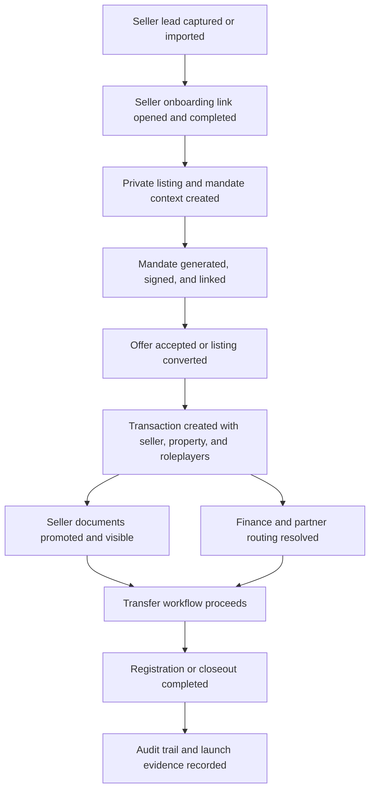

# Seller-Side Transaction Launch Scope Phase 0

Implemented on 2026-07-11.

## Goal

Lock the seller-side launch contract before remediation and automation work begins. This phase defines what "seller side of the transaction from lead to registration" means, which surfaces and records are in scope, who owns each gate, and which evidence must be produced before launch sign-off.

Phase 0 is a scope and checklist implementation. It does not change runtime behavior.

## Launch Story

The launch-certified seller journey starts when an agency user owns or receives a seller lead and ends when the resulting sale transaction reaches registration or closeout with seller-visible documents, roleplayers, workflow state, and audit history intact.



## In Scope

| Area | Locked scope |
| --- | --- |
| Lead acquisition | Agency seller lead list and detail workspace, including lead status, owner, branch, communications, and seller-specific actions. |
| Seller onboarding | Public seller onboarding token flow, seller identity, ownership, FICA/legal facts, property disclosure, and review submission. |
| Seller portal | Seller-facing client portal route for selling context, requirements, documents, updates, and progress. |
| Listing conversion | Private listing shell creation/linking, publication draft data, mandate status, seller relationship graph, and timeline continuity. |
| Mandate | Mandate start, generation, signing, packet/version linkage, and canonical document projection. |
| Offer-to-transaction | Accepted offer conversion into transaction, seller/property propagation, buyer dependency only where needed to create the sale. |
| Transaction workspace | `/transactions/:transactionId` and transfer detail views for overview, finance, documents, transfer, registration, activity, and roleplayer routing. |
| Documents | Seller uploads before transaction, promotion into transaction documents, canonical requirements, additional requests, access grants, and visibility. |
| Finance/routing | Cash, bond, and hybrid transaction routing, bond originator assignment, finance readiness, and no-fallback partner routing. |
| Registration/closeout | Transfer workflow gates, attorney matter progression, registration readiness, closeout state, and auditability. |
| Security | Token access, authenticated role access, RLS visibility, setup/recovery routing, audit events, and no cross-workspace leakage. |

## Out Of Scope

- Buyer onboarding depth beyond the minimum buyer facts needed for offer-to-transaction creation.
- Commercial landlord or commercial sales flows.
- Marketing website, public listing publication UX polish, and property portal integrations unless they affect seller-to-transaction continuity.
- Commission payout, agent performance analytics, and post-registration reporting.
- Production data repair or migration rollout, except for staging QA fixture readiness needed to run launch smoke tests.
- Replacing legacy seller portal surfaces unless a later phase explicitly promotes that cleanup.

## Locked Routes

| Surface | Route |
| --- | --- |
| Seller lead list | `/pipeline/leads` |
| Seller lead detail | `/pipeline/leads/:leadId` |
| Lead mandate workspace | `/pipeline/leads/:leadId/legal/:packetType` |
| Seller onboarding | `/seller/onboarding/:token` |
| Mobile seller onboarding | `/mobile/seller-onboarding/:token` |
| Seller client portal | `/client/:token/selling` |
| Seller client portal section | `/client/:token/selling/:section` |
| Legal document workspace | `/legal-documents/:packetId` |
| Transaction workspace | `/transactions/:transactionId` |
| Transaction transfer detail | `/transactions/:transactionId/transfer/:workflowDetailKey` |
| Demo onboarding links | `/demo/onboarding-links` |

Demo seller tokens remain:

- Seller onboarding: `demo-seller-onboarding`
- Seller portal: `demo-seller-portal`

## Source Of Truth Map

| Domain | Source of truth | Launch expectation |
| --- | --- | --- |
| Seller lead state | `leads`, `lead_activities`, `lead_communication_events` | Lead ownership, branch, status, and acquisition history survive onboarding and conversion. |
| Seller onboarding facts | `private_listing_seller_onboarding` and canonical seller fact JSON | Seller identity, legal/FICA, ownership, bond, occupancy, and disclosure facts are complete and reusable. |
| Listing lifecycle | `private_listings` | One active listing shell is linked to the seller lead and carries operational listing status. |
| Marketing/publication draft | `listing_publication_data`, `listing_media`, `listing_external_links` | Seller-entered property data fills gaps without overwriting agent-edited publication data. |
| Mandate/legal packet | `document_packets`, `document_packet_versions`, `document_packet_signers`, `document_packet_events` | Mandate artifacts are generated, signed, linked, and auditable. |
| Seller pre-transaction docs | `private_listing_documents` | Seller uploads remain listing-scoped until a transaction exists. |
| Transaction docs | `documents`, canonical document requirements, `transaction_required_documents`, `document_requests` | Seller documents promote idempotently and remain correctly visible/requestable. |
| Transaction spine | `transactions`, `transaction_participants`, `transaction_role_players`, `transaction_events` | Seller, property, roleplayers, finance type, route profile, and event history are present. |
| Finance and partner routing | `transaction_finance_details`, routing rules, bond/attorney roleplayer records | Cash, bond, and hybrid paths resolve without fallback routing when a routing rule exists. |
| Transfer/registration workflow | `transaction_subprocesses`, `transaction_subprocess_steps`, workflow gate/readiness services | Transfer and registration progress can be read and advanced without conflicting stage state. |
| Access and audit | RLS policies, token-scoped APIs, audit/event rows | Seller token access and authenticated role access are scoped and observable. |

## Owner Map

| Owner | Phase 0 accountability | Launch sign-off evidence |
| --- | --- | --- |
| Product / Launch Owner | Confirms the journey boundary and go/no-go language. | Approved scope, out-of-scope list, and final blocker register. |
| Agency Operations | Owns seller lead, listing, mandate handoff, branch/agent attribution, and seller communications. | Lead/listing lifecycle checks and relationship integrity diagnostics. |
| Seller Experience | Owns public seller onboarding and seller client portal usability. | Public browser smoke, token flow checks, and seller portal route checks. |
| Legal Documents | Owns mandate, OTP dependency, packet linkage, seller requirements, and canonical document projection. | Document generator, command centre, canonical requirement, and seller document propagation checks. |
| Transaction Platform | Owns offer-to-transaction conversion, transaction spine, roleplayer propagation, routing profile, and workflow gates. | Offer matrix, routing, transaction propagation, workflow gate, and overview/activity checks. |
| Attorney Operations | Owns authenticated transaction workspace, transfer workflow, registration readiness, and closeout. | Attorney browser smoke, transfer/registration workflow checks, and matter activity checks. |
| Bond / Finance | Owns finance readiness, bond originator routing, hybrid handling, and no-fallback partner routing. | Finance tab, bond/attorney launch gate, and routing audit checks. |
| Security / Platform | Owns auth setup, recovery redirects, RLS visibility, token scoping, env readiness, and audit observability. | RLS smoke, authenticated login smoke, setup/recovery fixture validation, and env check. |
| QA / Release | Owns repeatable launch command, evidence capture, JSON summary, and release checklist. | Unified launch gate output with pass, warning, blocker, run ID, and transaction IDs. |

## Launch Checklist

### Scope Lock

- [x] Start state is defined as seller lead captured or imported.
- [x] End state is defined as registration or closeout with audit trail.
- [x] Primary routes are listed.
- [x] Demo seller tokens are listed.
- [x] Data sources of truth are mapped.
- [x] Product out-of-scope areas are documented.
- [x] Owner map is documented.

### Phase 1 Readiness

- [x] Staging attorney QA fixture has an active attorney firm membership.
- [x] Staging attorney QA fixture has a valid firm/workspace link.
- [x] Staging attorney QA fixture has at least one active department.
- [x] Authenticated QA route-gate validation no longer expects `/setup/recovery`.
- [x] `VITE_GOOGLE_MAPS_API_KEY` is confirmed in staging/preview and production deployment envs.
- [x] `VITE_DOCUMENT_TITLE` is confirmed in local, staging, and production env templates.

### Phase 2 Lead-To-Onboarding Contracts

- [x] Seller lead route contracts are gated for list and detail surfaces.
- [x] Seller onboarding token route contracts are gated for public and mobile entry points.
- [x] Seller onboarding canonical fact coverage is gated for seller, property, compliance, finance, occupancy, and disclosure branches.
- [x] Seller onboarding completion repeat-safety is gated at the linked listing draft boundary.
- [x] Seller portal selling route and seller-token context alignment are gated.

### Phase 3 Listing And Mandate Contracts

- [x] Private listing conversion idempotency is gated by seller lead and originating CRM lead.
- [x] Seller lead workspace listing-shell creation preserves branch attribution.
- [x] Signed mandate fallback listing creation preserves branch and agent attribution.
- [x] Seller lead backlinks point at the private listing and mandate packet after signing.
- [x] Seller onboarding publication draft sync preserves listing-owned operational fields.
- [x] Relationship, graph, document continuity, and timeline diagnostic reports are gated.
- [x] Signed mandate packets project into canonical seller authority requirements.

### Phase 4 Transaction Spine, Documents, And Routing Contracts

- [x] Accepted offer conversion preserves seller, buyer, property, listing, branch, agent, and participant boundary context.
- [x] Transaction branch attribution is resolved into `assigned_branch_id` from listing, lead, offer, payload, or actor context.
- [x] Seller uploaded documents promote to transaction documents idempotently.
- [x] Cash, bond, and hybrid transaction routing profiles are gated.
- [x] Finance tab and document command centre readiness are gated.
- [x] Transaction overview activity and structured conversation history are gated.

### Phase 5 Transfer, Registration, Security, And Browser Smoke Contracts

- [x] Transfer and registration workflow actions are gated by required next actions and blockers.
- [x] Registration completion requires registration date, title deed number, and confirmation evidence.
- [x] Registration completion writes workflow evidence and structured workflow action events.
- [x] Workflow event audit rows are protected by transaction-spine RLS policy contracts.
- [x] Browser entry blockers, seller portal alignment, and public seller route rendering are gated.
- [x] Authenticated transaction browser smoke is available as a reusable launch-script mode.

### Phase 6 Launch Hardening Contracts

- [x] Production build warning hygiene is gated and locally clean.
- [x] Transaction/API/attorney workflow chunk boundaries have an explicit reviewed launch budget.
- [x] Telemetry import hygiene no longer emits mixed dynamic/static import build warnings.
- [x] Seller-side transaction RLS static policy contracts are gated.
- [x] Live staging cross-workspace RLS probe is available as a required production-cutover command.

### Phase 7 Release Candidate And Cutover Evidence

- [x] A single seller-side release-candidate command assembles Phase 2 through Phase 6 evidence.
- [x] Phase 1 staging readiness can be included when staging fixture credentials are available.
- [x] Authenticated transaction browser smoke is explicit strict cutover evidence.
- [x] Live staging cross-workspace RLS probe is explicit strict cutover evidence.
- [x] Local release-candidate readiness is separated from production cutover readiness.

### Seller Lead And Registration Evidence

- [x] Seller lead list and detail load for agency role.
- [x] Seller onboarding token route loads.
- [x] Seller onboarding captures identity, legal, ownership, FICA, bond, occupancy, property, and disclosure facts.
- [x] Seller onboarding completion is idempotent.
- [x] Seller portal route loads with seller context.
- [x] Private listing relationship integrity passes.
- [x] Seller uploaded documents promote to transaction documents idempotently.
- [x] Mandate generation and signing artifacts are linked to packet, listing, and canonical requirements.
- [x] Offer-to-transaction conversion preserves seller, buyer, property, listing, branch, agent, and roleplayer context.
- [x] Transaction routing profile resolves for cash, bond, and hybrid sale scenarios.
- [x] Finance tab and document command centre render expected transaction state.
- [x] Transfer/registration workflow gates expose required next actions and blockers.
- [x] Seller-visible activity and conversation history render in transaction workspace.
- [x] RLS and token-scoped visibility contracts are gated for workflow events, seller entry blockers, and seller portal loading.
- [x] Registration/closeout state is auditable through transaction events and workflow records.

## Required Evidence Commands

Phase 0 locks these commands as the initial evidence inventory. Later phases may consolidate them behind one launch command, but they should not remove coverage without a replacement.

| Coverage | Command |
| --- | --- |
| Lead workspace | `npm run test:agent-leads-workspace` |
| Seller journey/readiness | `npm run test:seller-journey` |
| Seller readiness | `npm run test:seller-readiness` |
| Seller onboarding contract | `npm run test:seller-onboarding-flow-contract` |
| Seller onboarding facts | `npm run test:seller-onboarding-facts` |
| South African seller scenarios | `npm run test:seller-onboarding-sa-scenarios` |
| Listing conversion idempotency | `npm run test:seller-listing-conversion-idempotency` |
| Listing relationship integrity | `npm run test:seller-listing-relationship-integrity` |
| Listing graph integrity | `npm run test:seller-listing-relationship-graph-integrity` |
| Listing document continuity | `npm run test:seller-listing-document-continuity` |
| Listing timeline continuity | `npm run test:seller-listing-timeline-continuity` |
| Listing-to-transaction routing | `npm run test:listing-to-transaction-routing-propagation` |
| Offer-to-transaction matrix | `npm run test:offer-to-transaction-scenario-matrix` |
| Transaction routing profile | `npm run test:transaction-routing-profile` |
| Routing workflow adaptation | `npm run test:transaction-routing-workflow-adaptation` |
| Routing diagnostics | `npm run test:transaction-routing-diagnostics` |
| Routing correction | `npm run test:transaction-routing-correction` |
| Finance launch readiness | `npm run test:finance-tab-launch-readiness` |
| Documents command centre | `npm run test:transaction-documents-command-centre` |
| Canonical document engine | `npm run test:transaction-canonical-document-engine` |
| Canonical document review UI | `npm run test:canonical-document-review-ui` |
| Document request matrix | `npm run test:document-request-scenario-matrix` |
| Seller document propagation | `npm run test:seller-document-propagation` |
| Workflow gates | `npm run test:canonical-workflow-gates` |
| Transaction overview/activity | `npm run test:transaction-overview-conversation` |
| Phase 1 fixture/env readiness | `npm run verify:seller-side-phase1-readiness` |
| Phase 2 lead-to-onboarding gate | `npm run verify:seller-side-phase2-lead-onboarding` |
| Phase 3 listing/mandate gate | `npm run verify:seller-side-phase3-listing-mandate` |
| Phase 4 transaction spine gate | `npm run verify:seller-side-phase4-transaction-spine` |
| Phase 5 transfer/registration/security/browser gate | `npm run verify:seller-side-phase5-transfer-registration` |
| Phase 5 public browser smoke | `npm run test:seller-side-phase5-browser-smoke` |
| Phase 6 launch hardening gate | `npm run verify:seller-side-phase6-launch-hardening` |
| Phase 6 RLS static and live probe harness | `npm run test:seller-side-phase6-rls-probes` |
| Phase 7 release candidate gate | `npm run verify:seller-side-phase7-release-candidate` |
| Agent/bond/attorney staging gate | `npm run verify:agent-bond-attorney-launch` |
| Production build | `npm run build` |

## Browser Smoke Gates

Phase 5 implements the reusable browser smoke tracks originally locked in Phase 0.

Public seller smoke:

- `/demo/onboarding-links`
- `/seller/onboarding/demo-seller-onboarding`
- `/client/demo-seller-portal/selling`
- `/auth`

Default command:

```bash
npm run test:seller-side-phase5-browser-smoke
```

Authenticated transaction smoke:

- Login as a staging QA user with valid workspace membership.
- Open a smoke-created `/transactions/:transactionId`.
- Verify overview, documents, finance, transfer/registration, and activity surfaces.
- Fail on error overlays, setup/recovery redirects, page errors, failed critical requests, or missing route content.

Authenticated command shape:

```bash
SELLER_SIDE_BROWSER_SMOKE_BASE_URL=https://staging.arch9.co.za \
SELLER_SIDE_BROWSER_SMOKE_TRANSACTION_ID=<transaction-id> \
SELLER_SIDE_BROWSER_SMOKE_AUTH_STATE=playwright/.auth/staging-internal.json \
node scripts/seller-side-phase5-browser-smoke.mjs --authenticated-only
```

## Phase 6 Launch Hardening Gates

Phase 6 implements the build and RLS hardening track originally captured as Phase 0 follow-up work.

Default command:

```bash
npm run verify:seller-side-phase6-launch-hardening
```

The gate checks:

- build chunk hygiene contracts
- seller-side transaction RLS static policy contracts
- production build warnings for circular chunks, mixed dynamic/static imports, and chunk-size budget breaches

Live staging RLS probe command shape:

```bash
SELLER_SIDE_RLS_ACTOR_EMAIL=<actor@example.com> \
SELLER_SIDE_RLS_ACTOR_PASSWORD=<actor-password> \
SELLER_SIDE_RLS_UNRELATED_EMAIL=<unrelated@example.com> \
SELLER_SIDE_RLS_UNRELATED_PASSWORD=<unrelated-password> \
SELLER_SIDE_RLS_TRANSACTION_ID=<transaction-id> \
node scripts/seller-side-phase6-rls-probes.mjs --live --confirm-staging --require-live
```

## Phase 7 Release Candidate Gates

Phase 7 implements the final seller-side release-candidate dossier and the strict production cutover evidence gate.

Default command:

```bash
npm run verify:seller-side-phase7-release-candidate
```

The default command returns local release-candidate readiness and records these strict cutover checks as pending:

- authenticated transaction browser smoke with `SELLER_SIDE_BROWSER_SMOKE_TRANSACTION_ID`
- live staging RLS probe with `SELLER_SIDE_RLS_TRANSACTION_ID`

Strict cutover command shape:

```bash
SELLER_SIDE_BROWSER_SMOKE_BASE_URL=https://staging.arch9.co.za \
SELLER_SIDE_BROWSER_SMOKE_TRANSACTION_ID=<transaction-id> \
SELLER_SIDE_BROWSER_SMOKE_AUTH_STATE=playwright/.auth/staging-internal.json \
SELLER_SIDE_RLS_ACTOR_EMAIL=<actor@example.com> \
SELLER_SIDE_RLS_ACTOR_PASSWORD=<actor-password> \
SELLER_SIDE_RLS_UNRELATED_EMAIL=<unrelated@example.com> \
SELLER_SIDE_RLS_UNRELATED_PASSWORD=<unrelated-password> \
SELLER_SIDE_RLS_TRANSACTION_ID=<transaction-id> \
node scripts/seller-side-phase7-release-candidate-gate.mjs --require-cutover-evidence
```

## Known Blockers And Risks

| ID | Status | Owner | Description | Phase required |
| --- | --- | --- | --- | --- |
| B0-1 | Resolved | Security / Platform | Staging attorney QA fixture now has active profile, firm, department, and membership records. Authenticated route-gate prerequisites are ready. | Phase 1 |
| B0-2 | Resolved | Security / Platform | `VITE_GOOGLE_MAPS_API_KEY` is confirmed in Vercel Preview and Production env metadata. | Phase 1 |
| B0-3 | Resolved | Security / Platform | `VITE_DOCUMENT_TITLE` is declared in env templates and local defaults; production runtime already has it. | Phase 1 |
| B0-4 | Resolved | Agency Operations | Signed-mandate fallback listing creation now preserves `branch_id` and attribution from existing listing, lead, source context, or source lead. Seller lead workspace listing-shell creation also passes branch attribution. | Phase 3 |
| B0-5 | Resolved | Transaction Platform | Accepted-offer conversion now carries seller contact, seller lead provenance, listing branch, assigned branch, assigned agent, routing profile, and seller document promotion contracts into the transaction phase gate. | Phase 4 |
| B0-6 | Resolved | QA / Release | Public browser smoke is committed and executed by the Phase 5 gate; authenticated transaction smoke is committed as a reusable script mode for staging transaction evidence. | Phase 5 |
| B0-7 | Resolved | Transaction Platform | Production build warning hygiene is now gated; the Phase 6 gate passed locally with no circular chunk, mixed import, or chunk-size warning matches. | Phase 6 |
| B0-8 | Cutover evidence required | Security / Platform | Reusable static and live RLS probes are implemented. Static policy contracts pass locally; run the guarded live staging probe with real actor and unrelated-user credentials before production cutover. | Phase 6 |

## Phase 0 Acceptance

- The seller launch journey is defined from lead to registration.
- The route surface is explicit.
- The data source-of-truth map is explicit.
- The owner map is explicit.
- The full launch checklist has an initial evidence inventory.
- Known blockers are captured without being hidden as test noise.
- Phase 1 can begin with the staging QA fixture repair and env readiness checks.

## Phase 0 Decision

Phase 0 is implemented and ready for review.

Decision: GO TO PHASE 1 WITH BLOCKERS TRACKED.
