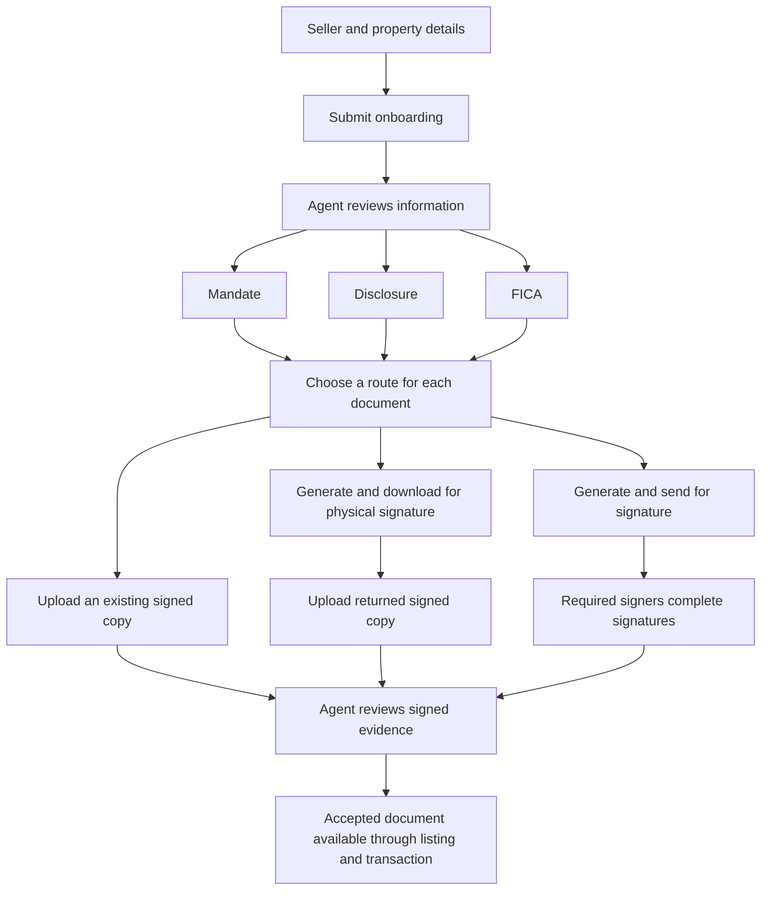

# Seller workflow audit and repair plan

10 October 2026. Primary Arch9 application and its shared Supabase seller services.

The first repair should protect saved seller information before changing the screens. Local database reproduction confirmed that an older seller page can overwrite a newer agent save and that a late draft can reopen completed onboarding. The document choices already exist, but onboarding, document preparation, corrections and completion still use overlapping workflows.

The proposed customer journey is: submit seller and property details, review that information, then handle mandate, disclosure and FICA separately. Each document should offer **Upload manually**, **Generate and download**, and **Generate and send for signature**. Existing signed documents and evidence must remain preserved.

This is an audit and proposed repair plan. Application code, existing migrations, hosted records, email delivery and deployments were not changed.

## Scope and evidence

The sweep covers agent seller lead workspaces, listing seller profiles, seller onboarding, the main seller portal, participant collaboration, document generation and signing, upload persistence, transaction handoff and transaction seller presentation. Public websites, rental landlord workflows, developer sales and a general portal redesign are outside this repair scope.

Evidence combines current source tracing, the established local checks, actual seller SQL functions executed in isolated PGlite, and the existing Chromium document acceptance journeys. The latter exercise real document generation, PDF downloads, signing-handler logic and review commands with synthetic identity, email, Storage and pre-transaction infrastructure. They do not certify the deployed frontend, production function catalogue, actual email delivery or a complete hosted lead to transaction journey.

The working tree is active. A document run was invalidated by its source-change guard, so its final result cannot be counted as passing. A separate frozen local copy is used for the repeat check. Findings refer to the audited implementation; subsequent changes require rechecking.

## The three seller journeys

| Journey | Current data and workflow | Required outcome |
| --- | --- | --- |
| Seller lead to seller lead workspace | CRM lead and contact snapshots; a linked private listing and onboarding record when available. The lead route still has some direct onboarding writes. | One saved seller record, consistent profile and document status, and an explicit explanation when a secondary CRM update fails. |
| Listing to seller profile | Listing and onboarding form are saved together by the canonical agent command. The listing also owns marketing and operational property fields. | Agent and seller can work concurrently without silently replacing each other's details. Legal owner, contact and authorised signers remain distinct. |
| Transaction to seller | The transaction links to the listing; seller documents are promoted into shared transaction documents. Transaction seller displays also use transaction and participant snapshots. | Current seller details and accepted documents carry through consistently. Signed instruments retain their original facts, and later legal corrections follow a review or amendment process. |

Keep the existing ownership boundary: lead for acquisition, listing for the property operation, onboarding record for seller facts, reviewed document versions for signed evidence, and transaction for sale and conveyancing state. A screen's cached snapshot should never become a competing authority.

## Findings

### Seller saves can overwrite newer agent details

**Priority: repair first. Confirmed by local execution of the actual SQL.**

Agent saving supplies an expected listing timestamp and rejects a stale save. Seller draft saving and submission supply no expected version. The seller page sends a complete form snapshot; the token functions merge that snapshot over stored fields. Serialising requests inside one browser does not coordinate a second browser or the agent's page.

Three local scenarios reproduced:

1. Save a new phone through the guarded agent command, then save the seller's older draft: the old phone replaces the new phone and the canonical facts.
2. Save another new phone through the agent command, then submit the seller's older form: the old phone replaces the new phone.
3. Complete onboarding, then send a late draft: both onboarding and listing onboarding status return to `in_progress`, while the submission timestamp remains.

Seller drafts also update the listing timestamp, so the agent can encounter a conflict after an unrelated background draft. The commands acquire listing and onboarding locks in opposite orders; this is an additional potential deadlock risk under true overlap, not a reproduced deadlock in the single-session fixture.

Evidence: `src/pages/SellerOnboarding.jsx` (`persistListingUpdate`, `saveDraft`, `handleSubmit`); `src/services/privateListingService.js` (`savePrivateListingSellerCanonicalUpdate`, `updateSellerOnboardingProgressInternal`, `submitSellerOnboarding`); migrations `20261001092739_seller_onboarding_access_enforcement.sql`, `20260906163555_corrective_seller_onboarding_receipt.sql`, and `20261006095510_seller_save_non_retryable_conflict.sql`.

### Some seller writes still bypass the shared save command

**Priority: repair with concurrency protection. Confirmed in source.**

`persistSellerProfileOnboardingFormData` reads an onboarding row, merges in the browser, then directly updates the full form without an expected-version condition. Active lead paths use it for token-only profile saving, onboarding preparation or replacement, initial listing handoff and assisted onboarding setup. It does not atomically update the listing's canonical facts alongside the form.

Guarded merging preserves many untouched fields, but cannot protect against a change saved between its read and write. The repair must include these callers rather than fixing only the main listing editor.

Evidence: `src/services/privateListingService.js:4040`; caller paths in `src/pages/agency/AgencyPipelinePage.jsx` around lines 23087, 24703, 26139 and 27045.

### Disclosure still blocks information onboarding

**Priority: workflow repair. Confirmed in source and existing component checks.**

Onboarding contains Ownership and FICA, Property Information, Disclosure and Confirmation, then Review and Send. Submission requires the disclosure answers and, in the seller route, its acknowledgements and signature. Assisted onboarding also requires the completed questionnaire, although it correctly avoids signing for the seller.

This conflicts with the proposed order and burdens an agent who already has a signed disclosure. Removing the pane alone would leave disclosure validation, frozen snapshots, generated drafts, completion projections and old step indices coupled to submission.

Evidence: `src/pages/SellerOnboarding.jsx:329`, `:4518`, `:4580`, `:6688`; `src/components/leads/SellerLeadAgentOnboardingEditor.jsx`; `src/lib/sellerLeadManualCaptureModel.js`; `src/core/documents/sellerOnboardingJourneyStatus.js`.

### Separate document buttons still enter combined pack rules

**Priority: workflow repair. Confirmed by source and a local model call.**

The shared actions already offer Generate and download, Generate and send for online signature, and Upload existing. Lead and listing screens use that component, but preparation still uses onboarding review, a shared formal pack, mandate-source decisions and several legacy pack projections.

For example, preparing only disclosure with the existing agency-mandate route is rejected by formal pack validation with “Include FICA”. Journey labels also repeatedly describe a FICA and mandate pack while disclosure follows separate onboarding completion rules. These dependencies prevent the three documents from feeling independent.

Use one action contract per document and retain preview and agent review before download or dispatch. An existing signed upload must not require generating another copy. Requirements for generation should apply only when that route is chosen.

Evidence: `src/core/documents/sellerDocumentWorkflow.js`; `src/components/documents/SellerDocumentWorkflowActions.jsx`; `src/core/documents/sellerOnboardingFormalPackApproval.js`; `src/core/documents/sellerOnboardingJourneyStatus.js`.

### Sellers have different correction routes in different portals

**Priority: usability repair. Confirmed in source.**

The main seller portal's My Details screen is read-only. A separate participant collaboration portal supports proposed changes and agent approval for protected fields. Signing links have another correction flow. Onboarding has its own completion and replacement rules.

The protected-change mechanism is useful, but the normal seller portal does not present it as one obvious correction action. After submission, a seller needs a visible way to correct contact details or request a legal-data correction, with status and responsibility shown in the same workspace.

Evidence: `src/pages/ClientPortal.jsx` (`SellerMyDetailsReadonlyPage`); `src/pages/SellerCollaborationPortal.jsx`; `src/components/listings/ListingSellerCollaborationPanel.jsx`; migration `20260924160026_listing_seller_collaboration_permissions_phase8.sql`.

### Lead upload feedback can omit an incomplete handoff

**Priority: reliability repair. Confirmed in source.**

Agent upload first saves the listing document, then attempts transaction promotion and checklist status updates. The service returns a persistence receipt with warnings if follow-up work needs attention. The listing screen displays those warnings; the general seller lead upload handler displays “uploaded” without reading that receipt.

The lead mandate handler also performs listing and CRM updates after the file has been saved. A later failure falls into a generic upload-error message even though the document may already exist. That makes it difficult to decide whether to retry and can encourage duplicate uploads.

Both screens should distinguish file saved, awaiting review, handoff pending and file save unconfirmed. A retry should recover the original attempt before creating another upload.

Evidence: `src/services/privateListingService.js` (`uploadPrivateListingDocument`, promotion and persistence receipt); `src/pages/AgentListingDetail.jsx:11606`; `src/pages/agency/AgencyPipelinePage.jsx:26458`, `:26644`, `:26795`.

### Seller document visibility needs an explicit release rule

**Priority: usability and responsibility repair. Confirmed policy behavior.**

The lead mandate upload deliberately stores the file with `internal` visibility. Seller document visibility correctly excludes an explicitly internal document, even when its requirement is seller-facing. Agent review changes document status; the reviewed-copy command does not itself release the file to the seller.

Treat this as a policy gap to resolve, not a reason to weaken private-document access. The recommended rule is that an accepted seller mandate is available to its authorised seller participants, while working notes and internal compliance material remain private. The interface should explain who can see each file and what approval will release it.

Evidence: `src/pages/agency/AgencyPipelinePage.jsx` (`handleSellerLeadSignedMandateUpload`); `src/services/documents/sellerDocumentVisibilityPolicy.js`; migration `20261004121736_seller_document_review_runtime_reconciliation.sql`.

### Transaction seller details still have competing display sources

**Priority: continuity repair. Source-level risk; hosted divergence not established.**

Transaction seller presentation is not uniformly sourced. For example, UnitDetail prefers transaction seller-name fields, while AttorneyTransactionDetail uses a seller-name resolver but prefers transaction or roleplayer email fields. The main seller portal reads the linked seller onboarding form. The agent canonical seller save updates listing and onboarding records, with CRM projection afterward; it does not update every transaction participant snapshot.

A later contact correction can therefore remain current in one screen and stale in another unless another projection synchronises it. The repair should explicitly separate current contact information from the legal facts frozen in an accepted instrument, then define what refreshes across transaction and attorney views.

Evidence: `src/pages/UnitDetail.jsx:7038`; `src/pages/AttorneyTransactionDetail.jsx:18315`; `src/services/listings/listingSellerCanonicalUpdateService.js`; `src/services/clientPortalWorkspaceService.js`.

### Legacy checks and records need evidence based classification

**Priority: planned cleanup. Confirmed test inconsistency.**

Historical normalisation already distinguishes configured, unconfigured, ambiguous and conflicting seller records. The shared document projection also refuses to mark a request complete without an actual artifact. Preserve these protections.

One older portal-behavior check fails: it expects a completed disclosure from a fixture with an empty questionnaire and missing current acknowledgement evidence. The same test later expects FICA completion from onboarding alone. That expectation conflicts with the current requirement for separate FICA signing evidence. Reconcile the fixture and intended workflow rather than making incomplete evidence count as complete.

Evidence: `scripts/seller-post-mandate-document-portal-behavior.test.mjs:150`; `src/services/listings/listingSellerHistoricalNormalizationModel.js`; `src/services/sellerDocumentRequirementsService.js` (`toSellerDocumentSourceRow`, `buildSellerFicaDeclarationDocumentFromOnboarding`).

## Proposed document workflow

| Document | Upload manually | Generate and download | Generate and send for signature |
| --- | --- | --- | --- |
| Mandate | Upload an existing signed mandate and review its owner, property, commercial terms and signatures. | Capture missing terms, preview the saved version, download, then upload the returned copy. | Review the saved version and required signers, send it, track delivery and signatures, then review. |
| Disclosure | Upload an existing signed disclosure without answering the questionnaire again as an onboarding condition. | Complete the questionnaire in the document workspace, preview, download and collect signatures. | Capture or request the answers in that workspace; the sellers review their declarations and sign their own document. |
| FICA | Upload the existing signed FICA form; supporting evidence remains separate. | Reuse onboarding identity and compliance details, complete document-specific gaps, preview and download. | Reuse those facts, check the appropriate people and authority, then send the reviewed version for signature. |

Each document needs a current accepted copy, any pending replacement, original versions, chosen route, responsible person, last event, next action and a reason when an action is unavailable. Sending, uploading, signing and reviewing must remain different statuses. Delivery failure, partial signature, rejection and handoff failure need visible recovery actions.

The supporting checklist remains conditional. The application's current matrix includes personal ID or passport and address evidence; entity registration and representative authority; trust, estate or power-of-attorney documents; and applicable property, bond, lease or compliance evidence. The signed FICA form does not replace those supporting documents or a compliance review. Present why each item is needed, who supplies it and who reviews it. This describes the application workflow, not a fresh legal-requirements determination.

## Information authority

Use the existing legal-owner, primary-contact, representative and signer model consistently. A CRM contact is not automatically the owner or an authorised signatory. An agent may capture a seller's answers, but that capture must not record a seller declaration or signature.

Display whether a value is a draft, agent-captured, seller-confirmed or reviewed, along with its actor and date. Contact corrections may use a simple authorised edit; ownership, identity, signing authority and signed-document changes should use the existing protected review or amendment route. Changing a person must not transfer another person's signature or authority evidence.

The seller should reach corrections from My Details and see pending, approved or returned changes there. The agent should see the same proposed change and the newer saved values before approving it. Server commands must derive actor identity from the authorised session or participant, and validate the exact record and permitted fields.

## Repair order and definition of done

1. **Protect saving and completion.** Give every seller writer a shared version check and request identity; apply changed fields against the version the user actually edited. Preserve unrelated newer fields, stop stale same-field changes, retain unsaved input, and offer a comparison. Align lock ordering and prevent drafts from downgrading completed intake. Route the direct helper's active callers through the same boundary. Add focused overlap cases to existing saving checks.
2. **Separate onboarding from documents.** Remove disclosure answers, acknowledgements and signatures from information submission in both seller and assisted routes. Move their collection and validation to disclosure preparation. Keep onboarding permissions separate from document declarations. Preserve old signed disclosures and resume unfinished forms safely despite changed step numbering.
3. **Make the three document routes independent.** Reuse the shared seller document source and actions. Remove cross-document pack prerequisites, standardise labels and show missing inputs for the chosen route. Preserve reviewed versions, signer rules, active-request cancellation and replacement controls.
4. **Unify corrections and upload feedback.** Connect the main seller portal to the protected-change workflow. Show committed saves separately from pending CRM, checklist or transaction follow-up. Make retry and recovery consistent in lead and listing workspaces. Apply an explicit reviewed-document visibility policy.
5. **Verify continuity and classify historical records.** Confirm current contact and seller-fact reads across listing, transaction and attorney views. Keep signed snapshots immutable. Run a read-only historical classification before proposing repairs; distinguish recoverable projection gaps from ambiguous owners or missing signed evidence. Any hosted repair requires its own approved target and exact scope.

Acceptance must use the same seller through lead, listing, accepted-offer transaction and attorney handoff. Check individual, married, multiple-owner, company or CC, trust, estate, POA and foreign-owner cases, including manual capture without email. Digital dispatch must still require valid details for every required signer.

Required overlap cases: agent and seller edit different fields; both edit the same field; two seller tabs; draft versus submit; agent and seller upload the same requirement; upload versus online signing; review versus replacement; timeout after commit; stale readback; denied or expired access; and transaction creation during upload. Verify saved data and the resulting screens after reopening, not only the presence of buttons. True overlapping lock behavior needs a multi-connection PostgreSQL test; the sequential PGlite reproduction does not establish that behavior.

## Verification record

- Saving, access, ownership and collaboration checks: **36 passed** across the established onboarding-access, canonical-update, flow-contract, party-authority, merge-guardrail and collaboration scripts.
- Continuity, historical normalisation, existing evidence and upload persistence checks: **43 passed**.
- `npm run test:seller-document-journey`: its preliminary Node checks **58 passed**, and the seller-information component checks **18 passed**. The initial Chromium journey completed its scenarios but failed the source-stability guard because the working tree changed; it is not a passing suite result.
- Requirement, visibility, portal-summary and refresh checks: **13 passed, 1 failed**. The failure is the older portal-behavior expectation described above.
- Additional actual-SQL audit reproduction: all three assertions confirmed the stale-write and completion-regression behaviors described above. These assertions establish bugs, not repaired behavior.
- Frozen-copy document acceptance rerun: **passed 16 journeys, 54 actual PDF downloads and 293 rendered pages**, including corrections, expired-link handling, retry, manual evidence review and a local rollback rehearsal. Source fingerprint: `sha256:ffc73b9d5efdb613c3a519e212925c267b773483d2f39d4dd266bf689e9dec85` across 108 release-source files. This certifies the frozen local source, not a subsequent working-tree change or hosted deployment.

Hosted permissions, the deployed migration catalogue, real email delivery, Storage behavior and a complete hosted transaction journey remain acceptance requirements for a later authorised release. No production readiness claim follows from these local results.
