# Phase 8 - External Mapping And Delivery

## 1. Purpose

Phase 8 adds a controlled external export layer for the normalized guided bond application. It prepares canonical information packages from immutable submitted application snapshots, validates recipient readiness, records delivery attempts, and records external acknowledgements without changing bank workflow automatically.

OOBA is treated as one possible bond-originator recipient of Arch9 application information. Phase 8 does not create bank application rows, advance finance stages, submit to banks automatically, or introduce OOBA/bank payload formats without approved specifications.

## 2. Source Of Truth

Exports are built only from `transaction_bond_application_submissions.snapshot_json` where the submission is finalized, active and not superseded.

The mutable normalized draft tables and `onboarding_form_data.form_data.bond_application` compatibility JSON are not export sources. The compatibility JSON remains for current Unit Detail and originator consumers only.

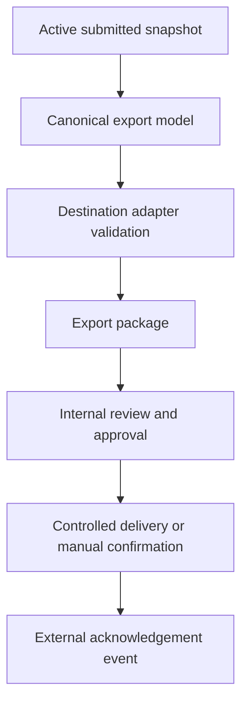

## 3. Feature Flags

All Phase 8 flags default to false:

- `bond_application_exports_v1`
- `bond_application_ooba_adapter_v1`
- `bond_application_bank_adapters_v1`
- `bond_application_live_delivery_v1`
- `bond_application_external_status_sync_v1`

Exports depend on `guided_bond_application_v2` and `guided_bond_application_participants_v1`. Live delivery depends on exports and an enabled destination adapter. No query-string override exists.

## 4. Official Specification Blocker

Repository inspection found no approved OOBA bond-originator intake schema, bank-specific schema, enum map, payload sample, validation rule set, transport credential policy, delivery acknowledgement contract, or external status mapping.

Therefore:

- OOBA is registered as a disabled bond-originator recipient adapter.
- Generic bank adapter support is registered as disabled.
- No destination XML, CSV or API payload is generated.
- No live delivery is enabled.
- Mapping coverage reports show the official specification as a blocker.

No OOBA recipient mapping, bank-specific mapping or live delivery is enabled by default.

## 5. Canonical Export Model

The canonical model uses schema version `phase-8-canonical-v1`.

It includes:

- Source references: transaction, normalized application, submission, submission version, application revision, review context hash and snapshot hash.
- Shared application information: property, finance, applicant structure and selected banks.
- Active participants: primary applicant, co-applicant and surety where included in the signed snapshot.
- Participant-owned answers.
- Participant and shared document manifests.
- Declaration evidence.
- Signer manifest.
- Signing package manifest where present.
- Version metadata.

It excludes:

- Invite tokens.
- Portal tokens.
- Signing tokens.
- Signed URLs.
- Storage paths.
- Internal notes.
- Analytics.
- Mutable navigation state.
- Removed participant draft data outside the submitted snapshot.

## 6. Canonicalization And Hashing

Canonical JSON uses sorted object keys and deterministic JSON serialization through the existing `hashCanonicalBondApplicationPayload()` SHA-256 helper.

The export stores:

- Source snapshot hash.
- Canonical export hash.
- Destination payload hash where a destination payload exists.

Navigation metadata is ignored by the canonical model. Material answer changes alter the canonical hash.

## 7. Validation

Validation blocks export when:

- The source submission is not `submitted`.
- The submission is superseded.
- The snapshot is missing.
- The stored snapshot hash does not match the snapshot content.
- The request expected a different snapshot hash.
- The submission is not the application active submission.
- A material revision is still active.
- The destination adapter is disabled.
- The official destination specification is missing.
- Sensitive token, URL, path or internal-note fields appear in the canonical export.

## 8. Adapter Contract

Every adapter must expose:

- `validateCanonicalSource()`
- `mapCanonicalToDestination()`
- `validateDestinationPayload()`
- `serializePayload()`
- `mapDeliveryResponse()`
- `mapExternalEvent()`

The registry records adapter version, canonical schema version, transformation registry version, capability profile, delivery methods, live-delivery support and blockers.

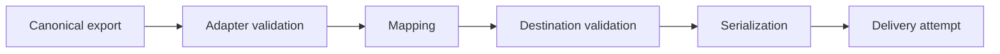

## 9. Transformation Registry

The transformation registry is versioned as `phase-8-transformations-v1`.

Supported pure transformations include:

- Date to `YYYY-MM-DD`.
- Boolean to `Yes`/`No`.
- Boolean to `Y`/`N`.
- Exact money to decimal string.
- Exact money to minor units.
- Enum to destination enum.
- Participant role to destination role.
- Document type to destination category.
- Phone to E.164 or blocker.

Missing values, false values and zero values remain distinguishable.

## 10. Export Package Domain

The migration adds:

- `transaction_bond_application_export_packages`
- `transaction_bond_application_delivery_attempts`
- `transaction_bond_application_external_events`

Export packages record:

- Destination key and adapter version.
- Source submission and snapshot hash.
- Canonical hash.
- Destination payload hash where available.
- Validation summary.
- Mapping manifest.
- Document manifest.
- Operational context.
- Approval, delivery, cancellation and supersession state.

Delivery attempts record:

- Package reference.
- Destination.
- Delivery method.
- Status.
- External reference.
- Redacted response summary.
- Idempotency key.

External events record:

- Destination.
- External reference.
- External status.
- Mapped internal export status.
- Redacted event JSON.
- Mapping result.

## 11. Status Lifecycle

Package statuses:

- `draft`
- `validation_failed`
- `ready_for_review`
- `ready_for_originator`
- `accepted_by_originator`
- `approved`
- `delivering`
- `delivered`
- `downloaded`
- `delivery_failed`
- `partially_delivered`
- `cancelled`
- `superseded`

Delivery statuses:

- `queued`
- `in_progress`
- `accepted`
- `confirmed`
- `failed`
- `unknown`
- `cancelled`

External events map to export-level states only. They do not automatically modify bank workflow rows.

## 12. Phase 8A Originator Intake Package

Phase 8A introduces a general bond-originator intake package. This is the practical handoff layer for recipients such as OOBA and other bond originators.

The package is not an OOBA-specific payload and not a bank payload. It contains:

- Signed application document references.
- Supporting document manifest.
- Canonical application summary.
- Participant summary.
- Source submission and snapshot hash.
- Audit-safe operational context.

The lifecycle is:

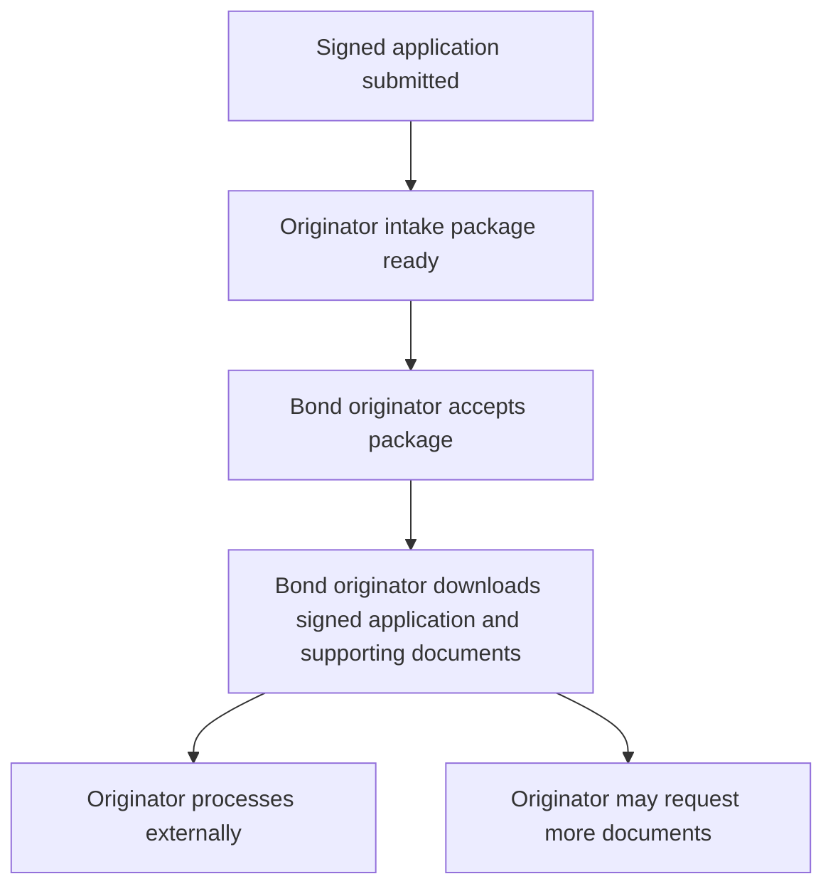

Phase 8A records:

- `package_ready_at`
- `accepted_by`
- `accepted_at`
- `download_count`
- `last_downloaded_by`
- `last_downloaded_at`
- `document_bundle_manifest_json`

Downloads are recorded through a service-only audit helper. Download audit stores document IDs and counts, not public URLs, storage paths, raw files or bank decisions.

## 13. Phase 8B Originator Document Requests

Phase 8B lets a bond originator request missing, replacement or supplemental supporting documents after accepting the intake package.

This is still facilitation, not decisioning. The originator processes the application externally and may ask Arch9 buyers for more documents through the platform. Arch9 records the request, routes it to the correct participant or shared document area, receives the upload through the existing document system, and lets the originator review the uploaded document.

Supported request types:

- `missing_document`
- `replacement_document`
- `supplemental_document`

The lifecycle is:

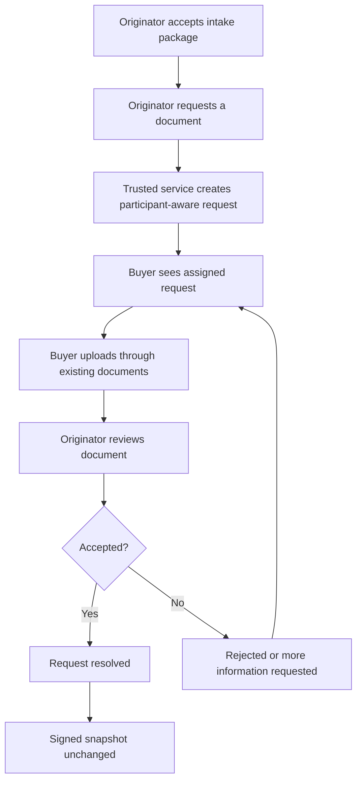

Phase 8B adds `transaction_bond_originator_document_requests`.

The table links to:

- The originator intake export package.
- The transaction.
- The submitted application snapshot.
- The normalized participant where the request is participant-specific.
- Existing `transaction_required_documents` where a requirement already exists.
- Existing `documents` when the buyer uploads a response.

Document requests are supplemental-only in Phase 8B:

- `requires_new_submission` remains false.
- `bank_workflow_unchanged` remains true.
- The immutable signed application snapshot is not changed.
- No new submission version is created.
- No bank application row is created.
- Offers and grants are not changed.

If an originator needs an application answer corrected, that remains the Phase 7 controlled revision/change-request workflow because it can affect signable application content and may require a new signed version.

### Privacy

Buyer-facing request views must be filtered by the trusted backend:

- A primary applicant sees shared document requests and their own participant document requests.
- A co-applicant sees shared document requests and their own participant document requests.
- A surety sees shared document requests allowed for their role and their own participant document requests.
- Participants do not receive another participant's private document request details.
- Internal notes are never returned in buyer-facing request payloads.

The dashboard card only shows high-level counts such as open requested documents and documents awaiting review.

### Persistence And RLS

`transaction_bond_originator_document_requests` uses RLS with service-role writes only. Originator and buyer screens must use trusted operations that enforce transaction access, participant ownership, and document visibility before reading or mutating request state.

The service-only upload helper links an existing uploaded document to the request and moves the request to `awaiting_review`; it does not store public URLs or copy files into a new storage system.

## 14. Phase 8C Originator Progress Tracking

Phase 8C adds high-level progress tracking for the originator intake package.

This helps buyers, agents and internal teams understand where the facilitated bond process is without turning Arch9 into the decision-maker and without treating tracking updates as bank workflow.

Progress can come from:

- System milestones, such as package ready, accepted and downloaded.
- Phase 8B document-request activity.
- Originator-recorded updates, such as reviewing, processing, waiting for buyer documents, on hold or completed.

The lifecycle is:

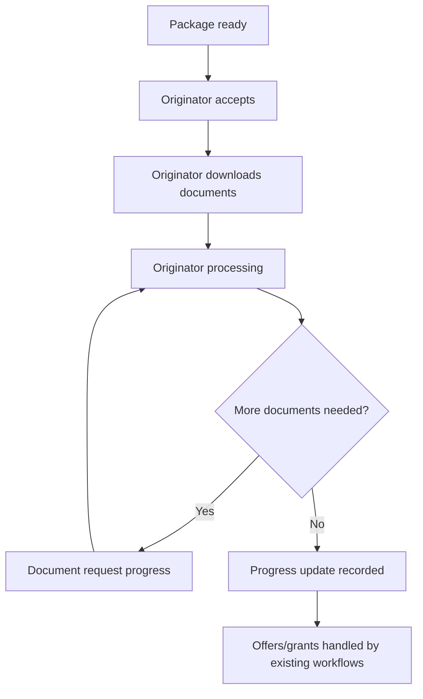

Phase 8C adds `transaction_bond_originator_progress_events`.

Progress events record:

- Intake package reference.
- Transaction and submitted application references.
- Event type.
- High-level status.
- Buyer/agent/originator visibility flags.
- Buyer-safe summary.
- Separate internal note where required.
- Idempotency key.
- Audit timestamps.

Progress events do not record:

- Bank decisions.
- Offer decisions.
- Grant decisions.
- Bank payloads.
- External credentials.
- Applicant financial values.
- Internal notes in buyer-facing payloads.

The dashboard and portal views use a derived timeline and summary. Buyers and agents receive only events allowed for their visibility level; originators/internal users may see internal operational context where existing permissions allow it.

Phase 8C explicitly preserves:

- `bank_workflow_unchanged = true`
- `offer_workflow_unchanged = true`
- `grant_workflow_unchanged = true`

An originator progress update may say that the originator is processing the application or waiting for documents. It must not claim a bank outcome, change a finance stage, alter an offer, accept a grant, or create a bank application row.

## 15. Phase 8D Bank Offers And Grants Capture

Phase 8D lets a bond originator capture bank offers and formal bond grants that they obtained while processing the application.

This matches Arch9's role:

- Buyers submit the application and supporting documents on Arch9.
- Bond originators process the application with banks.
- Bond originators capture offers and grants back into Arch9.
- Buyers can view offers and accept the grant through the existing buyer workflow.
- Agents can track high-level progress.
- Attorneys can access the bond grant through the existing document/workflow surfaces.

Arch9 facilitates the process. It does not make lending decisions.

Phase 8D adds:

- `transaction_bond_originator_bank_offer_captures`
- `transaction_bond_originator_grant_captures`

Offer captures record:

- Originator intake package reference.
- Submitted application reference.
- Bank name.
- Offered amount.
- Interest rate details.
- Monthly repayment.
- Term.
- Valid-until date.
- Offer document reference.
- Buyer publication state.
- Buyer decision state where recorded.
- Optional link to an existing `transaction_bond_quotes` row.

Grant captures record:

- Originator intake package reference.
- Submitted application reference.
- Bank name.
- Approved amount.
- Grant document reference.
- Signed grant document reference where available.
- Grant reference.
- Buyer publication state.
- Optional link to an accepted `transaction_bond_quotes` row.

The capture helpers return explicit proposals for the existing governed workflow:

- `create_transaction_bond_quote`
- `record_bond_offer_decision`
- `record_grant_received`
- `record_grant_signed`

Those proposals are not executed automatically by Phase 8D. Existing authorized workflows remain responsible for writing `transaction_bond_quotes`, `transaction_bond_offer_decisions` and `transaction_bond_instructions`.

Phase 8D explicitly does not:

- Create bank application rows.
- Submit anything to a bank.
- Accept or decline an offer on behalf of the buyer.
- Mark a grant signed without the proper buyer action/document.
- Change finance stages automatically.
- Change offer or grant workflow tables automatically.

The dashboard can show high-level counts such as captured offers and captured grants. Buyer-facing offer/grant views must use existing access rules and trusted APIs before exposing documents or decision actions.

## 16. Phase 8E Buyer Offer/Grant Experience

Phase 8E makes originator-captured offers and grants understandable and actionable for the buyer.

In simple terms:

- The originator receives or negotiates offers from banks.
- The originator captures those offers and grants in Arch9.
- The buyer sees only offers and grants that were published for buyer visibility.
- The buyer can accept or decline an offer from the buyer portal.
- The buyer can upload the signed accepted offer through the existing secure document upload.
- The buyer can view published grant documents and signed grant copies where available.

Arch9 still facilitates the process only. The buyer action records intent and evidence. It does not make a lending decision, submit to a bank, or automatically change bank workflow records.

Phase 8E adds:

- `transaction_bond_originator_buyer_offer_decisions`
- `transaction_bond_originator_buyer_grant_acknowledgements`
- `bridge_client_portal_bond_originator_offer_grant_package()`, a token-scoped portal read model that returns sanitized buyer-visible fields only.
- A buyer-facing offer/grant view model.
- Buyer portal rendering for structured originator-captured offers and grants.
- Legacy uploaded offer/grant document fallback for older transactions.

The buyer offer/grant view model:

- Includes only buyer-visible offer statuses.
- Includes only buyer-visible grant statuses.
- Links to existing secure document references.
- Excludes internal notes.
- Excludes raw tokens.
- Excludes bank delivery payloads.
- Excludes private originator processing data.

The buyer portal does not receive or construct the originator export payload. It calls the server-side portal read model, which resolves the client portal token, finds the transaction, and returns only published offer/grant fields plus existing document references.

Offer decisions produce a governed proposal such as:

- `record_bond_offer_decision`

Grant acknowledgements produce a governed proposal such as:

- `record_grant_acknowledged`
- `record_grant_signed`

Those proposals are not executed automatically by Phase 8E. Existing authorized workflows remain responsible for writing to `transaction_bond_offer_decisions`, `transaction_bond_quotes`, `transaction_bond_instructions`, or any downstream finance records.

Phase 8E explicitly does not:

- Accept or decline an offer without buyer action.
- Mark a grant signed without buyer evidence.
- Create bank application rows.
- Submit anything to banks.
- Change bank statuses.
- Advance finance stages.
- Change offers or grants automatically.
- Grant attorneys new decision rights.

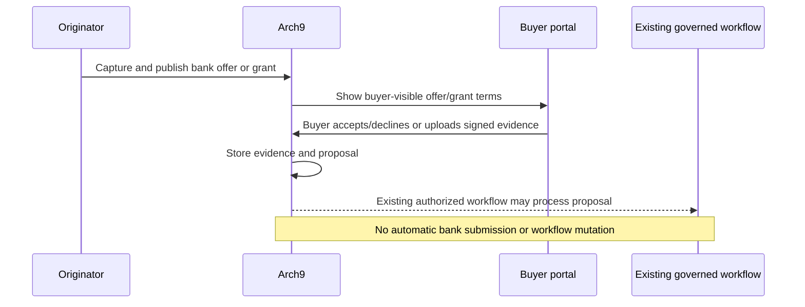

## 17. Phase 8F Agent Progress View

Phase 8F gives agents a read-only view of bond originator progress.

In simple terms:

- Buyers submit the application, documents, offer decisions and grant evidence through Arch9.
- Bond originators process the application with the banks and capture progress, document requests, offers and grants.
- Agents can track where the bond process is from the transaction workspace.
- Agents do not accept the originator package, download the originator bundle, request bond documents as the originator, create bank applications, change bank statuses, make lending decisions, change offers or change grants.

Phase 8F adds:

- `bridge_agent_bond_originator_progress_view(transaction_id)`, a transaction-scoped read model for authorized agent access.
- An agent-safe progress view model.
- An Agent Transaction Detail progress panel.
- A compact transaction-list bond progress chip.

The agent view may show:

- Originator package status.
- Whether the package was accepted or downloaded by the originator.
- Agent-visible originator progress updates.
- Counts of open document requests and documents awaiting originator review.
- Counts of published/accepted bank offers captured by the originator.
- Counts of published/signed bond grants captured by the originator.
- Safe next-step wording.

The agent view excludes:

- Export payload JSON.
- OOBA or bank-specific payloads.
- Raw tokens.
- Signed URLs.
- Internal originator notes.
- Buyer private draft answers outside authorized transaction views.
- Any action that mutates bank workflow, offers or grants.

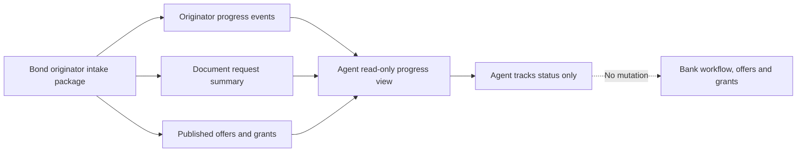

Phase 8F preserves:

- `bank_workflow_unchanged = true`
- Offer workflow mutation deferred.
- Grant workflow mutation deferred.
- Existing buyer, bond originator, attorney, offer and grant permissions.

## 18. Phase 8G Attorney Handoff

Phase 8G gives attorneys a focused handoff view once the bond originator has captured grant evidence.

In simple terms:

- The bond originator captures the bank offer and formal bond grant in Arch9.
- The buyer reviews/accepts the offer and may provide signed grant evidence through the buyer flow.
- Attorneys can see the accepted-offer/grant handoff status from the attorney finance workspace.
- Attorneys can open the existing secure grant document and signed grant document references where available.
- Bond attorney and cancellation attorney allocation remains in the existing Roleplayers workflow.

Phase 8G adds:

- `bridge_attorney_bond_originator_handoff_view(transaction_id)`, a transaction-scoped attorney handoff read model.
- An attorney handoff view model.
- An attorney finance workspace panel for grant documents, signed grant evidence and allocation status.

The attorney handoff view may show:

- Accepted offer count.
- Formal bond grant document references.
- Signed grant document references.
- Grant reference, bank name, approved amount and buyer-safe conditions summary.
- Current bond attorney and cancellation attorney allocation status.
- Safe next-step wording.

The attorney handoff view excludes:

- Export payload JSON.
- OOBA or bank-specific delivery payloads.
- Raw tokens.
- Public document URLs or storage paths from the RPC.
- Internal originator notes.
- Buyer draft financial answers outside existing authorized transaction views.
- Any action that mutates bank workflow, offers or grants.

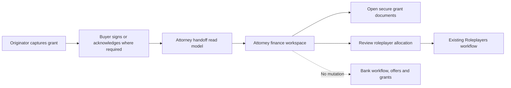

Phase 8G preserves:

- `bank_workflow_unchanged = true`
- Offer workflow mutation deferred.
- Grant workflow mutation deferred.
- Existing attorney document access.
- Existing roleplayer assignment rules.
- Existing bond-registration and cancellation workflows.

## 19. Approval And Delivery

Packages with blocking validation issues cannot be approved.

Approved packages may receive delivery attempts or manual confirmation. Manual confirmation returns a bank workflow update proposal for authorized originator review. The export package module does not create `transaction_bond_applications` rows or change finance workflow stages.

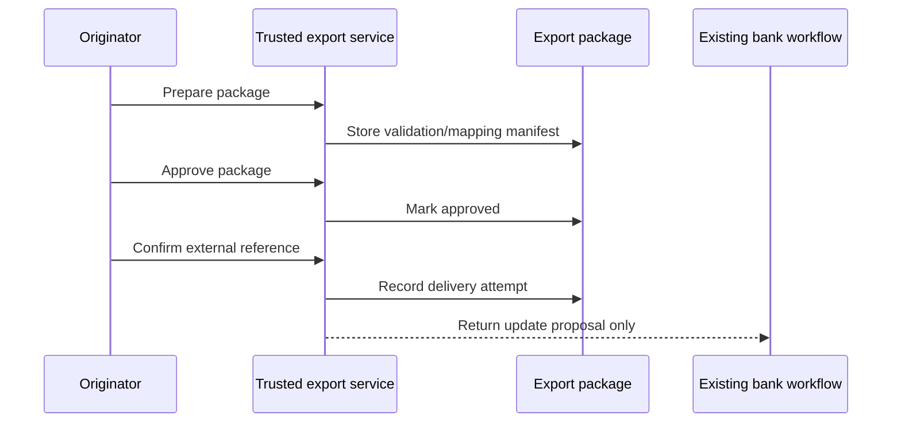

For Phase 8A originator intake packages, acceptance and download are operational handoff events. They do not mean a bank has received the application and they do not update bank workflow automatically.

## 17. External Response Reconciliation

External events are redacted and stored separately from bank workflow. The external status sync flag controls whether acknowledgement/status events may be processed by trusted services.

Because no official status mapping contract exists yet, destination adapters map unknown events to `review_required`.

## 18. Database And RLS

RLS is enabled on all Phase 8 tables.

Writes are service-role only. This keeps buyer tokens and browser sessions away from export payloads and delivery evidence. Authorized originator screens must access these records through trusted backend operations.

An immutability trigger prevents package source, mapping and payload fields from changing after approval/delivery/supersession.

Rollback approach:

- Disable Phase 8 flags.
- Stop trusted export operations.
- Drop the Phase 8 tables and triggers if no production package records must be retained.

## 19. Security And Privacy

Phase 8 confirms:

- No raw tokens are stored.
- No raw tokens are logged by the export modules.
- No public document URLs are stored in canonical exports.
- No storage paths are stored in canonical exports.
- No destination credentials are stored.
- No participant browser builds a combined external payload.
- No browser automation or portal scraping is used.
- Raw external response payloads are not stored; only redacted summaries/events are retained.

## 20. Legacy And Workflow Compatibility

Phase 8 preserves:

- Legacy bond application flow.
- Phase 5 sole submission flow.
- Phase 6 co-applicant flow.
- Phase 7 surety and revision flow.
- Unit Detail compatibility.
- Originator review compatibility.
- Existing document storage.
- Existing signing infrastructure.
- Offers.
- Grant.
- Existing bank workflow tables.

`transaction_bond_applications` is not repurposed. A nullable relationship from an export package to an existing bank workflow row exists only for manual confirmation/audit.

## 21. Destination Support Matrix

| Destination | Status | Reason |
| --- | --- | --- |
| OOBA bond-originator recipient | Disabled | Approved intake schema, enum map, payload validation and delivery contract are not present. |
| Bank-specific adapters | Disabled | Approved bank-specific schemas and delivery contracts are not present. |
| General originator intake package | Available for validation/audit | Provides signed application and supporting-document package to approved bond-originator recipients. |
| Secure internal export package | Available for validation/audit | Uses canonical export model and requires internal review. |
| Live API/SFTP/email delivery | Disabled | Requires approved destination contract, credentials and operational policy. |

## 23. Phase 8H Recipient-Specific Formats

Phase 8H adds a recipient-specific formatting layer on top of the Phase 8A originator intake package.

OOBA is handled as a bond-originator recipient, not as a bank and not as an automated decision-maker inside Arch9. In practical terms, Arch9 prepares the signed buyer application information and supporting-document manifests in secure downloadable formats, and OOBA or another bond originator processes that information in their own workflow.

The first supported profiles are:

- `arch9_originator_manual`
- `ooba_originator_manual`
- `ooba_official_payload` blocked
- `bank_official_payload` blocked

The manual originator profiles can generate:

- `arch9_originator_json`
- `arch9_originator_summary_csv`
- `arch9_document_manifest_csv`

These artifacts are generated from the existing canonical export and originator intake package. They exclude raw tokens, public URLs and storage paths, and they remain marked:

- `manual_download_only = true`
- `live_delivery_enabled = false`
- `no_automatic_bank_submission = true`
- `bank_workflow_unchanged = true`

Official OOBA and bank payload generation remains blocked until the recipient supplies approved:

- Payload schemas.
- Enum and value maps.
- Validation rules.
- Transport policy.
- Credentials.
- Acknowledgement and status contracts.

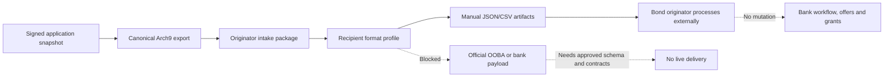

Phase 8H also adds `transaction_bond_application_recipient_format_packages` for generated recipient format package evidence. The table is service-write only and has hard checks preventing live delivery and automatic bank submission flags from being enabled. `bridge_originator_recipient_format_packages_view(transaction_id)` returns metadata only, not artifact payload bodies.

## 24. Phase 8I Governance And Reporting

Phase 8I adds a governance and reporting layer over the Phase 8 handoff workflow.

The report answers a simple operational question:

“Are we safely facilitating the bond process without pretending to be the lender, the bond originator or the bank delivery system?”

The governance report covers:

- Source submission and export package identity.
- Originator intake package status.
- Recipient-specific format readiness.
- Official OOBA and bank payload blockers.
- Document request status.
- Originator progress status.
- Captured offers and grants.
- Delivery-attempt and external-event counts.
- Workflow safety controls.

The decision boundary is explicit:

- Arch9 facilitates the application process.
- Buyers submit their application and supporting documents.
- Bond originators process the information externally.
- Banks and bond originators make lending and processing decisions outside Arch9.
- Arch9 does not automatically submit to banks.
- Arch9 does not mutate bank workflow, offer workflow or grant workflow from the report.

The governance report is marked:

- `reporting_only = true`
- `sensitive_payload_included = false`
- `no_automatic_bank_submission = true`
- `live_delivery_enabled = false`
- `bank_workflow_unchanged = true`

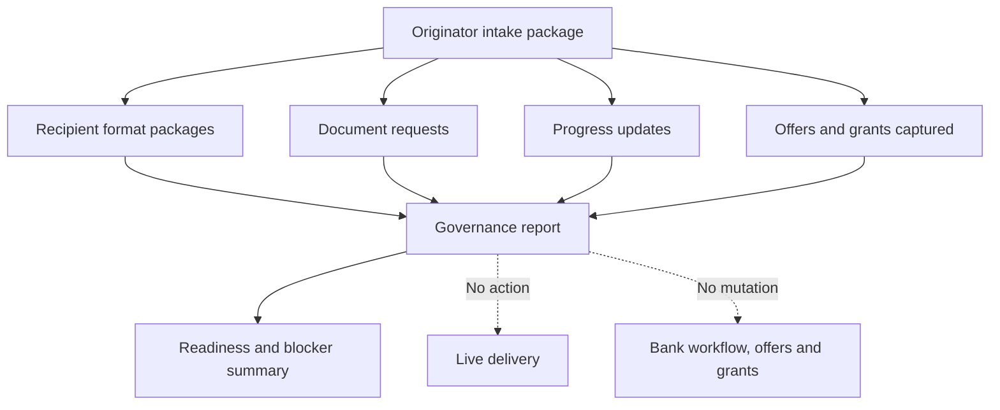

Phase 8I adds `transaction_bond_application_governance_reports` for service-generated report evidence. `bridge_bond_application_governance_report_view(transaction_id)` returns a metadata-only latest-report summary for authorized transaction users. It does not expose payload bodies, raw tokens, public document URLs, storage paths, credentials or internal delivery payloads.

## 25. Phase R1 Internal Readiness

Phase R1 is the internal gate before Arch9 introduces the bond-originator workflow to any external originator.

The purpose is to prove that Arch9 can prepare and inspect a clean signed buyer application package in staging while preserving the product boundary:

- Arch9 facilitates the bond application process.
- Buyers submit their application and supporting documents.
- Bond originators process the information externally.
- Banks and originators make lending and processing decisions outside Arch9.
- Arch9 does not automatically submit to banks.
- Arch9 does not mutate bank workflow, offer workflow or grant workflow.

The R1 readiness checklist requires evidence for:

- Phase 5 through Phase 8I migrations applied in the target environment.
- Feature flags defaulting off.
- No public query-string or buyer-controlled activation.
- Signed application package prepared.
- Signed application and supporting-document manifest visible internally.
- Manual originator recipient format generated.
- Phase 8I governance report generated.
- Manual release authority defined.
- Buyer submission verified in staging.
- Originator package generation verified in staging.
- Document manifest and signed documents verified in staging.
- Targeted Phase 8 tests, targeted lint and production build passing.
- No live delivery enabled.
- No bank workflow mutation enabled.

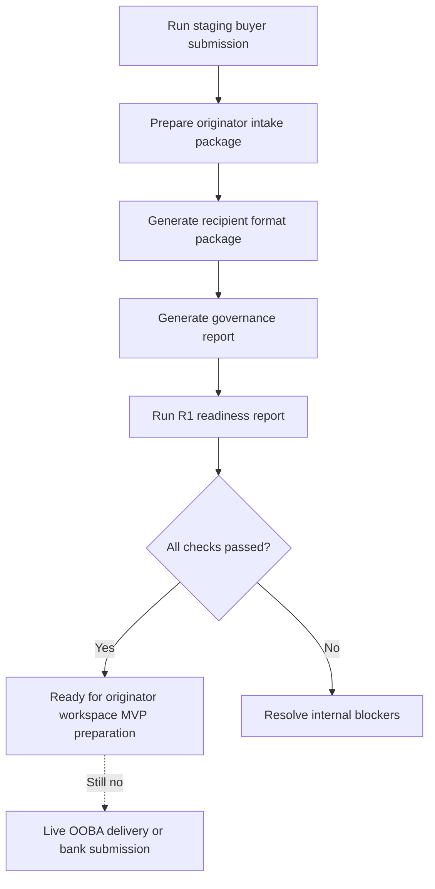

Phase R1 adds `transaction_bond_originator_internal_readiness_reports` for service-generated readiness evidence. `bridge_bond_originator_internal_readiness_view(transaction_id)` returns metadata only. It does not expose application payloads and it does not enable originator access, live OOBA delivery or bank workflow mutation.

## 26. Phase R2 Originator Workspace MVP

Phase R2 introduces the first bond-originator workspace surface.

The objective is simple:

- Arch9 prepares a signed buyer application package.
- An approved bond originator is assigned to that package.
- The originator can accept the package.
- The originator can download the signed application and supporting-document pack through secure document access.
- The originator can request missing, replacement or supplemental documents.
- The originator can record safe progress updates.
- The originator can capture bank offers and grants they obtained outside Arch9.
- Arch9 shows the captured information to the right parties without making lending decisions.

OOBA is handled as one possible bond-originator recipient, not as the only destination and not as a bank. In R2, OOBA or any other originator receives the Arch9 information pack and processes it externally.

The workspace does not:

- Generate official OOBA payloads.
- Deliver anything directly to OOBA or banks.
- Submit an application to a bank.
- Create bank application rows.
- Change bank statuses.
- Progress the finance workflow automatically.
- Change offers or grants automatically.

Phase R2 adds `transaction_bond_originator_workspace_assignments` so a package can be assigned to an originator workspace user without exposing the export payload. `bridge_bond_originator_workspace_mvp_view(originator_profile_id)` returns a metadata-only worklist:

- Package status.
- Recipient name.
- Document counts.
- Document-request counts.
- Progress summary.
- Offer and grant capture counts.
- Safe workspace actions.

The view intentionally excludes:

- Canonical application payload JSON.
- Destination payload JSON.
- Raw tokens.
- Public document URLs.
- Storage paths.
- Internal delivery credentials.
- Bank workflow mutation controls.

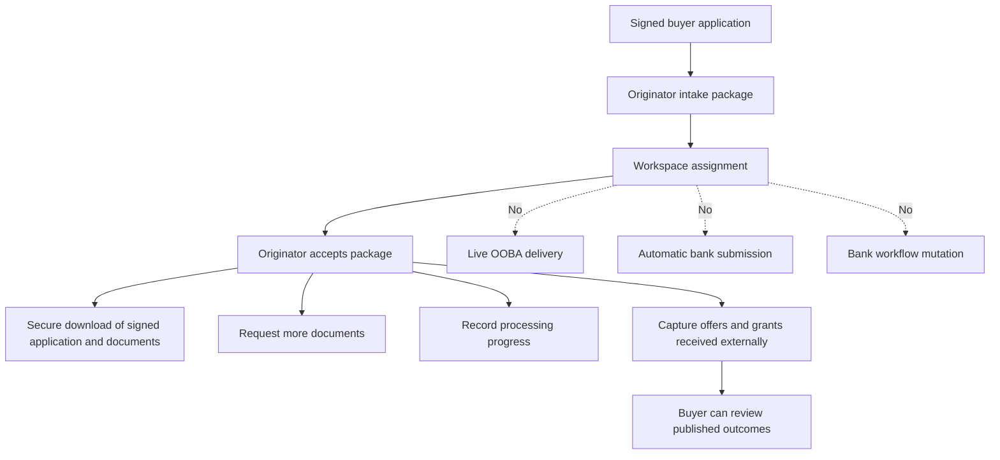

The R2 acceptance helper is `bridge_accept_bond_originator_workspace_package(export_package_id, originator_profile_id)`. It verifies that the authenticated originator is assigned to the package, marks the workspace assignment accepted and marks the intake package `accepted_by_originator` when appropriate. It does not create bank workflow records.

## 27. Phase R3 Document Requests

Phase R3 makes document requests practical inside the originator workspace.

R3 builds on Phase 8B. It does not create a second request system. It adds:

- Workspace-grade document request queue models.
- Originator-safe request detail views.
- Buyer/participant-safe request detail views.
- Request priority for follow-up ordering.
- Trusted originator request creation.
- Trusted originator request review.
- A buyer-safe client portal request view.

The request types remain:

- `missing_document`
- `replacement_document`
- `supplemental_document`

The status groups used by the workspace are:

- Waiting for buyer.
- Needs buyer action.
- Awaiting originator review.
- Resolved.
- Closed.

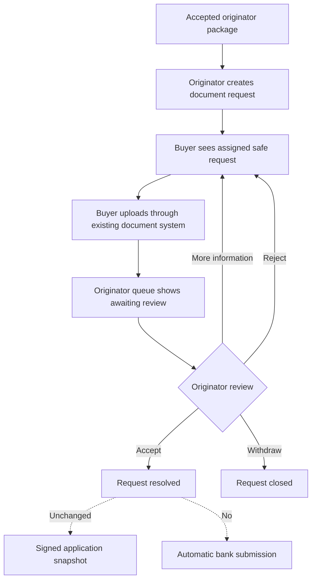

R3 adds these trusted functions:

- `bridge_create_bond_originator_workspace_document_request(...)`
- `bridge_review_bond_originator_workspace_document_request(...)`
- `bridge_originator_document_request_queue_view(export_package_id, originator_profile_id)`
- `bridge_client_portal_bond_originator_document_requests_view(participant_key)`

The originator queue may show originator internal notes to the assigned originator. Buyer-facing and participant-facing views exclude internal notes.

R3 remains document-only:

- `requires_new_submission = false`
- `supplemental_only = true`
- `signed_snapshot_unchanged = true`
- `no_new_submission_version = true`
- `no_automatic_bank_submission = true`
- `live_delivery_enabled = false`
- `bank_workflow_unchanged = true`

If an originator asks the buyer to change an answer in the signed application, that is not an R3 document request. It belongs to the controlled Phase 7 revision/change-request workflow and may require all required signers to review and sign a new application version.

## 28. Phase R4 Progress Tracking

Phase R4 makes originator progress tracking usable in the originator workspace and client portal.

Progress tracking answers:

“Where is the facilitated bond application process right now?”

It does not answer:

“Has a bank approved this application?”

R4 builds on Phase 8C and adds:

- Workspace-grade progress event view models.
- Originator progress dashboard models.
- Milestone summaries.
- Buyer-safe progress views.
- Agent-safe progress continuity.
- Assigned-originator progress update RPC.
- Originator progress workspace RPC.
- Buyer-safe client portal progress RPC.

Progress events may describe:

- Package readiness.
- Package acceptance.
- Package download.
- Documents requested.
- Documents uploaded.
- Documents accepted.
- Originator reviewing.
- Originator processing.
- General operational updates.
- On-hold states.
- Completion of external originator processing.

They must not describe unverified bank outcomes.

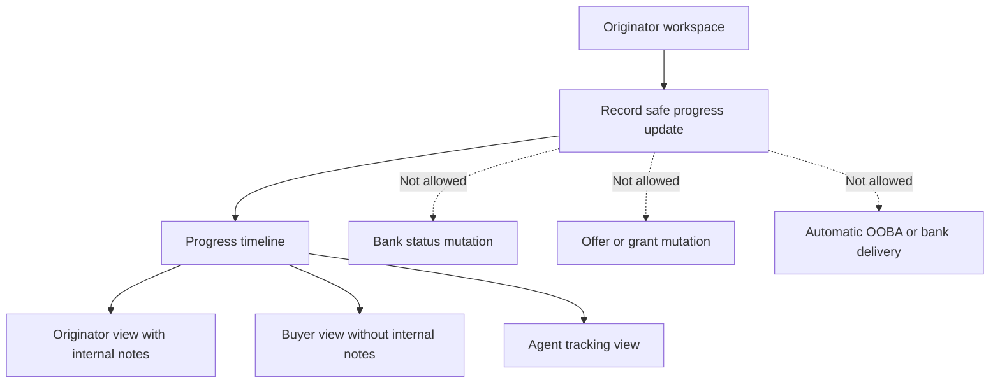

R4 adds these trusted functions:

- `bridge_record_bond_originator_workspace_progress_update(...)`
- `bridge_originator_progress_workspace_view(export_package_id, originator_profile_id)`
- `bridge_client_portal_bond_originator_progress_view()`

The progress workspace remains marked:

- `tracking_only = true`
- `progress_is_not_bank_decision = true`
- `sensitive_payload_included = false`
- `no_automatic_bank_submission = true`
- `live_delivery_enabled = false`
- `bank_workflow_unchanged = true`
- `offer_workflow_unchanged = true`
- `grant_workflow_unchanged = true`

## 29. Phase R5 Offers And Grants Capture

Phase R5 gives assigned bond originators a focused workspace to record bank offers and bond grants that they obtained through their own external processing.

Arch9 remains a facilitator in this phase:

- Buyers submit the application and documents through Arch9.
- Originators process the application outside Arch9 with their chosen banks or originator systems.
- Originators capture the offers and grants back into Arch9.
- Buyers can view published offers and grant evidence in the portal.
- Attorneys can use the captured grant evidence through the existing attorney handoff surface.
- Arch9 does not decide affordability, approve an offer, submit to a bank, mutate bank workflow rows, or change grant workflow rows automatically.

R5 adds the version marker:

- `phase-r5-originator-offers-grants-capture-v1`

It extends the existing Phase 8D capture records with:

- `workspace_version`
- `originator_workspace_assignment_id`
- `capture_source = originator_supplied`
- `buyer_visibility_status`

R5 uses the existing capture tables:

- `transaction_bond_originator_bank_offer_captures`
- `transaction_bond_originator_grant_captures`

It does not create a second offer system, grant system, document system or signing system.

The trusted database functions are:

- `bridge_capture_bond_originator_workspace_bank_offer(...)`
- `bridge_publish_bond_originator_workspace_bank_offer(...)`
- `bridge_capture_bond_originator_workspace_grant(...)`
- `bridge_publish_bond_originator_workspace_grant(...)`
- `bridge_originator_offer_grant_capture_workspace_view(export_package_id, originator_profile_id)`

These functions require an assigned originator workspace user, preserve idempotency where capture calls provide an idempotency key, and keep all workflow boundary flags locked:

- `creates_bank_application = false`
- `no_automatic_bank_submission = true`
- `live_delivery_enabled = false`
- `bank_workflow_unchanged = true`
- `offer_workflow_unchanged = true`
- `grant_workflow_unchanged = true`

The R5 view models deliberately omit public document URLs. Document cards carry secure document identifiers and metadata only; download/view access must continue through the existing secured document access layer.

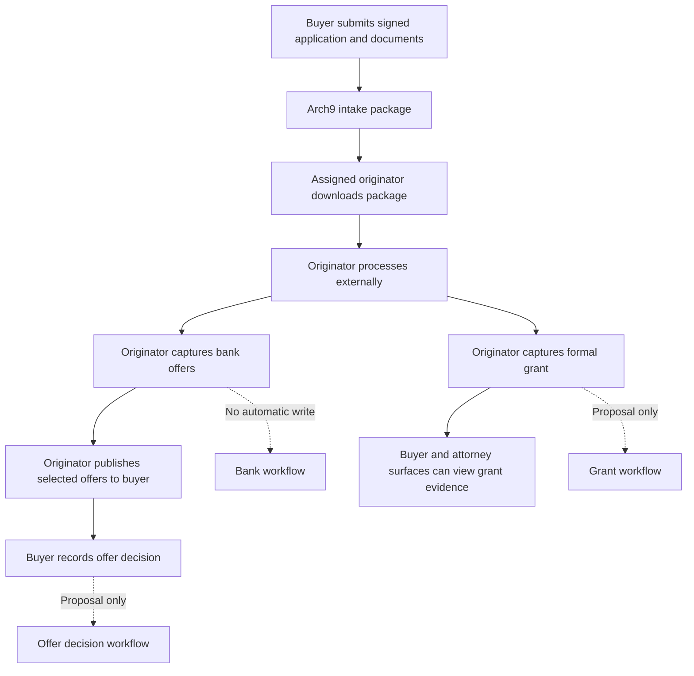

R5 intentionally leaves these items outside scope:

- Live OOBA delivery.
- Official OOBA payload generation.
- Bank-specific payload generation.
- Direct bank API submission.
- Automatic creation of bank workflow rows.
- Automatic offer acceptance or rejection.
- Automatic grant workflow mutation.
- Any change to offers, grant, attorney assignment or finance-stage policy.

## 30. Phase R6 Pilot With One Bond Originator

Phase R6 introduces the first controlled external pilot with one approved bond originator.

The objective is to prove the operational loop end to end:

1. Arch9 prepares the signed application and supporting-document package.
2. One assigned bond originator accepts/downloads the package.
3. The originator processes the application externally.
4. The originator requests extra documents where needed.
5. The originator records safe progress updates.
6. The originator captures externally obtained bank offers and bond grants.
7. Buyers, agents and attorneys see the appropriate status through existing Arch9 views.

The pilot does not change Arch9’s role. Arch9 still facilitates the process and stores the record of what happened; the originator and banks still make the lending decisions outside Arch9.

R6 adds:

- `phase-r6-one-originator-pilot-v1`
- `transaction_bond_originator_one_originator_pilots`
- `one_originator_pilot_id` on `transaction_bond_originator_workspace_assignments`

Trusted functions:

- `bridge_start_bond_originator_one_originator_pilot(...)`
- `bridge_pause_bond_originator_one_originator_pilot(...)`
- `bridge_bond_originator_one_originator_pilot_view(pilot_id)`

Central pilot rules:

- `maximum_active_originators = 1`
- a ready Phase R1 internal readiness report is required
- every package must be a `bond_originator_intake` package
- packages must be `ready_for_originator`, `accepted_by_originator` or `downloaded`
- package handling remains manual/download-only
- support owner and rollback owner must be named in operational controls
- one active/ready pilot is allowed at a time

Pilot safety flags remain locked:

- `sensitive_payload_included = false`
- `no_automatic_bank_submission = true`
- `live_delivery_enabled = false`
- `bank_workflow_unchanged = true`
- `offer_workflow_unchanged = true`
- `grant_workflow_unchanged = true`

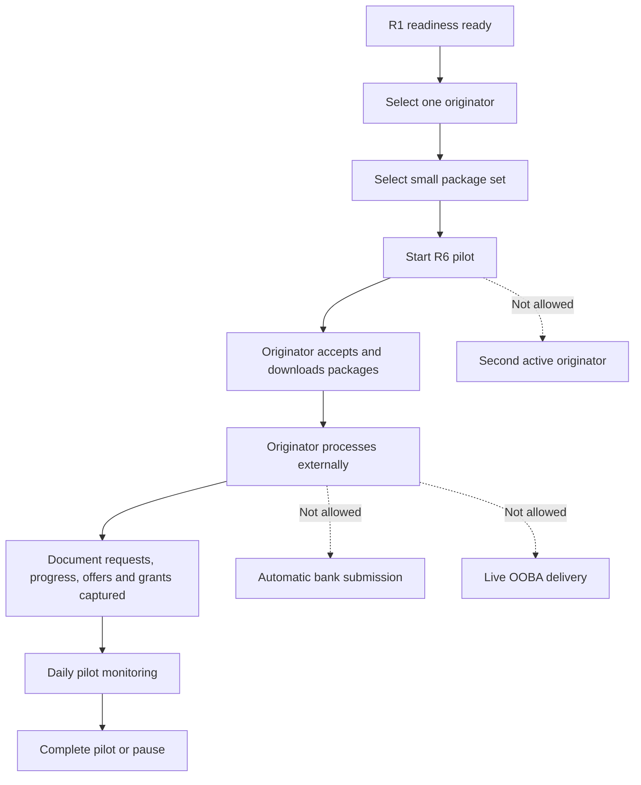

The pause path preserves existing assignment and package audit history. It prevents additional pilot work from being treated as active, but it does not delete packages, documents, progress updates, offers, grants or governance evidence.

R6 intentionally leaves these items outside scope:

- Multiple-originator rollout.
- Production-wide originator onboarding.
- Live OOBA delivery.
- Bank-specific payload delivery.
- Automatic bank workflow mutation.
- Automatic offer or grant mutation.
- Any change to attorney, offer, grant or finance-stage policy.

## 31. Phase R7 Operational Hardening

Phase R7 hardens the one-originator pilot before Arch9 introduces the workflow more broadly to bond originators.

In simple terms, R7 asks:

“Can we safely operate the pilot, support the originator, handle issues, pause when needed, and keep the line clear that Arch9 facilitates the process but does not submit to banks or make lending decisions?”

R7 does not expand the pilot beyond one active bond originator. It does not introduce live OOBA delivery, bank-specific delivery, automatic bank submission, bank workflow mutation, offer workflow mutation or grant workflow mutation.

R7 adds:

- `phase-r7-operational-hardening-v1`
- `transaction_bond_originator_operational_hardening_reports`
- `transaction_bond_originator_operational_incidents`
- `bridge_record_bond_originator_operational_incident(...)`
- `bridge_create_bond_originator_operational_hardening_report(...)`
- `bridge_bond_originator_operational_hardening_view(pilot_id)`

The hardening checklist covers:

- R6 pilot is ready or active.
- Single-originator limit remains enforced.
- Support, escalation and rollback owners are named.
- Support runbook and rollback runbook are available.
- The pilot pause path has been tested.
- Daily or agreed monitoring cadence is active.
- Recent originator activity exists.
- Document-request backlog is reviewed.
- No open high or critical operational incidents exist.
- Operational reports and incidents exclude sensitive payloads.
- Automation boundaries remain intact.

Locked operational flags remain:

- `maximum_active_originators = 1`
- `sensitive_payload_included = false`
- `no_automatic_bank_submission = true`
- `live_delivery_enabled = false`
- `bank_workflow_unchanged = true`
- `offer_workflow_unchanged = true`
- `grant_workflow_unchanged = true`

The R7 incident log is operational only. It can record issues such as support questions, stale document queues, package-access concerns or pilot blockers. It must not contain raw application payloads, identity numbers, bank-account values, debt values, document storage paths, public URLs, tokens, credentials, internal delivery payloads or external bank submission data.

The R7 view model exposes safe actions only:

- Continue the pilot when healthy enough.
- Pause the pilot when attention is required.
- Review incidents and backlog.
- Review support and rollback ownership.

It explicitly blocks:

- Adding a second originator.
- Live OOBA delivery.
- Automatic bank submission.
- Bank workflow mutation.
- Offer workflow mutation.
- Grant workflow mutation.

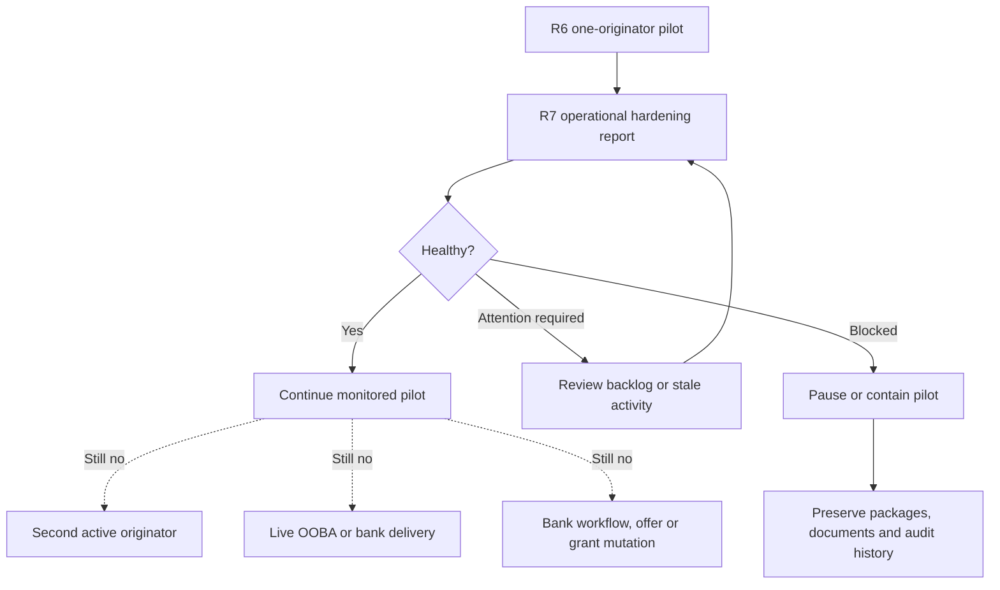

The R7 rollback posture is conservative:

- Preserve submitted applications.
- Preserve originator packages.
- Preserve downloads and document-request history.
- Preserve offers and grants already captured.
- Stop or pause future pilot activity through the trusted pause path.
- Keep existing bank workflow, offers, grants, attorneys and finance stages unchanged.

R7 intentionally leaves these items outside scope:

- Broader multi-originator rollout.
- Official OOBA payload generation.
- Bank-specific payload generation.
- Direct OOBA or bank delivery.
- Automatic bank submission.
- Automatic finance-stage progression.
- Automatic offer or grant mutation.
- Recipient credentials and acknowledgement contracts.

## 32. Phase R8 Multi-Originator Rollout

Phase R8 expands the originator workspace from the hardened one-originator pilot to a controlled cohort of approved bond originators.

R8 expands only to an approved originator cohort. It does not mean any originator can join, and it does not mean Arch9 starts submitting applications to OOBA or banks automatically.

The purpose is to prove that Arch9 can safely support more than one originator using the same facilitation model:

- Buyers submit applications and supporting documents on Arch9.
- Arch9 prepares manual originator intake packages.
- Approved originators accept and download the packages.
- Originators process the applications externally.
- Originators request documents, record progress, and capture offers/grants obtained externally.
- Buyers, agents and attorneys see the relevant status through existing views.
- Arch9 still does not make lending decisions.

R8 adds:

- `phase-r8-multi-originator-rollout-v1`
- `transaction_bond_originator_multi_originator_rollouts`
- `multi_originator_rollout_id` on `transaction_bond_originator_workspace_assignments`
- `bridge_start_bond_originator_multi_originator_rollout(...)`
- `bridge_pause_bond_originator_multi_originator_rollout(...)`
- `bridge_bond_originator_multi_originator_rollout_view(rollout_id)`

R8 entry requirements:

- A healthy Phase R7 operational hardening report.
- At least two approved originators.
- No more than the centrally configured maximum active originators.
- Every package is a manual `bond_originator_intake` package.
- Every package is assigned to one approved cohort originator.
- Package capacity per originator is respected.
- Support, escalation and rollback owners are named.
- Monitoring cadence is defined.
- Rollout pause path is tested.
- Automation boundaries remain locked.

The first rollout is centrally capped:

- `maximum_active_originators` defaults to 3.
- The database constraint allows 2 to 5 for controlled expansion.
- Originators outside the approved cohort cannot receive rollout packages through the R8 trusted start operation.

R8 locked controls remain:

- `sensitive_payload_included = false`
- `no_automatic_bank_submission = true`
- `live_delivery_enabled = false`
- `bank_workflow_unchanged = true`
- `offer_workflow_unchanged = true`
- `grant_workflow_unchanged = true`

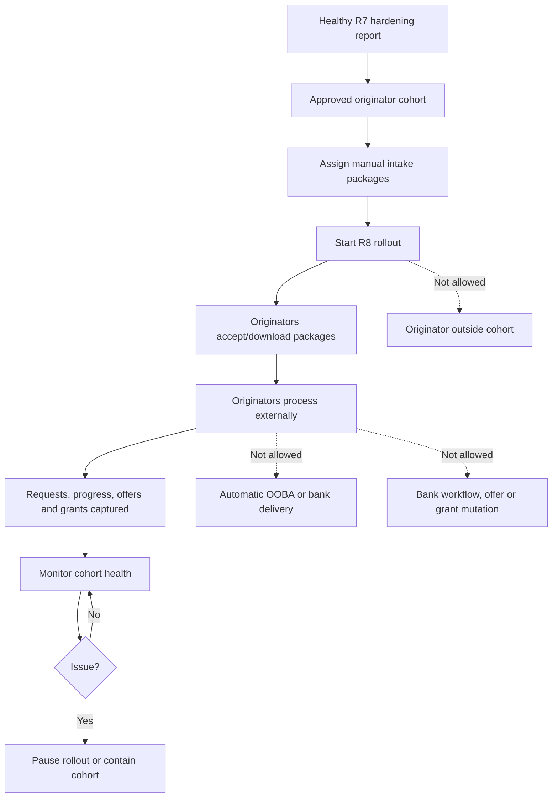

The R8 view is metadata-only. It returns rollout status, originator counts, package counts and safe actions. It excludes canonical payload JSON, destination payload JSON, raw tokens, public document URLs, storage paths, credentials and bank delivery data.

R8 intentionally leaves these items outside scope:

- Open/public originator onboarding.
- Official OOBA payload generation.
- Bank-specific payload generation.
- Direct OOBA or bank delivery.
- Automatic bank submission.
- Automatic finance-stage progression.
- Automatic offer or grant mutation.
- Recipient credential management.
- External acknowledgement/status automation.

## 33. Phase R9 Optional Formal Integrations

Phase R9 introduces an optional formal integration readiness gate for recipients that want a structured integration instead of the manual/download-only originator package.

OOBA is still just one possible bond-originator recipient. R9 does not make OOBA the only originator and does not turn Arch9 into a lender, originator decision engine or automatic bank-submission system.

R9 is sandbox-only by default. It can record that a formal integration is ready for sandbox validation only when the recipient supplies the approved contract pieces:

- Approved payload schema.
- Enum and value maps.
- Validation rules.
- Transport policy.
- Credential handling policy.
- Acknowledgement contract.
- Status mapping contract.
- Security review.
- Data-processing approval.
- Sandbox test plan.

R9 adds:

- `phase-r9-optional-formal-integrations-v1`
- `transaction_bond_originator_formal_integrations`
- `bridge_create_bond_originator_formal_integration_readiness(...)`
- `bridge_activate_bond_originator_formal_integration_sandbox(...)`
- `bridge_bond_originator_formal_integration_view(integration_id)`

The R9 readiness report intentionally stores evidence flags and metadata only. It does not store raw schema bodies, sample payloads, credentials, public document URLs, document storage paths, raw tokens, bank-account values, identity numbers or delivery secrets.

The R9 sandbox activation plan may allow:

- Sandbox validation against the approved recipient contract.
- Operator review of acknowledgement and status handling.
- Rollback of sandbox credentials and sandbox access.

It explicitly does not allow:

- Production payload generation.
- Production live delivery.
- Automatic OOBA delivery.
- Automatic bank submission.
- Bank workflow mutation.
- Offer workflow mutation.
- Grant workflow mutation.

Locked R9 controls:

- `sandbox_only = true`
- `production_live_delivery_enabled = false`
- `raw_schema_stored = false`
- `credentials_stored = false`
- `sensitive_payload_included = false`
- `no_automatic_bank_submission = true`
- `live_delivery_enabled = false`
- `bank_workflow_unchanged = true`
- `offer_workflow_unchanged = true`
- `grant_workflow_unchanged = true`

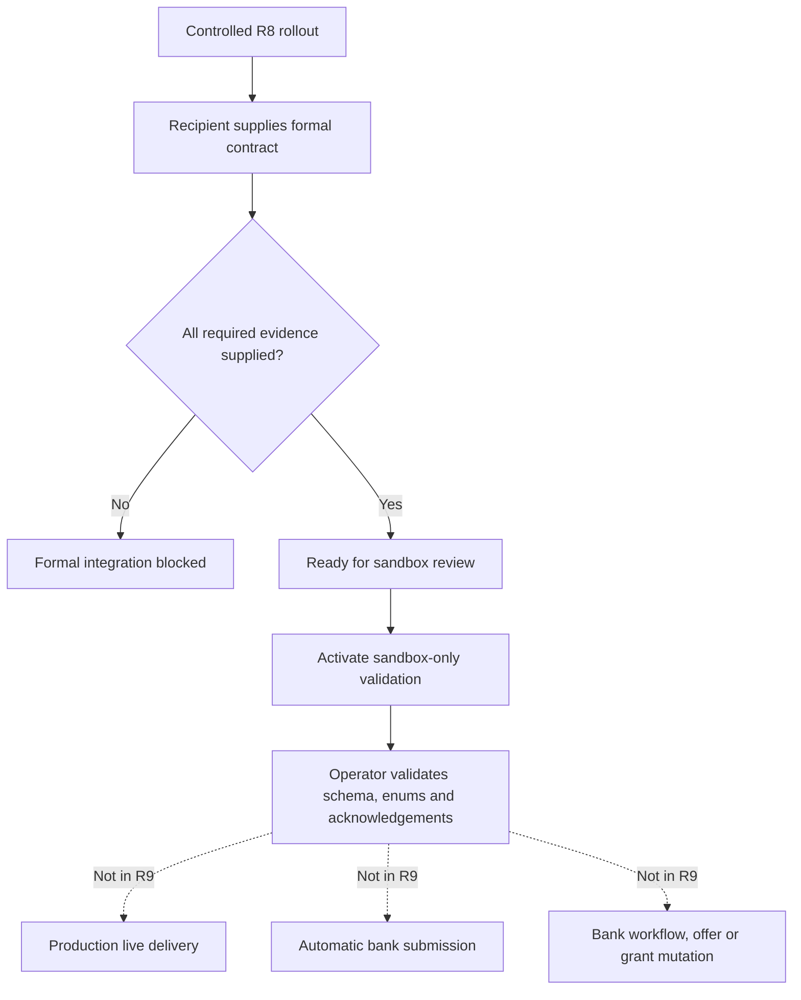

R9 intentionally leaves these items outside scope:

- Production OOBA delivery.
- Production bank delivery.
- Bank-specific payload activation.
- External credentials for live transport.
- Automatic acknowledgement/status mutation of bank workflow.
- Automatic bank application creation.
- Automatic finance-stage progression.
- Automatic offer or grant workflow changes.

## 34. Diagrams

### Package Domain

```mermaid
erDiagram
  transaction_bond_application_submissions ||--o{ transaction_bond_application_export_packages : "source submission"
  bond_applications ||--o{ transaction_bond_application_export_packages : "normalized source"
  transaction_bond_application_export_packages ||--o{ transaction_bond_application_delivery_attempts : "delivery attempts"
  transaction_bond_application_export_packages ||--o{ transaction_bond_application_external_events : "external events"
  transaction_bond_application_export_packages ||--o{ transaction_bond_application_recipient_format_packages : "recipient formats"
  transaction_bond_application_export_packages ||--o{ transaction_bond_application_governance_reports : "governance reports"
  transaction_bond_application_export_packages ||--o{ transaction_bond_originator_internal_readiness_reports : "R1 readiness reports"
  transaction_bond_application_export_packages ||--o{ transaction_bond_originator_workspace_assignments : "R2 originator workspace assignments"
  transaction_bond_application_export_packages ||--o{ transaction_bond_originator_document_requests : "document requests"
  transaction_bond_application_export_packages ||--o{ transaction_bond_originator_progress_events : "progress events"
  transaction_bond_application_export_packages ||--o{ transaction_bond_originator_bank_offer_captures : "offer captures"
  transaction_bond_application_export_packages ||--o{ transaction_bond_originator_grant_captures : "grant captures"
  transaction_bond_originator_one_originator_pilots ||--o{ transaction_bond_originator_operational_hardening_reports : "R7 hardening reports"
  transaction_bond_originator_one_originator_pilots ||--o{ transaction_bond_originator_operational_incidents : "R7 incidents"
  transaction_bond_originator_multi_originator_rollouts ||--o{ transaction_bond_originator_workspace_assignments : "R8 cohort assignments"
  transaction_bond_originator_multi_originator_rollouts ||--o{ transaction_bond_originator_formal_integrations : "R9 optional formal integrations"
```

### Safe Failure Path

```mermaid
flowchart TD
  A["Prepare OOBA export"] --> B["Adapter registry"]
  B --> C["OOBA disabled"]
  C --> D["Package validation_failed"]
  D --> E["No payload generated"]
  E --> F["No delivery attempt"]
  F --> G["No bank workflow change"]
```

## 35. Known Limitations

- OOBA recipient payload generation is blocked until approved specifications exist.
- Bank-specific payload generation is blocked until approved specifications exist.
- Live delivery is blocked until credentials, transport policy and acknowledgement rules exist.
- External status sync maps unsupported events to internal review.
- No automated bank submission exists.
- No bank workflow progression occurs.
- Phase 8A package acceptance/download does not mean a bank has accepted the application.
- Phase 8B document requests collect supplemental documents only and do not correct signable application answers.
- Phase 8C progress tracking is operational status only and does not represent bank decisions.
- Phase 8D captures originator-supplied offers and grants but does not execute buyer decisions or mutate grant workflow automatically.
- Phase R2 originator workspace assignment and package acceptance do not mean a bank has received or approved the application.
- Phase R7 operational hardening keeps the rollout to one active pilot originator.
- Phase R7 incidents and hardening reports are operational metadata only; they do not deliver applications or mutate bank workflow.
- Phase R8 supports only controlled approved-originator cohorts, not open originator self-onboarding.
- Phase R8 remains manual/download-only and does not introduce live recipient delivery.
- Phase R9 can prepare sandbox-only formal integration governance but does not enable production delivery.
- Phase R9 stores sanitized contract evidence only, not raw schemas, credentials or payload bodies.
- Manual confirmation still requires existing originator governance.
- Historic legacy submissions are not backfilled into export packages.

## 36. Deferred Beyond Phase 8

- Activation of a real OOBA bond-originator recipient adapter after official spec approval.
- Activation of specific bank adapters after official spec approval.
- Bank-specific payload governance and certification evidence.
- Controlled live-delivery rollout.
- External response automation beyond review-required placeholders.
- Any future bank workflow automation policy.
