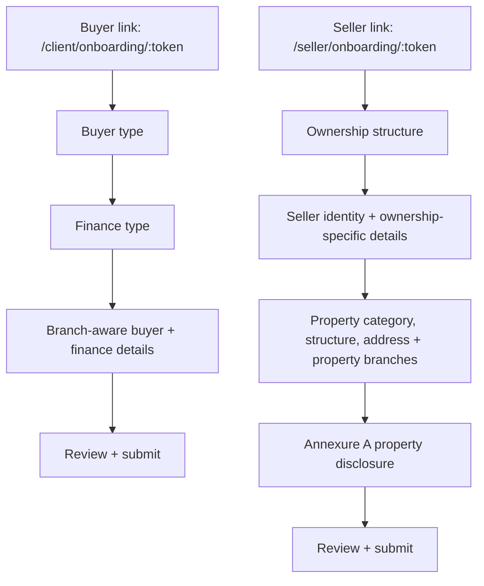

# Current Buyer and Seller Onboarding Logic Map

Pulled from the current code on 2026-07-07.

## Source Of Truth

- Routes: `src/App.jsx`
  - Buyer onboarding: `/client/onboarding/:token`
  - Seller onboarding: `/seller/onboarding/:token`
- Buyer UI: `src/pages/ClientOnboarding.jsx`
- Buyer canonical resolver: `src/lib/buyerOnboardingFlow.js`, `src/lib/buyerOnboardingFlowContract.js`
- Buyer step builder and legacy document logic: `src/lib/purchaserPersonas.js`
- Seller UI: `src/pages/SellerOnboarding.jsx`
- Seller canonical resolver: `src/lib/sellerOnboardingFlow.js`, `src/lib/sellerOnboardingFlowContract.js`
- Seller property disclosure: `src/lib/propertyDisclosure.js`

Important distinction:

- The UI question list below is what the current onboarding pages ask directly.
- The canonical matrix is what the resolver can expose as branch-aware visible, required, optional, and document-trigger fields. Some canonical fields are not currently explicit UI prompts, and some UI prompts are practical capture fields beyond the canonical contract.

## High-Level Flow

## Buyer Onboarding

### Buyer Step Order

1. Welcome / landing page, then starts the guided flow.
2. Buyer type: "Who is buying this property?"
3. Finance type: "How will this purchase be financed?"
4. Details: buyer, legal, and finance panes generated from selected branches.
5. Review: buyer summary, property context, finance summary, document next steps.

### Buyer Branch Decisions

Buyer type options:

- Individual
- Foreign Individual
- Company
- Trust

Natural-person purchase mode appears only for individual or foreign individual buyers:

- Individual Purchaser: buying alone.
- Co-Purchasing: buying with another person.

Finance type options:

- Bond
- Cash
- Hybrid

Derived canonical buyer branches:

- `individual`
- `married_coc`
- `married_anc`
- `married_anc_accrual`
- `company`
- `trust`
- `foreign_purchaser`
- `other`

Derived canonical finance branches:

- `cash`
- `bond`
- `hybrid`

### Buyer UI Questions

#### Buyer Type

Question: "Who is buying this property?"

Options:

- Individual
- Foreign Individual
- Company
- Trust

#### Finance Type

Question: "How will this purchase be financed?"

Options:

- Bond
- Cash
- Hybrid

#### Natural Person Purchase Mode

Shown for Individual and Foreign Individual.

Question: "Tell us whether you are buying alone or with another purchaser."

Options:

- Individual Purchaser
- Co-Purchasing

#### Natural Person - Personal Details

- First Name
- Surname
- Date of Birth
- South African ID Number, hidden for foreign purchaser
- Passport Number, shown for foreign purchaser
- Nationality
- Citizenship / Residency Status
- Tax Number

Residency options:

- South African citizen
- Permanent resident
- Foreign national / non-resident

#### Natural Person - Contact Details

- Email Address
- Mobile Number

#### Natural Person - Residential Address

- Street Address
- Suburb
- City
- Postal Code

#### Natural Person - Marital Status

- Marital Status
- Marital Regime, shown when marital status is Married
- Spouse Full Name, shown when marital status is Married
- Spouse ID Number, shown when marital status is Married
- Is your spouse a co-purchaser?, shown when marital status is Married
- Spouse Email Address, shown when marital status is Married; required when spouse contact is required
- Spouse Contact Number, shown when marital status is Married; required when spouse contact is required

Marital status options:

- Single
- Married
- Divorced
- Widowed

Marital regime options:

- Not applicable
- In community of property
- Out of community of property
- Out of community with accrual

#### Natural Person - Ownership Split

Shown for co-purchasing.

- Ownership Share (%)
- Consent to Purchase

#### Natural Person - Employment & Income

Employment Type is required for Bond and Hybrid. Follow-up employment fields are conditional.

- Employment Type
- Employer Name, shown for full-time employed bond/hybrid applicants
- Job Title, shown for full-time employed bond/hybrid applicants
- Employment Start Date, shown for full-time employed bond/hybrid applicants
- Business Name, shown for self-employed bond/hybrid applicants
- Years in Business, shown for self-employed bond/hybrid applicants
- Gross Monthly Income, shown for income-bearing bond/hybrid employment profiles
- Net Monthly Income, shown for income-bearing bond/hybrid employment profiles
- Income Frequency, shown for income-bearing bond/hybrid employment profiles

Employment type options:

- Full-time employed
- Self-employed / Business owner
- Company director
- Commission-based / Variable income
- Contract / Freelance
- Retired / Pension income
- Unemployed / No regular income
- Other

Income frequency options:

- Monthly
- Fortnightly
- Weekly

#### Natural Person - Financial Snapshot

- Number of Dependants
- Monthly Credit Commitments
- Monthly Living Expenses, shown for Bond and Hybrid
- First-time Buyer?
- Primary Residence?
- Investment Purchase?

#### Natural Person - Bond Readiness Declarations

Shown for Bond and Hybrid.

- Currently under debt review?
- Currently under administration?
- Ever declared insolvent?
- Any surety obligations?

#### Company Buyer Details

- Company Name
- Company Registration Number
- Registered Address
- Business Address
- Tax Number
- VAT Number
- Nature of Business
- Authorised Signatory Name
- Authorised Signatory ID Number
- Authorised Signatory Email
- Authorised Signatory Phone
- Authorised Signatory Capacity
- Board Resolution Available?

#### Company Directors / Owners

Repeatable associated-person fields:

- Full Name
- ID Number / Passport
- Contact Number
- Email Address
- Residential Address
- Role / Title
- Signing Authority

#### Trust Buyer Details

- Trust Name
- Trust Registration Number
- Trust Type
- Master's Office Reference
- Registered Address
- Trust Tax Number
- Authorised Trustee Name
- Authorised Trustee ID Number
- Authorised Trustee Email
- Authorised Trustee Phone
- Trust Deed Available?
- Letters of Authority Available?
- Trust Resolution Available?
- Are All Trustees Signing?

#### Additional Trustees

Repeatable associated-person fields:

- Full Name
- ID Number / Passport
- Contact Number
- Email Address
- Residential Address
- Role / Title
- Signing Authority

#### Finance Structure

- Purchase Price
- Cash Amount, shown for Cash and Hybrid
- Bond Amount, shown for Bond and Hybrid

#### Cash Funding

Shown for Cash and Hybrid.

- Is proof of funds available?
- Source of Funds
- Confirm the cash funds are available?

Source of funds options:

- Savings
- Investment
- Sale of property
- Business funds
- Inheritance
- Other

#### Bond Progress

Shown for Bond and Hybrid.

- Have you already started the bond process?
- Current Bond Status
- Bank / Bond Provider, shown and required when bond process has started
- Would you like bond originator help?
- Is this a joint bond application?
- Deposit / Cash Contribution Amount
- Deposit / Cash Contribution Source, shown and required when contribution amount is filled
- Recent Bank Statements Available?
- Consent to share this finance snapshot with the bond originator?
- Affordability ready / confirmed?

Bond status options:

- Not started
- Pre-approval only
- Application in progress
- Submitted to banks
- Bond approved

#### Originator Support

Shown when originator support is requested.

- Bond Originator / Consultant Name
- Bond Originator Contact Details

### Buyer Canonical Matrix

#### Natural Person Base Fields

Visible canonical questions:

- `buyer.person.first_name`
- `buyer.person.last_name`
- `buyer.person.date_of_birth`
- `buyer.person.identity_number_or_passport_number`
- `buyer.person.nationality`
- `buyer.person.residency_status`
- `buyer.person.tax_number`
- `buyer.person.email`
- `buyer.person.phone`
- `buyer.person.residential_address.line_1`
- `buyer.person.residential_address.suburb`
- `buyer.person.residential_address.city`
- `buyer.person.residential_address.postal_code`
- `buyer.person.postal_address.line_1`
- `buyer.person.postal_address.suburb`
- `buyer.person.postal_address.city`
- `buyer.person.postal_address.postal_code`
- `buyer.person.marital_status`
- `buyer.person.occupation`
- `buyer.person.income_source`
- `buyer.person.number_of_dependants`
- `buyer.person.monthly_credit_commitments`
- `buyer.person.first_time_buyer`
- `buyer.person.primary_residence`
- `buyer.person.investment_purchase`

#### Purchase Mode Branches

`individual`: no extra canonical questions.

`co_purchasing`:

- `buyer.co_purchasers`
- `buyer.co_purchasers[].first_name`
- `buyer.co_purchasers[].last_name`
- `buyer.co_purchasers[].identity_number_or_passport_number`
- `buyer.co_purchasers[].email`
- `buyer.co_purchasers[].phone`
- `buyer.co_purchasers[].residential_address`
- `buyer.co_purchasers[].ownership_share`
- `buyer.co_purchasers[].consent_to_purchase`

#### Purchaser Branches

`individual`: no extra canonical questions; document triggers `id_document`, `proof_of_address`.

`married_coc`:

- `buyer.person.spouse_full_name`
- `buyer.person.spouse_identity_number`
- `buyer.person.spouse_email`
- `buyer.person.spouse_phone`
- `buyer.person.spouse_residential_address`
- `buyer.person.spouse_consent_required`
- `buyer.person.marriage_date`

Document triggers: `spouse_id`, `spouse_proof_of_address`, `marriage_certificate`.

`married_anc`:

- `buyer.person.spouse_full_name`
- `buyer.person.spouse_identity_number`
- `buyer.person.spouse_email`
- `buyer.person.spouse_phone`
- `buyer.person.spouse_is_co_purchaser`
- `buyer.person.anc_available`

Document triggers: `spouse_id_optional`, `spouse_proof_of_address_optional`, `anc_document_optional`.

`married_anc_accrual`:

- `buyer.person.spouse_full_name`
- `buyer.person.spouse_identity_number`
- `buyer.person.spouse_email`
- `buyer.person.spouse_phone`
- `buyer.person.spouse_is_co_purchaser`
- `buyer.person.anc_available`

Document triggers: `spouse_id_optional`, `spouse_proof_of_address_optional`, `anc_accrual_document_optional`.

`company`:

- `buyer.company.name`
- `buyer.company.registration_number`
- `buyer.company.registered_address`
- `buyer.company.business_address`
- `buyer.company.tax_number`
- `buyer.company.vat_number`
- `buyer.company.nature_of_business`
- `buyer.company.authorised_signatory.name`
- `buyer.company.authorised_signatory.identity_number_or_passport_number`
- `buyer.company.authorised_signatory.email`
- `buyer.company.authorised_signatory.phone`
- `buyer.company.authorised_signatory.capacity`
- `buyer.company.directors`
- `buyer.company.board_resolution_available`
- `buyer.company.resolution_date`
- `buyer.company.authority_basis`

Document triggers: `cipc_registration`, `company_resolution`, `director_id`, `director_proof_of_address`.

`trust`:

- `buyer.trust.name`
- `buyer.trust.registration_number`
- `buyer.trust.type`
- `buyer.trust.masters_office_reference`
- `buyer.trust.registered_address`
- `buyer.trust.tax_number`
- `buyer.trust.contact.name`
- `buyer.trust.contact.email`
- `buyer.trust.contact.phone`
- `buyer.trust.authorised_trustee.name`
- `buyer.trust.authorised_trustee.identity_number_or_passport_number`
- `buyer.trust.authorised_trustee.email`
- `buyer.trust.authorised_trustee.phone`
- `buyer.trust.authorised_trustee.capacity`
- `buyer.trust.authority_basis`
- `buyer.trust.trust_deed_available`
- `buyer.trust.letters_of_authority_available`
- `buyer.trust.resolution_available`
- `buyer.trust.all_trustees_signing`
- `buyer.trust.trustees`

Document triggers: `trust_deed`, `letters_of_authority`, `trust_resolution`, `trustee_id`, `trustee_proof_of_address`.

`foreign_purchaser`:

- `buyer.person.passport_number`
- `buyer.person.nationality`
- `buyer.person.residency_status`
- `buyer.person.source_of_funds`
- `buyer.person.exchange_control_declaration`

Document triggers: `passport_copy`, `proof_of_address`, `source_of_funds`.

`other`:

- `buyer.entity.description`

Document trigger: `buyer_authority`.

#### Finance Branches

`cash`:

- `finance.cash_amount`
- `finance.proof_of_funds_available`
- `finance.source_of_funds`
- `finance.cash_funds_confirmed`

Optional canonical fields: `finance.bank_statements_available`, `finance.cash_contribution_available`, `finance.deposit_source`, `finance.cash_contribution_source`.

Document trigger: `proof_of_funds`.

`bond`:

- `finance.bond_amount`
- `finance.bond_bank_name`
- `finance.bond_process_started`
- `finance.bond_current_status`
- `finance.employment_type`
- `finance.employer_name`
- `finance.job_title`
- `finance.employment_start_date`
- `finance.business_name`
- `finance.years_in_business`
- `finance.gross_monthly_income`
- `finance.net_monthly_income`
- `finance.income_frequency`
- `finance.monthly_living_expenses`
- `finance.number_of_dependants`
- `finance.bank_statements_available`
- `finance.bond_readiness_consent`
- `finance.affordability_confirmed`
- `finance.bond_help_requested`
- `finance.ooba_assist_requested`
- `finance.joint_bond_application`
- `finance.cash_contribution_available`
- `finance.deposit_source`
- `finance.cash_contribution_source`

Document triggers: `bond_approval`, `grant_signed`.

`hybrid`:

- `finance.cash_amount`
- `finance.bond_amount`
- `finance.proof_of_funds_available`
- `finance.source_of_funds`
- `finance.cash_funds_confirmed`
- `finance.bond_bank_name`
- `finance.bond_process_started`
- `finance.bond_current_status`
- `finance.employment_type`
- `finance.gross_monthly_income`
- `finance.monthly_living_expenses`
- `finance.bank_statements_available`
- `finance.bond_readiness_consent`
- `finance.affordability_confirmed`
- `finance.bond_help_requested`
- `finance.ooba_assist_requested`
- `finance.joint_bond_application`
- `finance.cash_contribution_available`
- `finance.deposit_source`
- `finance.cash_contribution_source`

Document triggers: `proof_of_funds`, `bond_approval`, `grant_signed`, `proof_of_funds_cash_component`.

## Seller Onboarding

### Seller Step Order

1. Seller Information
2. Property Details
3. Property Disclosure
4. Review & Submit

### Seller Branch Decisions

Ownership structure options:

- Individual
- Married (COP)
- Married (ANC)
- Company
- Trust
- Deceased estate
- Power of attorney
- Multiple owners
- Other

Canonical seller branches:

- `individual`
- `married`
- `company`
- `trust`
- `deceased_estate`
- `power_of_attorney`
- `multiple_owners`
- `other`

Property category options:

- Residential
- Commercial
- Industrial
- Retail
- Agricultural
- Mixed Use
- Vacant Land

Property structure options vary by category:

- Residential: Full title, Sectional title, Estate, Share block, Freehold, Other
- Commercial: Full title, Sectional title, Freehold, Estate, Other
- Industrial: Full title, Freehold, Sectional title, Other
- Retail: Full title, Sectional title, Freehold, Other
- Agricultural: Agricultural holding, Freehold, Full title, Other
- Mixed Use: Full title, Sectional title, Freehold, Estate, Other
- Vacant Land: Full title, Freehold, Agricultural holding, Other

Canonical property branches:

- `residential`
- `sectional_title`
- `estate_hoa`
- `commercial`
- `mixed_use`
- `agricultural`
- `vacant_land`

Dynamic document triggers:

- Existing bond: `bond_statement`, `bond_bank_details`, `bond_cancellation_attorney_details`, `settlement_figure`
- Tenant occupied: `lease_agreement`, `tenant_details`
- Gas installation: `gas_compliance_certificate`
- Solar installation: `solar_compliance_documents`
- Electric fence: `electric_fence_certificate`
- Borehole: `borehole_certificate`
- Recent alterations: `alteration_approvals`

### Seller UI Questions

#### Seller Information - Ownership

Question: "Who owns this property?"

Options:

- Individual
- Married (COP)
- Married (ANC)
- Company
- Trust
- Deceased estate
- Power of attorney
- Multiple owners
- Other

#### Seller Information - Identity

Base identity questions:

- First name
- Surname
- Email
- Phone
- ID Number, hidden for company, trust, deceased estate, power of attorney, and multiple owners
- Tax Number (optional)
- VAT registered, shown where VAT fields apply
- VAT Number, shown when VAT registered

#### Seller Information - Married Seller

Shown for married ownership.

- Spouse Name
- Spouse ID Number
- Spouse Email (optional)
- Spouse Phone (optional)

#### Seller Information - Company Seller

- Company Name
- Registration Number
- Registered Address

Directors, repeatable:

- First name
- Surname
- Email (optional)
- Phone (optional)
- Address (optional)

Primary authorised signatory:

- Full name
- Email
- Phone
- Address (optional)

#### Seller Information - Trust Seller

- Trust Name
- Registration Number
- Registered Address

Trustees, repeatable:

- First name
- Surname
- Email (optional)
- Phone (optional)
- Address (optional)

Primary trustee:

- Full name
- Email
- Phone
- Address (optional)

#### Seller Information - Deceased Estate

Executor details:

- Full name
- Estate Reference
- Executor Email (optional)
- Executor Phone (optional)

Authority details:

- Authority Details

#### Seller Information - Power Of Attorney

Acting representative:

- Full name
- Representative Email (optional)
- Representative Phone (optional)

Principal details:

- Principal full name
- Principal ID Number

Authority details:

- Authority Details

#### Seller Information - Multiple Owners

Owner cards, repeatable:

- First name
- Surname
- ID Number
- Ownership Share % (optional)
- Email (optional)
- Phone (optional)
- Consent to sell

#### Seller Information - Residential Address

Shown for ownership branches that are not company, trust, deceased estate, power of attorney, or multiple owners.

- Residential address

#### Seller Information - Selling Details

- Mandate Type
- Asking Price (optional)
- Selling Timeline
- Reason for Selling (optional)

Mandate type options:

- Sole
- Dual
- Tri-Mandate

Selling timeline options:

- Urgent (0-1 month)
- 1-3 months
- 3-6 months

Reason options:

- Upgrading
- Downsizing
- Relocation
- Divorce
- Immigrating
- Deceased Estate
- Investment Exit
- Financial Change
- Other

#### Property Details - Category

Question: "Property category"

Options:

- Residential
- Commercial
- Industrial
- Retail
- Agricultural
- Mixed Use
- Vacant Land

#### Property Details - Type And Structure

- Property Type
- Legal structure

#### Property Details - Canonical Address

- Search address
- Address line 1
- Address line 2 (optional)
- Suburb
- City
- Province
- Postal Code
- Municipality
- Country
- Erf Number (optional)

#### Property Details - Sectional Title / Scheme

Shown for sectional title / share block structures.

- Scheme name
- Unit / section number
- Body corporate name
- Managing agent name
- Managing agent email (optional)
- Managing agent phone (optional)
- Levies (optional)
- Scheme rules available

#### Property Details - Estate / HOA

Shown for estate / HOA structures.

- Estate / HOA name
- Management company (optional)
- HOA contact name
- HOA contact email (optional)
- HOA contact phone (optional)
- HOA rules available

#### Property Details - Commercial / Mixed-Use

Shown for commercial and mixed-use property branches.

- Operating context
- Mixed-use split (optional)
- Floor Size (m2)
- Tenant schedule available
- Monthly water spend (optional)
- Monthly electricity spend (optional)

#### Property Details - Residential

Shown for residential property details.

- Erf Size (m2)
- Floor Size (m2)
- Bedrooms
- Bathrooms
- Living Areas
- Kitchens
- Garages
- Covered Parking
- Open Parking
- Pool

#### Property Details - Land / Agricultural

Shown for land and agricultural branches.

- Erf size (m2)
- Zoning / usage (optional)
- Services available (optional)
- Water source (optional)

#### Property Details - Alterations & Changes

- There have been alterations, additions, or changes
- Tell us what changed, shown when alterations are checked

#### Property Details - Valuation Factors

- Property Condition
- Kitchen Condition
- Bathroom Condition
- Rates & Taxes (optional)
- Levies (optional)
- Monthly water spend (optional)
- Monthly electricity spend (optional)
- Views (optional)
- Notes (optional)

Condition options:

- Needs renovation
- Average
- Good
- Recently renovated

#### Property Details - Documents Already Available

- Title deed copy
- SG diagram
- Erf diagram
- Building plans
- Floor plan

#### Property Details - Occupancy & Finance

- Occupancy Status
- Lease exists, shown when tenant occupied or partially occupied
- Tenant Name (optional), shown when tenant occupied or partially occupied
- Tenant Contact Details (optional), shown when tenant occupied or partially occupied
- Lease Expiry Date, shown when lease exists
- Monthly Rental (optional), shown when tenant occupied or partially occupied
- Rental Deposit (optional), shown when tenant occupied or partially occupied
- Notice Period Details (optional), shown when tenant occupied or partially occupied
- Rental schedule available, shown when tenant occupied or partially occupied
- Existing bond on the property
- Bond Bank, shown when existing bond is checked
- Bond Account / Reference (optional), shown when existing bond is checked
- Estimated Settlement Amount (optional), shown when existing bond is checked
- Multiple bonds, shown when existing bond is checked
- Access bond, shown when existing bond is checked
- Bond cancellation required, shown when existing bond is checked
- Cancellation attorney known, shown when existing bond is checked
- Cancellation Attorney Details, shown when cancellation attorney known is checked

Occupancy status options:

- Unknown
- Vacant
- Owner occupied
- Tenant occupied
- Partially occupied

#### Property Details - Features

- Garden
- Security (Estate / Alarm / Electric Fence)
- Solar / Inverter
- Borehole / Water Tank
- Fibre
- Aircon
- Fireplace
- Flatlet / Second Dwelling
- Staff Quarters

#### Property Disclosure - Annexure A

Each question is answered Yes, No, or Unsure.

1. Are you aware of any electrical faults / problems regarding the electrical installation or appliances?
2. Are there any illegal electrical extensions, or non-working points and has there been any disconnection or damage, to permanent fixtures / equipment? Eg stoves, oven, extractor fan, aircon, heaters, ceiling fans, light fixtures, water pumps etc...?
3. Are there any problems regarding the water heater for example: leaks, faulty gaskets, low pressure?
4. Are there any problems with the drainage system e.g. clogged drainage pipes, drains, storm water drains or gutters?
5. Are there any leaking taps, pipes, burst pipes or water heating systems not working properly?
6. Are there keys to all doors?
7. How many remote controls exist for electronic gates and garage doors? Extra field: Provide quantity.
8. Are all security systems in good working order e.g. alarms, burglar bars and security gates?
9. a) Is the pool pump, cleaning equipment and pipes in good working condition (general operation of equipment, pipes or filter, etc) b) Is there any damage to the fibreglass/marbelite and are there any cracks or loose tiles?
10. Were any repairs done to the items specified in 9 above, over the past six months?
11. Is there any rising damp in walls in any of the rooms / buildings?
12. Are there any leaks in the roof?
13. Are there cracks, leaks or problems with bathtubs, sinks, toilets or showers?
14. Are there any cracked or broken tiles, damaged wooden floors?
15. Are there any structural defects which you are aware of for example, cracks in walls or erosion etc?
16. Is there any damage to the carpets such as stains, burn marks, spots etc?
17. Are all cupboards in working order and acceptable condition?
18. Are all door handles, back doors and window locking systems in working order?
19. Are all the improvements carried out at the property reflected on the approved building plans?
20. Are you in possession of such approved building plans?
21. Comments or explanation for any of the above.

Seller declaration:

- I accept the seller declaration
- Signature
- Date
- Signed at

### Seller Canonical Matrix

#### Core Seller Fields

- `seller.ownership_type`
- `seller.first_name`
- `seller.surname`
- `seller.email`
- `seller.phone`

Optional canonical fields:

- `seller.tax_number`
- `seller.vat_registered`
- `seller.vat_number`

Document triggers: `identity_documents`, `proof_of_address`, `signed_mandate`.

#### Core Property Fields

- `property.category`
- `property.type`
- `property.structure_type`
- `property.address.search_query`
- `property.address.line_1`
- `property.address.line_2`
- `property.address.suburb`
- `property.address.city`
- `property.address.province`
- `property.address.postal_code`
- `property.municipality`

Optional canonical fields:

- `property.address.search_query`
- `property.address.line_2`
- `property.address.postal_code`
- `property.municipality`
- `property.address.country`
- `property.erf_size`
- `property.floor_size`
- `property.utilities.monthly_water_spend`
- `property.utilities.monthly_electricity_spend`
- `property.alterations.recent`
- `property.alterations.details`

Document triggers: `title_deed_copy`, `rates_account`, `property_condition_disclosure`.

#### Seller Branches

`individual`:

- `seller.id_number`
- `seller.residential_address`
- `seller.marital_status`

Optional: `seller.marital_regime`.

Document triggers: `identity_documents`, `proof_of_address`.

`married`:

- `seller.id_number`
- `seller.marital_status`
- `seller.marital_regime`
- `seller.spouse.name`
- `seller.spouse.id_number`
- `seller.spouse.email`
- `seller.spouse.phone`
- `seller.spouse.consent_required`

Optional: `seller.spouse.email`, `seller.spouse.phone`, `seller.spouse.residential_address`.

Document triggers: `identity_documents`, `proof_of_address`, `marriage_certificate`, `spouse_consent`, `antenuptial_contract`.

`company`:

- `seller.company.name`
- `seller.company.registration_number`
- `seller.company.registered_address`
- `seller.company.directors`
- `seller.company.authorised_signatory.name`
- `seller.company.authorised_signatory.capacity`
- `seller.company.resolution_date`
- `seller.company.authority_basis`
- `seller.company.authorised_signatory.email`
- `seller.company.authorised_signatory.phone`
- `seller.company.authorised_signatory.residential_address`

Optional: `seller.company.resolution_available`, `seller.company.beneficial_owners`, `seller.company.tax_number`, `seller.company.vat_number`.

Document triggers: `company_registration`, `company_resolution`, `director_identity`, `company_address_proof`.

`trust`:

- `seller.trust.name`
- `seller.trust.registration_number`
- `seller.trust.registered_address`
- `seller.trust.trustees`
- `seller.trust.authorised_trustee.name`
- `seller.trust.authorised_trustee.capacity`
- `seller.trust.authority_basis`
- `seller.trust.authorised_trustee.email`
- `seller.trust.authorised_trustee.phone`
- `seller.trust.authorised_trustee.residential_address`

Optional: `seller.trust.resolution_available`, `seller.trust.beneficiaries`.

Document triggers: `trust_deed`, `letters_of_authority`, `trustee_identity`, `trustee_resolution`.

`deceased_estate`:

- `seller.deceased_estate.executor_name`
- `seller.deceased_estate.estate_reference`
- `seller.deceased_estate.authority_details`
- `seller.deceased_estate.executor_email`
- `seller.deceased_estate.executor_phone`

Optional: `seller.deceased_estate.executor_email`, `seller.deceased_estate.executor_phone`, `seller.deceased_estate.executor_id_number`.

Document triggers: `estate_executorship`, `deceased_death_certificate`, `executor_identity`.

`power_of_attorney`:

- `seller.power_of_attorney.representative_name`
- `seller.power_of_attorney.representative_email`
- `seller.power_of_attorney.representative_phone`
- `seller.power_of_attorney.principal.name`
- `seller.power_of_attorney.principal.id_number`
- `seller.power_of_attorney.authority_details`

Optional: `seller.power_of_attorney.principal.email`, `seller.power_of_attorney.principal.phone`.

Document triggers: `power_of_attorney_document`, `principal_identity`.

`multiple_owners`:

- `seller.owners`
- `seller.owners[].ownership_share`
- `seller.owners[].consent_to_sell`

Optional: `seller.owners[].email`, `seller.owners[].phone`.

Document triggers: `ownership_split_confirmation`, `owner_consent`, `owner_identity_documents`.

`other`:

- `seller.ownership_description`

Document trigger: `seller_authority`.

#### Property Branches

`residential`:

- `property.features`
- `property.title_deed_available`
- `property.sg_diagram_available`
- `property.erf_diagram_available`
- `property.floor_plan_available`

Optional: `property.approved_building_plans_available`, `property.bedrooms`, `property.bathrooms`, `property.garages`, `property.parking.covered`, `property.parking.open`.

`sectional_title`:

- `property.scheme.name`
- `property.scheme.unit_number`
- `property.scheme.section_number`
- `property.scheme.body_corporate_name`
- `property.scheme.managing_agent.name`
- `property.scheme.managing_agent.email`
- `property.scheme.managing_agent.phone`
- `property.scheme.levies`
- `property.scheme.rules`

Document triggers: `sectional_levy_statement`, `body_corporate_details`.

`estate_hoa`:

- `property.estate.name`
- `property.estate.hoa_contact.name`
- `property.estate.hoa_contact.email`
- `property.estate.hoa_contact.phone`
- `property.estate.management_company`
- `property.estate.rules`

Document triggers: `hoa_levy_statement`, `hoa_details`.

`commercial`:

- `property.use.description`
- `property.use.mixed_use_split`
- `property.tenant_schedule`
- `property.floor_size`
- `property.utilities.monthly_water_spend`
- `property.utilities.monthly_electricity_spend`

Document triggers: `zoning_certificate`, `occupation_certificate`, `commercial_use_summary`.

`mixed_use`:

- `property.use.description`
- `property.use.mixed_use_split`
- `property.tenant_schedule`
- `property.floor_size`

Document triggers: `zoning_certificate`, `occupation_certificate`, `mixed_use_summary`.

`agricultural`:

- `property.land.size`
- `property.land.zoning`
- `property.land.water_source`
- `property.utilities.monthly_water_spend`
- `property.utilities.monthly_electricity_spend`

Document triggers: `zoning_disclosure`, `water_source_disclosure`.

`vacant_land`:

- `property.land.size`
- `property.land.zoning`
- `property.land.services_available`
- `property.sg_diagram_available`

Document triggers: `sg_diagram`, `zoning_disclosure`.

