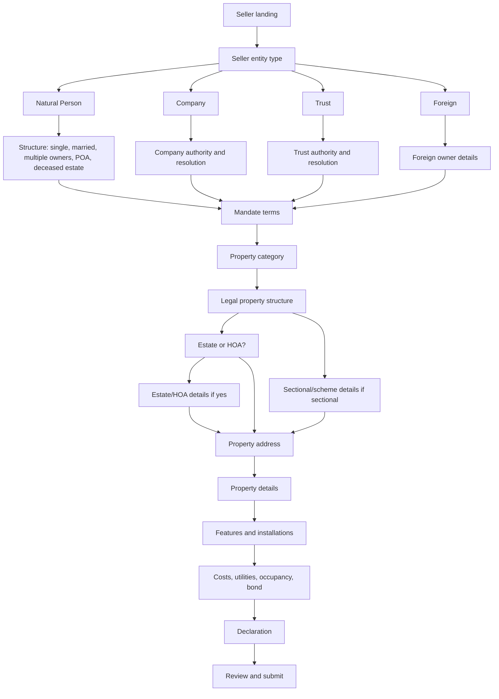
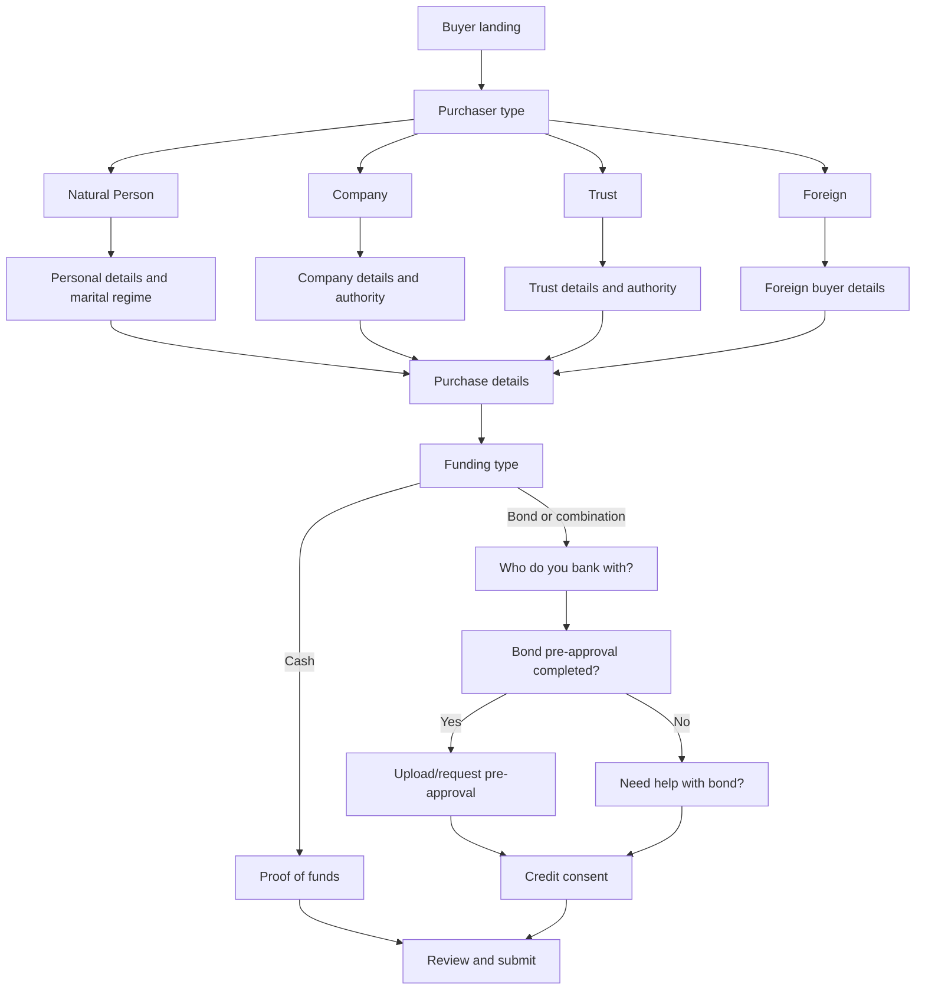

# Global onboarding flow implementation plan

Date: 2026-07-07

Scope: all buyer and seller onboarding flows, not an agency-specific Kingstons variant.

Source notes: the Kingstons meeting notes are treated as product feedback exposing global onboarding logic flaws.

Related docs:

- `docs/current-buyer-seller-onboarding-flow-map.md`
- `docs/kingstons-onboarding-feedback-analysis.md`

## Position

The practical solution is a global onboarding v2 cleanup, not a Kingstons override.

Do not hard-code agency-specific behaviour for these changes. The notes identify modelling mistakes that affect everyone:

- Seller ownership mixes entity type, marital state, authority, and multiple-owner composition in one question.
- Seller property structure treats estate/HOA as a mutually exclusive title structure.
- Buyer finance asks operational bond-process questions that buyers often cannot answer.
- Several seller and buyer questions duplicate later declarations or internal team work.

The implementation should update the shared buyer/seller onboarding contracts, UI, validation, and canonical facts while preserving compatibility with existing saved submissions.

## Guiding Principles

1. Global defaults first.
   - These are not agency preferences.
   - Use one shared flow unless there is a proven jurisdiction/transaction-type exception.

2. Keep old data readable.
   - Add new fields where needed.
   - Derive old fields for existing document generation and integrations until downstream code is updated.

3. Separate legal classification from workflow overlays.
   - Example: Full Title is a title/structure. Estate/HOA is an overlay.
   - Example: Natural Person is an owner entity type. Married or multiple owners is a structure/authority detail.

4. Buyer-facing questions should be answerable by ordinary buyers.
   - Ask "Have you completed a pre-approval?"
   - Do not ask them to name process status, cancellation attorneys, or internal originator workflow details.

5. Declarations should be the source for disclosure facts.
   - Avoid asking alterations/plans twice.
   - If Annexure A already asks it, keep it there and use the answer downstream.

## Recommended Delivery Shape

Deliver in three practical PR-sized slices.

### Slice 1: Global Low-Risk Corrections

Purpose: fix confirmed bugs and copy issues without changing the core data model.

Seller:

- Seller landing should use the light logo variant on dark/visual landing screens.
- Rename "Individual" to "Natural Person".
- Add "Open Mandate" to mandate types.
- Rename "Canonical address" to "Property address".
- Remove the duplicate canonical address summary from the seller-facing form.
- Preserve Address line 2 when selecting a Google address.
- Rename bond account/reference to "Bond account number".
- Remove seller-facing cancellation attorney fields.

Buyer:

- Change "Primary Residence?" to "Will this be your primary residence?"
- Change bond help wording to "Do you need help with your bond?"
- Remove buyer-facing originator nomination wording.
- Clean document availability labels.

Implementation notes:

- Minimal schema impact.
- Keep existing validation mostly intact except where removed fields become hidden.
- Good first rollout because it is visible and low risk.

### Slice 2: Global Seller Property Model Cleanup

Purpose: fix the strongest seller logic flaw.

Current problem:

- `estate` is presented as a property structure.
- Full title and estate/HOA are incorrectly treated as mutually exclusive.
- Sectional/estate panels can appear from stale legacy branch signals.

Target model:

- `propertyCategory`: residential, commercial, industrial, retail, agricultural, mixed-use, vacant land.
- `propertyStructureType`: full title, sectional title, share block, freehold, agricultural holding, other.
- `estateOrHoa`: yes/no overlay.

Target questions:

1. What property category is this?
2. What is the legal property structure?
3. Is the property in an estate or HOA?
4. If yes, collect estate/HOA name, levies, and managing agent details.
5. If sectional/share block, collect scheme/body corporate details.

Implementation notes:

- Remove `estate` from structure button lists.
- Keep old `propertyStructureType === 'estate'` readable as legacy data and map it to `estateOrHoa: true`.
- Update `resolvePropertyBranch()` so current explicit UI selections win over stale canonical fields.
- Clear incompatible branch fields only when the user changes structure/category deliberately.
- Add QA cases for full-title non-estate, full-title estate, sectional non-estate, sectional estate, vacant land, and commercial.

### Slice 3: Global Seller Form Simplification

Purpose: reduce duplicate or poor-quality seller questions.

Remove from main property form:

- Alterations and changes.
- Building plans availability if Annexure A is the source.
- Property condition, kitchen condition, bathroom condition.

Keep in declaration:

- Improvements reflected on approved building plans.
- Seller possession of approved building plans.
- Other Annexure A property disclosure questions.

Add or adjust:

- Costs and utilities section:
  - Rates and taxes.
  - Levies with explicit "not applicable" where appropriate.
  - Water billing type: prepaid, council/municipal, both, unknown.
- Property features should move earlier.
- Split features:
  - Solar.
  - Inverter/battery.
  - Gas geyser.
  - Borehole.
  - Water tank.
  - Garden and other current features.

Implementation notes:

- Map feature answers to existing compliance/document triggers.
- Do not delete historical saved fields; just stop asking low-value fields.
- Use declaration answers for alteration/building-plan document triggers.

### Slice 4: Global Seller Ownership Model

Purpose: fix owner-type modelling without breaking document generation.

Target model:

- `sellerEntityType`: natural person, company, trust, foreign.
- `sellerStructureType`: conditional structure/authority detail.

Natural person structures:

- Single owner.
- Married.
- Multiple owners.
- Power of attorney.
- Deceased estate.

Company structures:

- Company details.
- Directors.
- Authorised signatory.
- Company resolution availability/details.

Trust structures:

- Trust details.
- Trustees.
- Authorised trustee.
- Letters of authority.
- Trust resolution availability/details.

Foreign:

- Needs product/legal confirmation before final labels.
- Treat as global path, not agency-specific.

Compatibility:

- Derive existing `ownershipType` from the new fields.
- Existing document/canonical logic can continue to consume `ownershipType` while the internals are migrated.

Multiple owners:

- Phase 1: keep manual capture of all owners.
- Phase 2: add "send onboarding to other owner(s)" as a separate invite-link workflow.

### Slice 5: Global Buyer Finance Cleanup

Purpose: replace current bond process/admin questions with a buyer-friendly finance path.

Remove from buyer-facing bond path:

- "Have you already started the bond process?"
- "Current Bond Status"
- "Bank / Bond Provider"
- Originator nomination.
- "Affordability ready / confirmed?"
- "Consent to share this finance snapshot with the bond originator?"

Add:

- "Who do you bank with?" as a multi-select.
- "Have you completed a bond pre-approval?"
- If yes: request/upload pre-approval.
- If no: "Do you need help with your bond?"
- "Do you consent to a credit check for bond assistance?"

Implementation notes:

- If inline uploads already exist in this onboarding surface, support upload directly.
- If not, trigger a required pre-approval document request in the client portal after submit.
- Update `ClientOnboarding.jsx`, `buyerOnboardingFlowContract.js`, and `purchaserPersonas.js` together so UI, required fields, and canonical facts stay aligned.
- Keep income/debt/dependant questions only if they are genuinely required for the new credit-consent/pre-qualification path. Otherwise move them out of the core buyer form.

### Slice 6: Shared Contract and Migration Pass

Purpose: stop the UI and canonical flow from drifting again.

Add or formalise:

- `onboardingFlowVersion`: use `v2` for the new global flow.
- Field aliases from v1 to v2.
- A single resolver layer for:
  - seller entity/structure.
  - property category/structure/estate overlay.
  - buyer finance/pre-approval status.
- Tests for branch visibility and required fields.

Important:

- A temporary feature flag can control rollout timing, but it should not be agency-specific.
- If a feature flag is used, it should be something like `globalOnboardingV2`, then enabled broadly after QA.

## Proposed Global Seller Flow

## Proposed Global Buyer Flow

## What Not To Do

- Do not create a Kingstons-only fork of buyer/seller onboarding.
- Do not only change labels while leaving branch logic broken.
- Do not remove fields from the UI without updating validation and canonical contracts.
- Do not build the multi-owner invite workflow in the same slice as the ownership model refactor unless it is explicitly required for this release.
- Do not force all properties to have levies without a "not applicable" option.

## Immediate Next Step

Start with Slice 1 and Slice 2.

That gives the fastest product-wide improvement:

- Fixes visible bugs.
- Fixes the most confusing seller property path.
- Keeps risk controlled.
- Sets up the later ownership and buyer finance refactors without needing a full onboarding rebuild.

