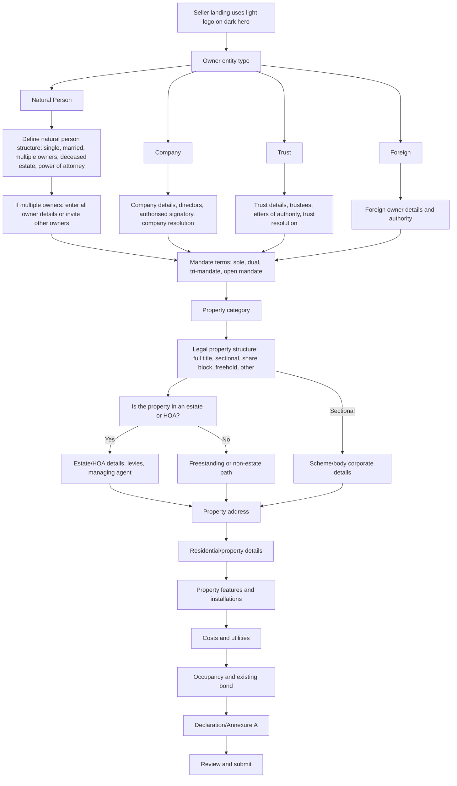
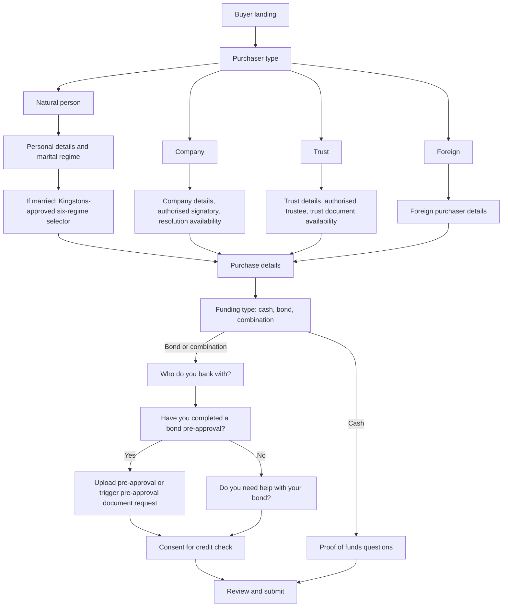

# Kingstons onboarding feedback analysis

Date: 2026-07-07

Base map: `docs/current-buyer-seller-onboarding-flow-map.md`

Primary source files checked:

- `src/pages/SellerOnboarding.jsx`
- `src/lib/sellerOnboardingFlowContract.js`
- `src/pages/ClientOnboarding.jsx`
- `src/lib/buyerOnboardingFlowContract.js`
- `src/lib/purchaserPersonas.js`

## Executive read

The Kingstons notes are coherent. They point to two bigger logic issues and a set of smaller copy/UI fixes.

1. Seller onboarding currently mixes legal owner type, marital/signing structure, and multi-owner handling in one first question. Kingstons wants that split into a cleaner tree: owner entity first, then structure and authority questions.
2. Seller property structure currently treats "Estate" as a legal structure option. Kingstons is right that an estate/HOA is an overlay, not mutually exclusive with full title. The flow should ask legal structure first, then ask whether the property is in an estate/HOA.
3. Buyer finance currently asks for bond progress, bond status, bank/provider, originator nomination, affordability confirmation, and finance snapshot consent. Kingstons wants a simpler buyer-facing path: who the buyer banks with, pre-approval status/upload, whether they need bond help, and credit consent.
4. Several notes are confirmed current workflow mismatches or likely bugs: seller landing logo preference, "Canonical address" duplication, address line 2 being wiped by Google address mapping, sectional details showing from stale branch signals, and buyer labels/copy.

## Seller Feedback Mapped To Current Workflow

### Landing logo

Raw note: "Logo on top not changing to white rotating form (displaying wrong logo)"

Current workflow:

- `resolveAgencyBrand()` builds `logoUrl` as `logoDarkUrl || fallbackLogoUrl || logoLightUrl`.
- `SellerWelcomeScreen` passes `agencyLogo={brand?.logoUrl || ''}` into the dark premium landing.
- The seller hero uses a light-aware brand mark elsewhere, so the landing and in-flow hero do not behave consistently.

Interpretation:

- Confirmed bug. The landing is dark/visual, so it should prefer the white/light logo variant.

Recommended edit:

- For `PremiumOnboardingLanding`, pass `brand.logoLightUrl || brand.logoUrl || brand.logoDarkUrl`.
- Keep `logoUrl` for normal/light backgrounds.

Confidence: high.

### Seller owner type and structure

Raw notes:

- "Change Individual name to (add Natural Person) and break it up in steps"
- "Natural Person / Company / Trust / Foreign"
- "Based on the answer compile the next question -> define structure"
- "Define the structure / married / multiple owners / compsolution etc"
- "IF Multiple owners allow override to input all details or send that onboarding to other owner"

Current workflow:

- First ownership question currently offers: Individual, Married (COP), Married (ANC), Company, Trust, Deceased estate, Power of attorney, Multiple owners, Other.
- Multiple owners already has repeatable owner cards and requires at least two owners with name, surname, ID number, and consent to sell.
- There is no first-class "Foreign" owner type.
- Company and trust details exist, but they are selected from the same first list as natural-person marital states.

Interpretation:

- Kingstons wants a two-layer seller tree:
  - Layer 1: legal owner class.
  - Layer 2: signing/authority/composition structure for that owner class.
- "Individual" should become "Natural Person".
- "Multiple owners" is not the same kind of answer as "Company" or "Trust"; it is a structure under Natural Person.
- "compsolution" likely means company resolution.
- Multiple owners need a choice: the current user can capture everyone manually, or the system sends separate onboarding/invite links to other owners.

Recommended edit:

- Replace the single `ownershipType` UX with:
  - `sellerEntityType`: `natural_person`, `company`, `trust`, `foreign`
  - `sellerStructureType`: conditional second answer
- Candidate second-level structure:
  - Natural person: single owner, married, multiple owners, power of attorney, deceased estate
  - Company: authorised signatory, director/shareholder capture, company resolution available/date
  - Trust: authorised trustee, trustees, letters of authority, trust resolution
  - Foreign: foreign natural person or foreign entity details, passport/registration, tax/residency, local authority/contact
- For multiple owners add `multipleOwnerCaptureMode`:
  - "I will enter all owners now"
  - "Send onboarding to other owner(s)"

Confidence: high for the split; medium for exact foreign structure until Kingstons confirms what "Foreign" covers.

### Mandate terms

Raw note: "Mandate terms - add open mandate"

Current workflow:

- Mandate type options are Sole, Dual, and Tri-Mandate.

Interpretation:

- Confirmed missing option.

Recommended edit:

- Add `open` / "Open Mandate" to seller mandate options.
- Check any mandate document generator/template mappings so the new value is not only UI-deep.

Confidence: high.

### Property category, type, and estate logic

Raw notes:

- "Property Category"
- "Full title ask if its in an estate (remove the estate button because it an be full title and an in an estate)"
- "Full title ask if its in an estate - and levies, how"
- "If not then its just freestanding"
- "Are you in a estate - add managing agent details"
- "Sectional is popping up even though its not selected"

Current workflow:

- `PROPERTY_STRUCTURES_BY_CATEGORY` includes `estate` as a property structure for residential, commercial, and mixed-use.
- The property branch resolver can return `estate_hoa` when `propertyStructureType === 'estate'`, `estateOrHoa` is true, or estate name fields exist.
- Sectional details show when `propertyBranch === 'sectional_title'`.
- The resolver also looks at legacy/canonical fields such as `canonicalPropertyType`, `propertyType`, `sectionalTitle`, and `shareBlock`, so stale saved facts can make branch panels appear even after the visible selection changed.

Interpretation:

- Kingstons is right: "Estate" should not be a mutually exclusive structure button.
- The legal structure should be one of Full Title, Sectional Title, Share Block, Freehold, etc.
- Estate/HOA should be a separate boolean overlay.
- The sectional pop-up issue is likely from stale branch signals or legacy/canonical fallback fields being allowed to override the current visible selection.

Recommended edit:

- Remove `estate` from the property structure button list.
- Add an explicit question after legal structure:
  - "Is this property in an estate or HOA?"
- If yes, ask:
  - Estate/HOA name
  - Levies
  - Managing agent/company name
  - Managing agent contact name
  - Managing agent email/phone
  - HOA/estate rules available
- If legal structure is Full Title and estate answer is no, treat it as freestanding.
- Fix branch resolution so current explicit structure wins over stale legacy flags.
- When changing category or structure, clear incompatible branch fields or keep them hidden without letting them drive visibility.

Confidence: high.

### Address section

Raw notes:

- "Duplication on the address field - remove canonical address"
- "Debug the address line 2"
- "Also the fields are not dropping down"

Current workflow:

- Address section title is "Canonical address".
- It includes address fields and a separate "Canonical address:" summary block below them.
- Google address mapping explicitly sets `line2: ''`, which wipes Address line 2 whenever a Google Places value is selected.

Interpretation:

- The user-facing word "canonical" is internal language and is creating duplication.
- Address line 2 has a confirmed preservation bug.
- "Fields are not dropping down" likely relates to conditional panels not opening/showing because branch state is not updating cleanly; needs browser reproduction, but it fits the stale branch-state issue above.

Recommended edit:

- Rename the section to "Property address".
- Remove the "Canonical address:" summary block from the seller-facing form, or make it an internal review-only display.
- Preserve `fallback.line2` in Google address mapping unless the selected place includes a better sub-premise/unit value.
- Re-test conditional dropdown/panel visibility after the branch resolver cleanup.

Confidence: high for copy and line 2; medium for dropdown root cause until reproduced.

### Residential/property details

Raw note: "Property Details (resonation details)"

Current workflow:

- Current section is "Residential details" and asks erf size, floor size, bedrooms, bathrooms, living areas, kitchens, garages, parking, etc.

Interpretation:

- "resonation" is almost certainly "residential".
- This is not a contradiction in the current flow, but Kingstons appears to want property features and utility details reorganised around this area.

Recommended edit:

- Keep residential details but make the section label and ordering plain.
- Move feature capture earlier, close to property details, before valuation/finance/admin questions.

Confidence: medium.

### Alterations and plans

Raw notes:

- "Alterations -> yes / no if yes"
- "If yes do you have the plans?"
- "Remove alterations and plans from form we have it in the -> declaration"

Current workflow:

- Main seller property form has an "Alterations & changes" section.
- It asks whether there have been alterations/additions/changes and asks for details if yes.
- "Documents already available" includes "Building plans".
- The Annexure A declaration already asks:
  - Whether improvements are reflected on approved building plans.
  - Whether the seller has approved building plans.

Interpretation:

- The notes self-correct: Kingstons first described an alterations/plans flow, then remembered it already belongs in the declaration.
- Current flow duplicates this too early.

Recommended edit:

- Remove the separate "Alterations & changes" section from the property form.
- Remove "Building plans" from the early "Documents already available" area if Kingstons wants that captured only in declaration.
- Keep the Annexure A/declaration questions as the source for alteration/plan disclosure.
- Keep document triggers tied to declaration answers, not the removed early property form field.

Confidence: high.

### Property conditions, rates, levies, and water

Raw notes:

- "Remove the property the conditions"
- "Mandatory for Rates and Levies"
- "Do you have prepaid or council water - tick yes or no"

Current workflow:

- "Valuation factors" asks Property Condition, Kitchen Condition, Bathroom Condition.
- Rates & Taxes and Levies are optional.
- Monthly water spend and monthly electricity spend are optional.
- There is no clear prepaid/council water yes/no question.

Interpretation:

- Remove subjective condition dropdowns from seller onboarding.
- Rates and levies should be treated as required cost facts.
- Water should be captured as a utility/billing type rather than free text/monthly spend only.

Recommended edit:

- Remove Property Condition, Kitchen Condition, and Bathroom Condition from seller onboarding.
- Add a "Costs and utilities" section with:
  - Rates and taxes amount
  - Levies amount
  - If levies do not apply, allow an explicit "No levies / not applicable" answer rather than leaving the field blank.
  - Water billing: prepaid water, council/municipal water, both, other/unknown
- Clarify whether levies are mandatory for all properties or conditionally mandatory only for sectional/estate/HOA.

Confidence: high for removing conditions and adding water type; medium for levy requirement details.

### Existing bond and cancellation attorney

Raw notes:

- "Bond account number"
- "Remove the cancellation attorney tick box (they wont know)"

Current workflow:

- Existing bond branch asks Bond Bank, Bond Account / Reference (optional), Estimated Settlement Amount, Multiple bonds, Access bond, Bond cancellation required, Cancellation attorney known, and Cancellation Attorney Details if known.

Interpretation:

- Keep bond account number and probably make it clearer/required when the seller has an existing bond.
- Remove seller-facing cancellation attorney knowledge. Sellers generally will not know this and it is internal/legal follow-up.

Recommended edit:

- Rename "Bond Account / Reference (optional)" to "Bond account number" and consider making it required when `existingBond` is yes.
- Remove "Cancellation attorney known" and "Cancellation Attorney Details" from the seller-facing form.
- Keep internal downstream fields if the transfer team needs them later.

Confidence: high.

### Features and installations

Raw notes:

- "Move features (solar , garden etc) up to the property features"
- "Separate borehole and water tank separately"
- "Solar / Gas geyser"

Current workflow:

- Features are near the end of the property form.
- `PROPERTY_FEATURES` currently combines "Borehole / Water Tank" into one feature.
- Solar is currently "Solar / Inverter".
- Compliance fields exist in form state for gas, solar, borehole, electric fence, etc., but they are not all visible as clean feature questions.

Interpretation:

- Kingstons wants features earlier and more granular.
- Borehole and water tank should be separate because they have different disclosure/certificate implications.
- Solar and gas geyser should be separate enough to trigger the right compliance questions later.

Recommended edit:

- Move the Features section directly after property details.
- Split features:
  - Garden
  - Security
  - Solar
  - Inverter/battery
  - Gas geyser
  - Borehole
  - Water tank
  - Fibre
  - Aircon
  - Fireplace
  - Flatlet/second dwelling
  - Staff quarters
- Map solar/gas/borehole answers into compliance/document triggers.

Confidence: high.

## Proposed Seller Target Flow

## Buyer Feedback Mapped To Current Workflow

### Marital regime

Raw notes:

- "Remove with Acrual in the married section"
- "Married // Check the 6 marraige regime"

Current workflow:

- Buyer marital regime options are: Not applicable, In community of property, Out of community of property, Out of community with accrual.
- The canonical buyer flow has a separate `married_anc_accrual` branch whenever the regime includes "accrual".

Interpretation:

- There is a tension in the raw notes. They say remove "with Accrual", but also say to check the six marriage regimes.
- Most likely meaning: do not expose the current simplified "with accrual" option in its current form; replace the married flow with a proper six-regime selector using Kingstons-approved legal wording.

Recommended edit:

- Confirm the exact six labels with Kingstons before implementation.
- Candidate structure for discussion:
  - Married in community of property
  - Married out of community of property without accrual
  - Married out of community of property with accrual
  - Customary marriage in community of property
  - Customary marriage out of community of property
  - Foreign marriage
- If Kingstons truly wants accrual hidden, ask "Is the accrual system applicable?" as a follow-up only when ANC/out-of-community is selected.

Confidence: medium because the notes conflict.

### Buyer copy changes

Raw notes:

- "Change - will this be your primary residence"
- "Change to is available not are available"

Current workflow:

- Buyer field label is "Primary Residence?"
- Company/trust fields include labels such as "Board Resolution Available?", "Trust Deed Available?", "Letters of Authority Available?", and "Trust Resolution Available?"

Interpretation:

- Straightforward copy cleanup.
- "Letters of authority" is plural, but Kingstons appears to prefer "is available" wording for document availability questions.

Recommended edit:

- Change "Primary Residence?" to "Will this be your primary residence?"
- Use sentence-style availability labels:
  - "Is the board resolution available?"
  - "Is the trust deed available?"
  - "Is the letters of authority document available?" or "Are the letters of authority available?" depending on final legal preference.
  - "Is the trust resolution available?"

Confidence: high for primary residence; medium for exact letters-of-authority grammar.

### Buyer bank question

Raw notes:

- "Change the bond provider to who do you bank with"
- "Multiple selection for banks"

Current workflow:

- Bond finance asks "Bank / Bond Provider" as a required text field, and only shows it if the buyer says they have already started the bond process.

Interpretation:

- Kingstons does not want the buyer to name the bond provider at this stage.
- They want to know which bank or banks the buyer uses, probably to guide bond pre-qualification/originator routing.

Recommended edit:

- Replace `bond_bank_name` with a multi-select `buyer_banks` field labelled "Who do you bank with?"
- Include major bank options plus "Other".
- Make it visible for bond/combination finance whether or not pre-approval has started.

Confidence: high.

### Bond originator and bond help

Raw notes:

- "Remove do you want to nominate a bond originator"
- "Do you need help with your bond"

Current workflow:

- Base field asks "Would you like bond originator help?"
- In some contexts the label changes to "Would you like to nominate your own bond originator?"
- If yes, validation requires a bond originator/consultant name.

Interpretation:

- Kingstons wants to remove buyer nomination of a specific originator.
- The only buyer-facing question should be whether they need help with the bond.

Recommended edit:

- Use label: "Do you need help with your bond?"
- Remove buyer-facing originator nomination fields and validation requirement.
- Keep assigned originator logic internal.

Confidence: high.

### Bond progress, pre-approval, upload, and affordability

Raw notes:

- "Remove Progress - Basic Bond information"
- "Remove the current bond process"
- "If no you have not yet done a pre approval"
- "Upload your pre-approval"
- "Remove affordability section as well"
- "Consent for credit"

Current workflow:

- Buyer bond path has a `bond_progress` section.
- It asks:
  - Have you already started the bond process?
  - Current Bond Status
  - Bank / Bond Provider
  - Would you like bond originator help?
  - Is this a joint bond application?
  - Deposit/cash contribution amount and source
  - Recent bank statements available?
  - Consent to share this finance snapshot with the bond originator?
  - Affordability ready / confirmed?
- Validation currently requires bond process started, current bond status, bond help, bank statements, bond readiness consent, and affordability confirmation for bond/combination finance.

Interpretation:

- Replace the current "bond process/status" model with a pre-approval model.
- Uploading pre-approval is not currently an inline upload in onboarding; the client portal document checklist handles uploads after submission.
- If Kingstons wants upload during onboarding, this is a larger product change than a label edit.
- Remove affordability confirmation from buyer-facing onboarding. Decide separately whether income/expense facts remain for internal bond support.

Recommended edit:

- Remove buyer-facing:
  - "Have you already started the bond process?"
  - "Current Bond Status"
  - "Affordability ready / confirmed?"
  - "Consent to share this finance snapshot with the bond originator?"
- Add:
  - "Have you completed a bond pre-approval?"
  - If yes: "Upload your pre-approval" or "Will upload after submission" depending on upload capability.
  - If no: "Do you need help with your bond?"
  - "Do you consent to a credit check for bond assistance?"
- Update validation and buyer onboarding contract so removed fields are no longer required.

Confidence: high for direction; medium for upload implementation scope.

## Proposed Buyer Target Flow

## High Confidence Implementation Changes

These can be implemented with low ambiguity:

- Seller landing should prefer the light logo on the dark landing.
- Rename seller "Individual" to "Natural Person".
- Add "Open Mandate".
- Remove `estate` as a property structure button and add a separate estate/HOA question.
- Rename "Canonical address" to "Property address" and remove the duplicate canonical summary from the form.
- Preserve Address line 2 when Google address data is selected.
- Remove seller-facing cancellation attorney fields.
- Split Borehole and Water Tank, and add Gas Geyser as a distinct feature/installations option.
- Buyer "Primary Residence?" becomes "Will this be your primary residence?"
- Buyer "Bank / Bond Provider" becomes "Who do you bank with?" with multiple bank selection.
- Buyer originator nomination should be removed from the buyer-facing flow.
- Buyer bond progress/status and affordability confirmation should be removed from validation if removed from UI.

## Needs Confirmation Before Implementation

These should be clarified with Kingstons or the product owner before code changes:

- Exact six buyer marriage regime labels.
- Whether "Foreign" means foreign natural person only, foreign company/trust too, or any non-SA-resident seller/buyer.
- Whether Open Mandate also requires mandate document/template updates.
- For multiple sellers, whether separate owner onboarding links are in scope now or should be a later phase.
- Whether levies must be mandatory for every property, or conditionally mandatory for sectional/estate/HOA with an explicit "not applicable" option for freestanding properties.
- Whether buyer pre-approval upload must happen inside onboarding, or can be handled by the existing client portal document checklist after submission.
- Whether "remove affordability section" means remove only `affordability_confirmed`, or also remove income/expense/dependant/debt-review questions.
- Exact bank list for the multi-select and whether "Other bank" is allowed.

## Suggested Implementation Sequence

1. Quick copy and confirmed bug fixes:
   - Light logo on seller landing.
   - Natural Person label.
   - Open Mandate option.
   - Buyer label/copy changes.
   - Address section wording and line 2 preservation.

2. Seller property branching:
   - Remove Estate as structure.
   - Add estate/HOA overlay question.
   - Clean stale branch fields so sectional/estate panels do not appear from old signals.

3. Seller form pruning and feature re-ordering:
   - Remove early alterations/plans duplication.
   - Remove property condition fields.
   - Add costs/utilities and water billing.
   - Move and split features.
   - Remove cancellation attorney from seller-facing flow.

4. Seller ownership restructuring:
   - Split owner entity type from owner structure.
   - Add Foreign.
   - Add multiple-owner capture mode.

5. Buyer finance restructuring:
   - Replace bond provider with bank multi-select.
   - Replace bond progress/status with pre-approval question.
   - Add credit consent.
   - Remove originator nomination and affordability confirmation from UI and validation.

6. Contract, validation, and document-trigger pass:
   - Update `sellerOnboardingFlowContract.js`, `buyerOnboardingFlowContract.js`, and `purchaserPersonas.js` so canonical requirements match the new UI.
   - Re-check generated document requirements after the alterations/plans and pre-approval changes.

7. Browser QA:
   - Seller: full title non-estate, full title estate/HOA, sectional, multiple natural-person owners, company, trust.
   - Buyer: natural person married regimes, company, trust, bond with pre-approval, bond without pre-approval, cash.

